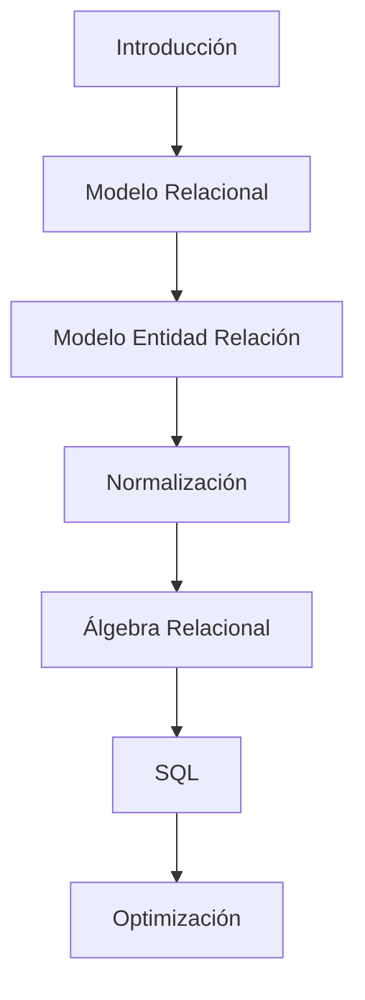

# 01. Presentación de la asignatura

### ¿Por qué existe esta asignatura?

Prácticamente todas las aplicaciones modernas utilizan una base de datos.

Un banco necesita almacenar cuentas, movimientos y clientes.

Una universidad necesita almacenar estudiantes, profesores y asignaturas.

Una red social necesita almacenar publicaciones, usuarios y mensajes.

Una tienda en línea necesita almacenar productos, pedidos y pagos.

Detrás de cada uno de esos sistemas existe una estructura organizada que permite almacenar, consultar y mantener información de manera eficiente.

Las Bases de Datos constituyen una de las áreas fundamentales de la informática porque permiten transformar datos dispersos en sistemas capaces de apoyar decisiones y procesos de negocio.

### Más allá de SQL

Una idea equivocada muy frecuente consiste en pensar que esta asignatura trata únicamente sobre aprender comandos SQL.

Aprender SQL es importante.

Pero SQL es solamente una herramienta.

Sería equivalente a pensar que aprender arquitectura consiste únicamente en aprender a utilizar un martillo.

El verdadero objetivo consiste en aprender a diseñar correctamente estructuras de información.

Durante el semestre dedicaremos más tiempo a comprender problemas que a memorizar sintaxis.

### El perfil de un diseñador de Bases de Datos

Un buen diseñador de bases de datos desarrolla varias capacidades:

* Analizar organizaciones.
* Comprender procesos de negocio.
* Identificar información relevante.
* Diseñar estructuras eficientes.
* Detectar redundancias.
* Garantizar consistencia.
* Optimizar consultas.

Estas habilidades son mucho más valiosas que memorizar comandos aislados.

### Una visión general del semestre

### Idea clave

El objetivo del curso no consiste en aprender SQL.

El objetivo consiste en aprender a representar correctamente la realidad mediante modelos de datos.

