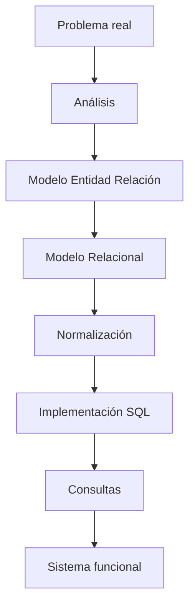

# 02. ¿Qué aprenderemos en el curso?

### Comenzando por el final

Antes de estudiar cualquier tema conviene responder una pregunta.

¿Qué seré capaz de hacer al finalizar el semestre?

La respuesta es mucho más amplia de lo que parece.

No se trata únicamente de crear tablas.

Tampoco se trata únicamente de realizar consultas.

Al finalizar el curso el estudiante deberá ser capaz de analizar un problema real y construir una solución completa basada en una Base de Datos Relacional.

### El recorrido completo

Durante el semestre recorreremos un camino similar al siguiente.

### Lo que aprenderemos

### Diseño

Aprenderemos a identificar entidades, atributos y relaciones.

### Modelado

Aprenderemos a construir diagramas Entidad-Relación.

### Transformación

Aprenderemos a convertir modelos conceptuales en modelos relacionales.

### Calidad

Aprenderemos a eliminar redundancias mediante normalización.

### Consultas

Aprenderemos SQL desde nivel básico hasta intermedio-avanzado.

### Rendimiento

Aprenderemos principios básicos de optimización.

## Un proyecto común

Durante todo el semestre construiremos el sistema de una empresa comercial.

Cada clase añadirá nuevos elementos.

De esta forma no resolveremos ejercicios aislados.

Construiremos un único proyecto que evolucionará progresivamente.

## Idea clave

Las Bases de Datos son una disciplina de diseño y análisis tanto como una disciplina tecnológica.

