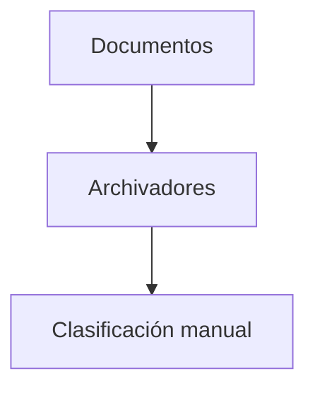
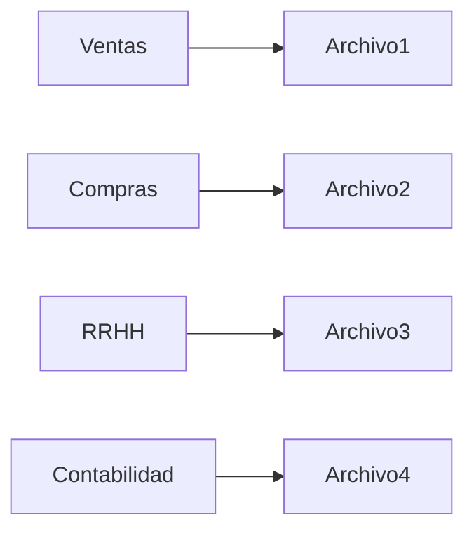

# 06. Evolución del almacenamiento de la información

### Un problema tan antiguo como la civilización

La necesidad de almacenar información es mucho más antigua que la informática.

Desde las primeras civilizaciones, las sociedades necesitaron registrar hechos importantes.

Comercio.

Impuestos.

Propiedades.

Inventarios.

Población.

### Primeras formas de almacenamiento

Durante miles de años se utilizaron diversos medios.

```text
Tablillas de arcilla

Papiros

Pergaminos

Libros contables

Archivos físicos
```

Todos permitían conservar información.

Pero ninguno facilitaba búsquedas rápidas o análisis complejos.

### La llegada de los sistemas mecánicos

Con la Revolución Industrial aumentó enormemente la cantidad de información generada.

Las organizaciones comenzaron a utilizar sistemas de clasificación, fichas y archivadores.



Aunque representaban una mejora, seguían dependiendo completamente del trabajo humano.

### Los primeros sistemas informáticos

Durante el siglo XX aparecieron los ordenadores.

Las organizaciones comenzaron a almacenar información en archivos digitales.

Aquello parecía revolucionario.

Sin embargo, pronto aparecieron nuevos problemas.

La información estaba dispersa.

Duplicada.

Difícil de compartir.

Difícil de mantener.

### Antes de las Bases de Datos

La situación típica era la siguiente.



Cada departamento gestionaba sus propios archivos.

Cada uno mantenía sus propias copias de la información.

Los problemas crecían con el tamaño de la organización.

### Conexión con el siguiente tema

Los archivos digitales parecían una solución definitiva.

Sin embargo, introdujeron nuevos desafíos que terminarían impulsando el nacimiento de las Bases de Datos modernas.

Comprender esos problemas será el siguiente paso de nuestro recorrido.

