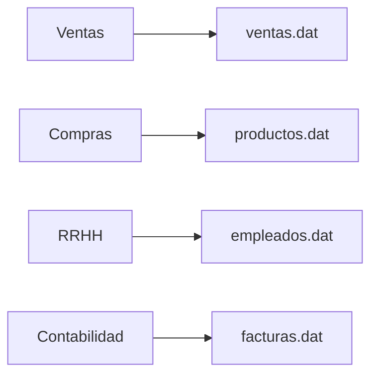

 07. El problema de los archivos tradicionales

En los primeros sistemas informáticos no existían las Bases de Datos tal y como las conocemos hoy. Cada programa almacenaba su propia información en archivos independientes. Mientras las organizaciones eran pequeñas este enfoque funcionaba razonablemente bien, pero conforme aumentó el volumen de datos comenzaron a aparecer numerosos problemas.

Comprender estas limitaciones permite entender por qué fue necesario desarrollar un nuevo modelo de almacenamiento.

### Un sistema basado en archivos

Imaginemos una empresa con varios departamentos.

Cada departamento administra sus propios archivos.

No existe un lugar único donde almacenar toda la información.

### Principales problemas

Los sistemas basados en archivos presentaban varias limitaciones importantes.

* La misma información aparecía repetida en distintos archivos.
* Era difícil compartir información entre departamentos.
* Una modificación obligaba a actualizar varios archivos.
* Los programas dependían completamente de la estructura de los archivos.
* La búsqueda de información era lenta cuando era necesario combinar varios archivos.

### Un ejemplo

Supongamos que el cliente Ana Ruiz cambia de teléfono.

Ese dato puede aparecer en:

* Clientes.
* Ventas.
* Facturación.
* Promociones.

Si alguno de esos archivos no se actualiza, la empresa comenzará a trabajar con información distinta para una misma persona.

### Ideas clave

Los archivos tradicionales resolvían el problema de almacenar información, pero no el de administrarla de forma consistente y compartida.

### Siguiente lectura

→ [08. ¿Qué es una Base de Datos?](https://chatgpt.com/c/08_que_es_una_base_de_datos.md)

