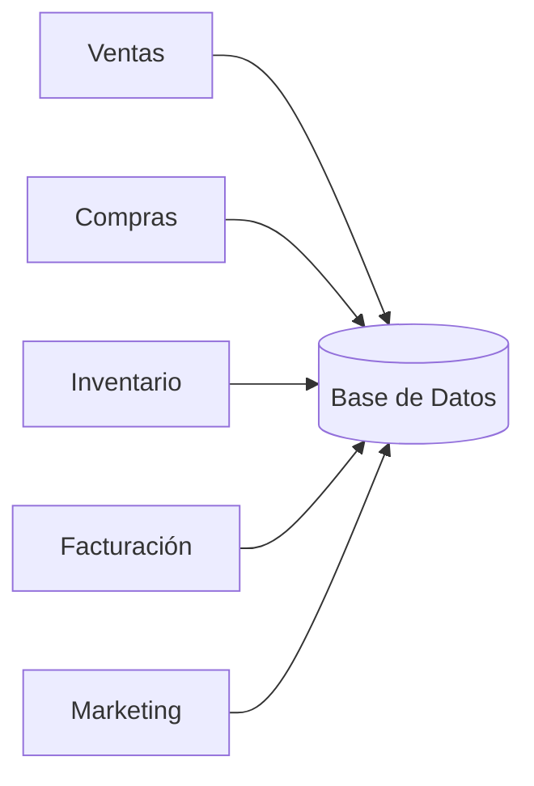

# 08. ¿Qué es una Base de Datos?

Después de analizar los problemas de los archivos tradicionales surge una pregunta natural.

¿Qué solución ofrecen las Bases de Datos?

Una Base de Datos es un conjunto organizado de datos relacionados entre sí, diseñado para facilitar su almacenamiento, consulta, actualización y mantenimiento.

La palabra importante de esta definición es ​**organizado**​.

No basta con guardar información.

Debe existir una estructura que permita encontrarla y mantenerla correctamente.

### Una única fuente de información

La idea fundamental consiste en almacenar cada dato una sola vez.

Todas las aplicaciones consultan la misma información.

Si un cliente cambia su dirección, basta con modificarla una única vez.

Todos los departamentos verán automáticamente la información actualizada.

### Características principales

Una Base de Datos moderna debe permitir:

* Almacenar información.
* Consultar información rápidamente.
* Actualizar datos de forma segura.
* Compartir información entre distintos usuarios.
* Evitar inconsistencias.

### Ejemplo

En lugar de mantener cinco copias del mismo cliente, existe un único registro.

| Código | Nombre   | Ciudad    |
| --------- | ---------- | ----------- |
| C001    | Ana Ruiz | Santander |

Todas las aplicaciones consultan este mismo registro.

### Ideas clave

Una Base de Datos no es simplemente un lugar donde guardar información.

Es un sistema diseñado para mantener los datos organizados, consistentes y disponibles para toda la organización.

