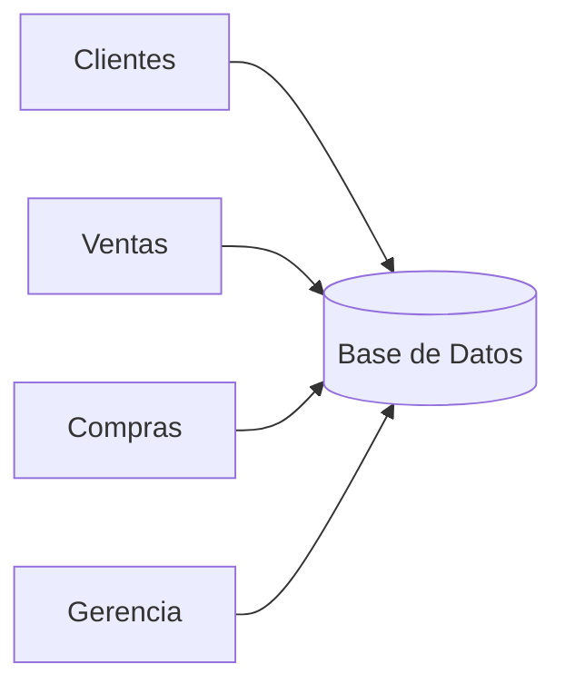

# 09. Objetivos de una Base de Datos

Una Base de Datos no existe únicamente para almacenar datos.

Su verdadero propósito consiste en facilitar el trabajo de las personas y de las aplicaciones que utilizan esa información.

### Objetivo 1. Reducir la redundancia

La información debe almacenarse una única vez siempre que sea posible.

De esta manera disminuyen los errores y el mantenimiento resulta mucho más sencillo.

### Objetivo 2. Mantener la consistencia

Todos los usuarios deben trabajar con la misma versión de los datos.

No puede existir una dirección distinta para el mismo cliente dependiendo del programa utilizado.

### Objetivo 3. Compartir información

Todos los departamentos deben poder acceder a los datos que necesitan.

La Base de Datos actúa como punto central de información.

### Objetivo 4. Garantizar la seguridad

No todos los usuarios necesitan acceder a toda la información.

Por ejemplo:

* Un vendedor puede consultar clientes.
* Recursos Humanos puede consultar empleados.
* Contabilidad puede consultar facturas.

Cada usuario debe acceder únicamente a la información autorizada.

### Objetivo 5. Facilitar la toma de decisiones

Una organización necesita responder preguntas como:

* ¿Cuál fue el producto más vendido?
* ¿Qué sucursal obtuvo mayores ingresos?
* ¿Qué clientes compran con mayor frecuencia?

Una Base de Datos bien diseñada permite responder estas preguntas en pocos segundos.

### Resumen

Los principales objetivos de una Base de Datos son:

* Reducir la redundancia.
* Mantener la consistencia.
* Compartir información.
* Garantizar la seguridad.
* Facilitar consultas eficientes.
* Apoyar la toma de decisiones.

