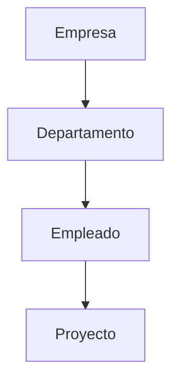

# 10. Historia del Modelo Relacional

Hasta este momento hemos visto que los sistemas basados en archivos presentaban numerosos inconvenientes y que las Bases de Datos surgieron para resolverlos. Sin embargo, las primeras Bases de Datos tampoco eran perfectas.

Durante las décadas de 1960 y 1970 existían diferentes formas de organizar la información. Cada fabricante proponía su propio modelo, lo que dificultaba el desarrollo de aplicaciones y el intercambio de conocimientos.

Fue en ese contexto donde apareció una idea que cambiaría la informática para siempre: el Modelo Relacional.

### Antes del Modelo Relacional

Antes de 1970 predominaban principalmente dos modelos.

* Modelo jerárquico.
* Modelo en red.

En ambos casos era necesario conocer exactamente cómo estaban conectados los datos para poder consultarlos.

Aunque estos modelos funcionaban, resultaban complejos de diseñar y mantener.

Modificar la estructura de los datos suponía, en muchos casos, modificar también las aplicaciones que los utilizaban.

### Un cambio de perspectiva

En 1970 el investigador Edgar F. Codd propuso una idea revolucionaria.

En lugar de pensar la información como árboles o redes de enlaces, propuso organizarla mediante ​**relaciones**​, representadas en forma de tablas.

Cada tabla describía un conjunto de objetos del mundo real.

Por ejemplo:

| ClienteID | Nombre       | Ciudad    |
| ----------- | -------------- | ----------- |
| 1         | Ana Ruiz     | Santander |
| 2         | Luis Pérez  | Bilbao    |
| 3         | Marta Gómez | Burgos    |

La simplicidad de esta representación facilitó enormemente el diseño y el mantenimiento de las bases de datos.

### ¿Por qué fue una revolución?

El Modelo Relacional aportó varias ventajas importantes.

* Independencia entre los datos y las aplicaciones.
* Organización uniforme mediante tablas.
* Mayor facilidad para consultar información.
* Reducción de errores de diseño.
* Posibilidad de aplicar fundamentos matemáticos.

Estas características permitieron construir sistemas mucho más robustos y fáciles de mantener.

### Una idea que sigue vigente

Más de cincuenta años después de su publicación, el Modelo Relacional continúa siendo la base de la mayoría de sistemas utilizados por bancos, hospitales, universidades, administraciones públicas y empresas de todo el mundo.

Aunque han surgido otros modelos, el relacional sigue siendo el estándar sobre el que se apoya gran parte del software moderno.

### Ideas clave

* Antes del Modelo Relacional existían otros modelos de bases de datos.
* El Modelo Relacional fue propuesto en 1970.
* Su principal innovación consistió en organizar la información mediante relaciones representadas como tablas.
* Su sencillez y solidez hicieron que se convirtiera en el estándar de la industria.

