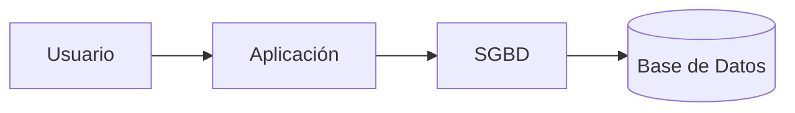

# 13. Sistemas Gestores de Bases de Datos (SGBD)

Hasta ahora hemos hablado de las Bases de Datos como un concepto. Sin embargo, una Base de Datos no funciona por sí sola. Es necesario un software especializado que permita crearla, administrarla, protegerla y consultarla.

Ese software recibe el nombre de ​**Sistema Gestor de Bases de Datos**​, conocido por sus siglas **SGBD** (o ​**DBMS**​, ​*Database Management System*​, en inglés).

### ¿Qué hace un SGBD?

Un SGBD actúa como intermediario entre los usuarios y los datos.

En lugar de acceder directamente a los archivos del disco, todas las operaciones pasan por el gestor.

Gracias a ello el sistema puede controlar quién accede a la información, evitar errores y garantizar que los datos permanezcan consistentes.

### Funciones principales

Un Sistema Gestor de Bases de Datos permite:

* Crear Bases de Datos.
* Crear tablas.
* Insertar información.
* Modificar registros.
* Eliminar datos.
* Buscar información mediante consultas.
* Gestionar usuarios y permisos.
* Realizar copias de seguridad.
* Recuperar información en caso de fallo.

### Ejemplos de SGBD

Algunos de los sistemas más utilizados actualmente son:

| SGBD                 | Tipo      | Uso habitual                          |
| ---------------------- | ----------- | --------------------------------------- |
| MySQL                | Libre     | Aplicaciones web                      |
| PostgreSQL           | Libre     | Sistemas empresariales y científicos |
| Oracle Database      | Comercial | Grandes organizaciones                |
| Microsoft SQL Server | Comercial | Entornos corporativos                 |
| MariaDB              | Libre     | Sustituto compatible con MySQL        |
| SQLite               | Libre     | Aplicaciones móviles y de escritorio |

Durante este curso utilizaremos ​**MySQL**​, ya que combina facilidad de aprendizaje con un amplio uso profesional.

### Ideas clave

* Un SGBD es el software que administra una Base de Datos.
* Los usuarios nunca deberían manipular directamente los archivos de datos.
* El gestor proporciona seguridad, integridad y eficiencia.
* Existen numerosos SGBD, pero todos comparten una filosofía similar basada en el Modelo Relacional.

