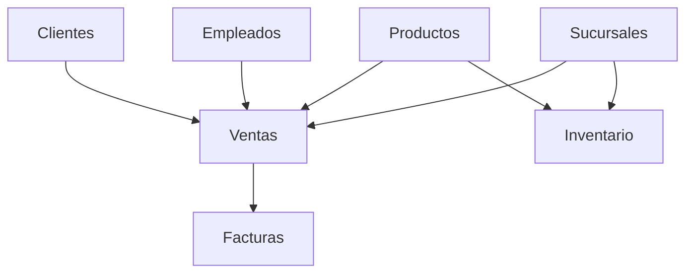

# 14. Caso de estudio: Empresa Comercial

Durante este semestre no resolveremos ejercicios independientes en cada clase.

En su lugar construiremos progresivamente un único sistema de información que evolucionará conforme avancemos en el curso.

Este enfoque permitirá comprender cómo se desarrolla un proyecto real desde el análisis inicial hasta su implementación completa.

### La empresa

Nuestro caso de estudio será ​**Comercial Nova**​, una empresa dedicada a la venta de productos tecnológicos.

Inicialmente la empresa dispone de:

* Dos sucursales.
* Ocho empleados.
* Aproximadamente mil clientes.
* Quinientos productos.
* Un almacén por sucursal.

Actualmente gran parte de la información se encuentra distribuida en hojas de cálculo y documentos independientes.

La dirección desea implantar un sistema basado en una Base de Datos Relacional.

### ¿Qué desarrollaremos?

A medida que avance el curso iremos incorporando nuevos componentes.

En esta primera clase todavía no construiremos tablas.

Nuestro objetivo consiste únicamente en comprender el negocio y conocer los elementos principales que lo forman.

En las siguientes sesiones comenzaremos a identificar entidades, atributos y relaciones.

### ¿Por qué utilizar un único caso de estudio?

Trabajar siempre sobre el mismo proyecto ofrece varias ventajas.

* Se observa la evolución de un sistema real.
* Los conceptos se relacionan entre sí.
* Se evita aprender mediante ejemplos aislados.
* Cada nueva clase amplía el trabajo realizado anteriormente.

Al finalizar el semestre habremos desarrollado una Base de Datos completa para esta empresa, desde su diseño conceptual hasta su implementación en MySQL.

### Ideas clave

* Comercial Nova será el proyecto que acompañará todo el curso.
* Cada clase añadirá nuevos elementos al sistema.
* El objetivo final será construir una Base de Datos Relacional completamente funcional.

