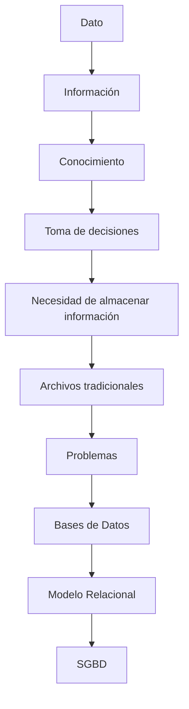

# Clase 1. Introducción a las Bases de Datos Relacionales

## Descripción

Esta primera clase tiene un objetivo muy diferente al resto del curso.

Todavía no vamos a crear tablas.

Todavía no vamos a escribir consultas SQL.

Tampoco utilizaremos MySQL.

Antes de aprender herramientas es necesario comprender el problema que dichas herramientas intentan resolver.

Las Bases de Datos nacieron porque almacenar información se convirtió en un desafío cada vez más complejo para empresas, gobiernos, universidades y organizaciones de cualquier tamaño.

Durante esta sesión estudiaremos cómo se almacena la información, qué diferencias existen entre datos e información, cuáles eran las limitaciones de los sistemas tradicionales y por qué el modelo relacional terminó convirtiéndose en el estándar dominante de la industria.

También iniciaremos el caso práctico que nos acompañará durante todo el semestre: el sistema de información de una empresa comercial.

## Objetivos de aprendizaje

Al finalizar esta clase el estudiante será capaz de:

* Comprender qué es un dato.
* Diferenciar datos, información y conocimiento.
* Entender la evolución histórica del almacenamiento de información.
* Identificar los problemas de los archivos tradicionales.
* Explicar qué es una base de datos.
* Comprender los objetivos de una base de datos moderna.
* Reconocer la importancia del modelo relacional.
* Identificar el papel de Edgar F. Codd en la historia de la informática.
* Comprender qué es un Sistema Gestor de Bases de Datos.
* Conocer el caso de estudio que se desarrollará durante todo el curso.

## Contenido

1. [Presentación de la asignatura](01_presentacion_de_la_asignatura.md)
2. [¿Qué aprenderemos en el curso?](02_que_aprenderemos_en_el_curso.md)
3. [¿Qué es un dato?](03_que_es_un_dato.md)
4. [Datos vs. Información](04_datos_vs_informacion.md)
5. [Información, conocimiento y toma de decisiones](05_informacion_conocimiento_y_toma_de_decisiones.md)
6. [Evolución del almacenamiento de la información](06_evolucion_del_almacenamiento_de_la_informacion.md)
7. [El problema de los archivos tradicionales](07_el_problema_de_los_archivos_tradicionales.md)
8. [¿Qué es una Base de Datos?](08_que_es_una_base_de_datos.md)
9. [Objetivos de una Base de Datos](09_objetivos_de_una_base_de_datos.md)
10. [Historia del Modelo Relacional](10_historia_del_modelo_relacional.md)
11. [Edgar F. Codd y el nacimiento del Modelo Relacional](11_edgar_f_codd_y_el_nacimiento_del_modelo_relacional.md)
12. [Introducción a las Reglas de Codd](12_introduccion_a_las_reglas_de_codd.md)
13. [Sistemas Gestores de Bases de Datos (SGBD)](13_sistemas_gestores_de_bases_de_datos.md)
14. [Caso de estudio: Empresa Comercial](14_caso_de_estudio_empresa_comercial.md)
15. [Resumen y conexión con la siguiente clase](15_resumen_y_conexion_con_la_siguiente_clase.md)

## Mapa conceptual de la clase

## Conexión con el resto del curso

Esta clase establece las bases conceptuales del semestre.

Las siguientes sesiones profundizarán en el Modelo Relacional, el diseño de Bases de Datos, el Álgebra Relacional y finalmente SQL.

