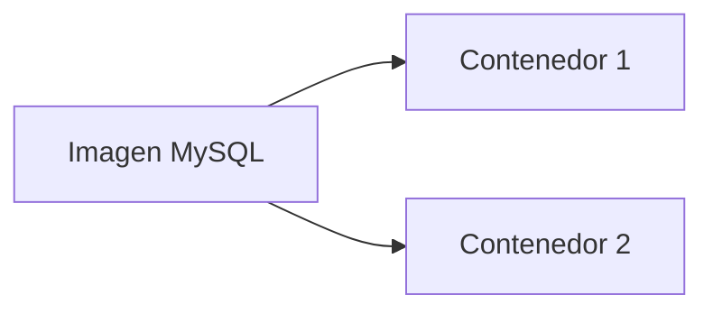

# Docker

Docker es una de las herramientas más importantes del desarrollo de software moderno. Aunque inicialmente fue creada para facilitar el despliegue de aplicaciones, hoy en día también es ampliamente utilizada en entornos educativos, laboratorios y proyectos profesionales.

Durante este curso utilizaremos Docker para ejecutar el servidor MySQL sobre el que construiremos nuestra base de datos. Gracias a ello, todos los estudiantes trabajarán con exactamente la misma configuración, independientemente del sistema operativo de su ordenador.

### ¿Qué problema resuelve Docker?

Es habitual que un programa funcione correctamente en un ordenador, pero falle al ejecutarse en otro. Las diferencias de versiones, bibliotecas instaladas o configuraciones pueden provocar errores difíciles de localizar.

Docker resuelve este problema encapsulando una aplicación junto con todos los elementos que necesita para funcionar. De esta forma, el entorno de ejecución es prácticamente idéntico en cualquier equipo.

Esta filosofía permite que un mismo proyecto pueda desarrollarse en distintos ordenadores sin necesidad de repetir complejos procesos de instalación.

### Contenedores y máquinas virtuales

Antes de Docker era frecuente utilizar máquinas virtuales para aislar aplicaciones. Una máquina virtual simula un ordenador completo, incluyendo su propio sistema operativo.

Los contenedores funcionan de forma diferente. En lugar de crear un sistema operativo independiente, comparten el núcleo del sistema anfitrión y únicamente aíslan la aplicación y sus dependencias.

Esto hace que los contenedores sean mucho más ligeros y rápidos.

| Máquina virtual                      | Contenedor Docker               |
| --------------------------------------- | --------------------------------- |
| Incluye un sistema operativo completo | Comparte el núcleo del sistema |
| Mayor consumo de recursos             | Menor consumo de recursos       |
| Inicio más lento                     | Inicio casi inmediato           |
| Archivos de gran tamaño              | Archivos mucho más pequeños   |

### Imagen y contenedor

Dos conceptos fundamentales en Docker son las **imágenes** y los ​**contenedores**​.

Una imagen puede entenderse como una plantilla preparada para ejecutar una aplicación.

Un contenedor es una copia en funcionamiento creada a partir de esa imagen.

Por ejemplo, una única imagen oficial de MySQL puede utilizarse para crear varios servidores independientes.



La imagen permanece sin cambios, mientras que cada contenedor tiene su propio estado y configuración.

### Docker Desktop

En este curso utilizaremos ​**Docker Desktop**​, la aplicación oficial que facilita el uso de Docker en Windows y macOS.

Docker Desktop incorpora una interfaz gráfica y administra automáticamente el motor de Docker. Aunque muchas tareas pueden realizarse mediante comandos, esta aplicación simplifica considerablemente el trabajo cuando se está aprendiendo.

Más adelante también utilizaremos la terminal integrada de Visual Studio Code para ejecutar algunos comandos sencillos.

### Docker Compose

En proyectos reales rara vez se ejecuta un único contenedor.

Una aplicación puede necesitar un servidor web, una base de datos, un sistema de caché y otros servicios funcionando simultáneamente.

Docker Compose permite describir todos esos servicios mediante un único archivo llamado normalmente `compose.yml`.

Después basta ejecutar:

```bash
docker compose up
```

Docker iniciará automáticamente todos los servicios definidos.

Durante este curso utilizaremos Docker Compose para levantar nuestro servidor MySQL. Esto permitirá que todos los estudiantes dispongan exactamente del mismo entorno de prácticas sin necesidad de configuraciones manuales complicadas.

### Caso práctico

Nuestra empresa comercial todavía no dispone de una base de datos.

En las próximas clases utilizaremos Docker Compose para iniciar un servidor MySQL completamente vacío. Sobre él iremos creando las tablas, relaciones y consultas que formarán parte del sistema de información de la empresa.

Al finalizar el semestre seguiremos utilizando ese mismo servidor, aunque contendrá una base de datos mucho más completa.

### Ideas clave

* Docker facilita que una aplicación funcione igual en diferentes ordenadores.
* Un contenedor es más ligero que una máquina virtual.
* Una imagen es una plantilla; un contenedor es una instancia en ejecución de esa plantilla.
* Docker Desktop simplifica el uso de Docker.
* Docker Compose permite iniciar varios servicios mediante un único archivo de configuración.
* Durante el curso utilizaremos Docker Compose para ejecutar el servidor MySQL.

