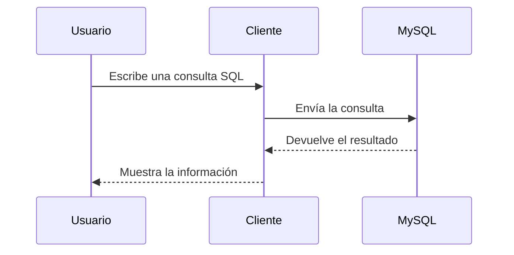
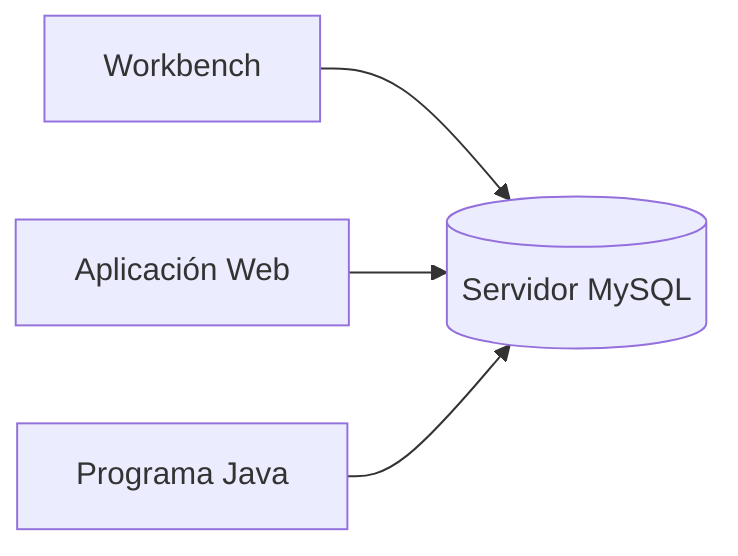

# Arquitectura Cliente-Servidor en MySQL

En el capítulo anterior estudiamos el funcionamiento general de una arquitectura Cliente-Servidor. Ahora veremos cómo se aplica este modelo al gestor de bases de datos MySQL.

Comprender esta arquitectura permitirá entender mejor qué ocurre cuando escribimos una consulta SQL y por qué diferentes aplicaciones pueden acceder simultáneamente a la misma base de datos.

### El servidor MySQL

MySQL es un ​**Sistema Gestor de Bases de Datos Relacionales (SGBD)**​.

Su función consiste en almacenar información, organizarla y responder a las consultas realizadas por los clientes.

El servidor permanece ejecutándose incluso cuando ningún usuario está conectado.

Es decir, no depende de que exista una aplicación abierta.

### Los clientes MySQL

Existen numerosos programas capaces de comunicarse con un servidor MySQL.

Algunos ejemplos son:

* MySQL Workbench.
* Visual Studio Code mediante extensiones SQL.
* Aplicaciones desarrolladas en Java, Python o PHP.
* Programas de administración de bases de datos.
* Aplicaciones web.

Todos ellos desempeñan exactamente el mismo papel: actuar como clientes.

### Comunicación entre cliente y servidor

El funcionamiento básico puede resumirse en cuatro pasos.

El cliente no ejecuta realmente la consulta.

Únicamente la envía al servidor.

Es el servidor quien interpreta el lenguaje SQL, accede a los datos y genera la respuesta.

### ¿Puede haber varios clientes?

Sí.

De hecho, es la situación más habitual.

Todos los clientes pueden trabajar sobre la misma base de datos al mismo tiempo.

El servidor se encarga de coordinar el acceso para mantener la integridad de la información.

### Caso práctico

Imaginemos nuestra empresa comercial.

El departamento de ventas utiliza una aplicación para registrar pedidos.

Al mismo tiempo, el responsable del almacén consulta el inventario desde otra aplicación distinta.

Aunque ambos programas sean diferentes, los dos se conectan al mismo servidor MySQL.

De esta forma toda la empresa trabaja siempre con la información actualizada.

### Ideas clave

* MySQL actúa como servidor de bases de datos.
* Existen numerosos programas cliente compatibles con MySQL.
* El cliente envía consultas; el servidor las procesa.
* Varios clientes pueden conectarse simultáneamente al mismo servidor.
* Esta arquitectura permite compartir una única base de datos entre diferentes aplicaciones.

