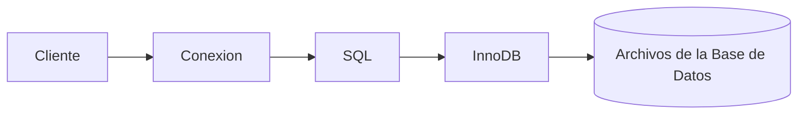

# Componentes del servidor MySQL

Desde el exterior solemos ver MySQL como una única aplicación. Sin embargo, internamente está formado por varios componentes que trabajan conjuntamente para recibir consultas, comprobar permisos, acceder a los datos y devolver los resultados.

En este capítulo realizaremos una visión general de estos componentes. Más adelante estudiaremos algunos de ellos con mayor profundidad.

### Recepción de conexiones

El primer componente del servidor se encarga de aceptar las conexiones procedentes de los clientes.

Cuando MySQL recibe una nueva solicitud, comprueba que el usuario existe y que dispone de permisos para acceder al servidor.

Si la autenticación falla, la conexión se rechaza antes de ejecutar cualquier consulta.

### Procesador SQL

Una vez establecida la conexión, el servidor analiza la consulta recibida.

Comprueba que:

* La sintaxis sea correcta.
* Las tablas existan.
* Las columnas solicitadas sean válidas.
* El usuario tenga permisos suficientes.

Si detecta algún error, devuelve un mensaje indicando el problema.

### Motor de almacenamiento

Cuando la consulta necesita leer o modificar información, el procesador SQL solicita esa operación al motor de almacenamiento.

Este componente es el responsable de acceder físicamente a los datos.

En MySQL existen varios motores de almacenamiento, siendo **InnoDB** el más utilizado y el que emplearemos durante el curso.

### Flujo simplificado

Aunque internamente existen muchos más componentes, este esquema resume el recorrido principal de una consulta.

### ¿Por qué es importante conocer esta arquitectura?

Comprender estos componentes ayuda a interpretar muchos mensajes de error.

Por ejemplo:

* Un error de autenticación suele producirse antes de ejecutar la consulta.
* Un error de sintaxis aparece durante el análisis SQL.
* Un problema de lectura puede deberse al acceso a los archivos de datos.

Este conocimiento facilitará el diagnóstico de incidencias cuando las bases de datos sean más complejas.

### Caso práctico

En las próximas prácticas nuestra aplicación enviará consultas al servidor MySQL.

El servidor comprobará que el usuario tiene permisos, analizará la consulta y accederá al motor InnoDB para recuperar la información de la empresa comercial.

Todo este proceso ocurrirá en apenas unas fracciones de segundo.

### Ideas clave

* El servidor MySQL está formado por varios componentes especializados.
* La autenticación se realiza antes de ejecutar las consultas.
* El procesador SQL analiza y valida las instrucciones recibidas.
* El motor de almacenamiento accede físicamente a los datos.
* Comprender esta arquitectura facilita interpretar errores y entender el funcionamiento interno del servidor.

