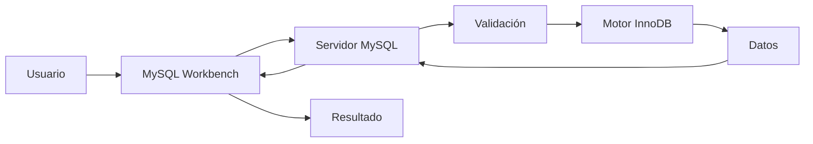

# Flujo de una consulta SQL

Hasta este momento hemos estudiado las herramientas que utilizaremos durante el curso y hemos conocido la arquitectura Cliente-Servidor sobre la que se basa MySQL. Ahora estamos en condiciones de responder una pregunta muy importante:

**¿Qué ocurre realmente cuando ejecutamos una consulta SQL?**

Aunque desde el punto de vista del usuario únicamente vemos una instrucción y una tabla con resultados, internamente se realizan numerosas operaciones en apenas unas milésimas de segundo.

Comprender este recorrido ayudará a entender mejor el funcionamiento de MySQL y facilitará el aprendizaje de los temas que abordaremos durante el resto del semestre.

### Paso 1. El usuario escribe la consulta

Todo comienza en una aplicación cliente.

Durante el curso utilizaremos principalmente ​**MySQL Workbench**​, aunque el mismo proceso ocurriría desde Visual Studio Code, una aplicación web o un programa desarrollado en cualquier lenguaje de programación.

Por ejemplo, escribimos la siguiente consulta:

```sql
SELECT nombre, ciudad
FROM clientes
WHERE ciudad = 'Santander';
```

En este momento la consulta todavía no ha sido ejecutada.

El cliente únicamente contiene un texto escrito por el usuario.

### Paso 2. El cliente envía la consulta

Cuando pulsamos el botón ​**Ejecutar**​, el cliente establece comunicación con el servidor MySQL.

La consulta viaja por la red utilizando el protocolo de comunicación de MySQL.

El cliente no interpreta el lenguaje SQL ni busca la información.

Su única responsabilidad consiste en enviar la petición y esperar la respuesta.

### Paso 3. El servidor valida la solicitud

Al recibir la consulta, MySQL realiza varias comprobaciones.

Entre ellas:

* Verifica que el usuario esté autenticado.
* Comprueba que posee permisos suficientes.
* Analiza la sintaxis SQL.
* Comprueba que existan las tablas y columnas utilizadas.

Si alguna de estas comprobaciones falla, el proceso termina y el servidor devuelve un mensaje de error.

### Paso 4. El motor de almacenamiento accede a los datos

Una vez validada la consulta, el motor de almacenamiento busca la información solicitada.

En nuestro curso utilizaremos el motor ​**InnoDB**​, que será el encargado de localizar los registros correspondientes dentro de la base de datos.

Este proceso es completamente transparente para el usuario.

### Paso 5. El servidor construye la respuesta

Con los datos obtenidos, el servidor prepara el resultado.

Dependiendo del tipo de consulta, puede devolver:

* Una tabla con registros.
* El número de filas afectadas.
* Un mensaje de confirmación.
* Un mensaje de error.

Toda esta información se envía nuevamente al cliente.

### Paso 6. El cliente presenta el resultado

Finalmente, MySQL Workbench recibe la respuesta y la muestra en pantalla.

El usuario únicamente observa el resultado final, aunque internamente se hayan realizado numerosas operaciones.

### Recorrido completo



Este recorrido será el mismo para prácticamente todas las consultas SQL que escribiremos durante el semestre.

### Caso práctico

Supongamos que un empleado de nuestra empresa desea consultar todos los clientes de la ciudad de Santander.

El empleado escribe la consulta en MySQL Workbench.

La consulta viaja hasta el servidor MySQL que está ejecutándose dentro del contenedor Docker.

El servidor verifica los permisos, busca los registros en la base de datos y devuelve únicamente aquellos clientes cuya ciudad sea ​**Santander**​.

Todo este proceso suele completarse en una fracción de segundo.

### Ideas clave

* Una consulta SQL siempre comienza en un cliente.
* El cliente envía la consulta al servidor; no la ejecuta.
* El servidor valida la sintaxis y los permisos antes de acceder a los datos.
* El motor de almacenamiento recupera la información solicitada.
* El resultado vuelve al cliente, que lo presenta al usuario.
* Comprender este flujo facilitará el estudio de todas las consultas SQL que realizaremos durante el curso.

