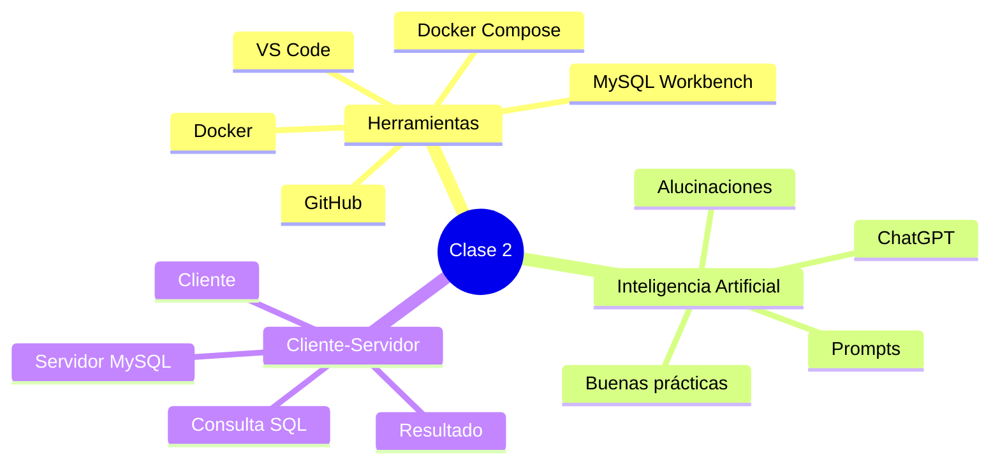

# Resumen

En esta segunda clase hemos preparado el entorno de trabajo y hemos conocido las herramientas que utilizaremos durante todo el semestre.

Comenzamos estudiando ​**Visual Studio Code**​, que será nuestro editor principal para trabajar con documentación, archivos de configuración y distintos lenguajes relacionados con el desarrollo de software.

Posteriormente conocimos ​**MySQL Workbench**​, la aplicación cliente desde la que administraremos el servidor MySQL y ejecutaremos nuestras consultas SQL.

A continuación introdujimos ​**Docker**​, una tecnología que permite ejecutar aplicaciones dentro de contenedores. Gracias a ella, todos los estudiantes trabajarán con el mismo entorno de desarrollo, evitando diferencias entre equipos. También vimos que utilizaremos **Docker Compose** para levantar automáticamente nuestro servidor MySQL mediante un archivo de configuración.

Después analizamos el papel de **GitHub** como repositorio oficial del curso. Todo el material docente estará organizado mediante directorios y archivos Markdown, lo que facilitará su consulta y actualización.

La segunda parte de la clase estuvo dedicada a la ​**Inteligencia Artificial Generativa**​. Aprendimos que herramientas como ChatGPT pueden convertirse en excelentes asistentes de aprendizaje siempre que se utilicen de forma responsable. También estudiamos sus limitaciones, el fenómeno de las alucinaciones y la importancia de formular buenos prompts para obtener respuestas de mayor calidad.

Finalmente nos adentramos en la arquitectura ​**Cliente-Servidor**​, comprendiendo cómo se comunican las aplicaciones con un servidor MySQL y cuál es el recorrido que sigue una consulta SQL desde que el usuario la escribe hasta que recibe el resultado.

Esta arquitectura será la base sobre la que construiremos todo el resto del curso.

### Mapa conceptual de la clase

### ¿Qué hemos aprendido?

Al finalizar esta clase deberías ser capaz de:

* Identificar las herramientas que utilizaremos durante el semestre.
* Explicar el propósito de Docker y Docker Compose.
* Comprender cómo se organiza el material del curso en GitHub.
* Utilizar ChatGPT como herramienta de apoyo al aprendizaje de forma responsable.
* Reconocer las limitaciones de los modelos de Inteligencia Artificial.
* Formular prompts más claros y efectivos.
* Explicar qué es una arquitectura Cliente-Servidor.
* Describir el recorrido completo de una consulta SQL.

### Preparación para la siguiente clase

En la próxima sesión comenzaremos a trabajar directamente con MySQL.

Crearemos nuestro primer entorno de trabajo, estableceremos conexiones con el servidor y empezaremos a utilizar el lenguaje SQL para interactuar con una base de datos real.

A partir de ese momento, todas las prácticas estarán basadas en la empresa comercial que nos acompañará durante el resto del curso.

### Ideas clave

* Las herramientas adecuadas facilitan el desarrollo de software y el aprendizaje.
* La Inteligencia Artificial debe complementar el razonamiento humano, no sustituirlo.
* MySQL utiliza una arquitectura Cliente-Servidor.
* Todas las consultas SQL siguen un flujo bien definido desde el cliente hasta el servidor y de regreso.
* Los conceptos introducidos en esta clase servirán como fundamento para el resto del curso.

