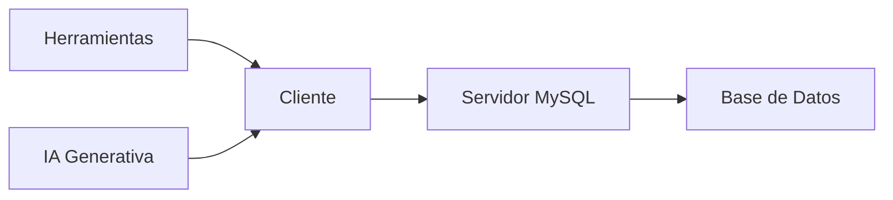

# Clase 2 — Herramientas del curso, Inteligencia Artificial y Arquitectura Cliente-Servidor

Bienvenidos a la segunda clase del curso.

En la primera sesión comprendimos qué es una base de datos, por qué surgieron los Sistemas Gestores de Bases de Datos (SGBD) y cuál será el recorrido que seguiremos durante el semestre.

Antes de comenzar a diseñar bases de datos y escribir consultas SQL necesitamos preparar nuestro entorno de trabajo. Además, es importante comprender cómo utilizaremos las herramientas informáticas que nos acompañarán durante todo el curso.

En esta clase instalaremos y conoceremos las principales herramientas que utilizaremos en las prácticas. También aprenderemos cómo aprovechar correctamente la Inteligencia Artificial como apoyo al aprendizaje, comprendiendo tanto sus ventajas como sus limitaciones.

Finalmente estudiaremos uno de los conceptos más importantes de toda la informática moderna: la arquitectura Cliente-Servidor. Aunque todavía no escribiremos consultas complejas, entenderemos cómo una aplicación logra comunicarse con un servidor de bases de datos y qué ocurre desde que escribimos una consulta SQL hasta que obtenemos el resultado.

Al finalizar esta sesión el estudiante comprenderá no solamente qué herramientas utilizará, sino también cómo todas ellas trabajan conjuntamente.

### Objetivos de aprendizaje

Al finalizar la clase el estudiante será capaz de:

* Preparar correctamente el entorno de trabajo.
* Comprender el propósito de Visual Studio Code.
* Comprender el papel de MySQL Workbench.
* Entender por qué Docker facilita el desarrollo de software.
* Utilizar GitHub como plataforma oficial del curso.
* Comprender qué es la Inteligencia Artificial Generativa.
* Utilizar ChatGPT como herramienta de aprendizaje responsable.
* Identificar las limitaciones de los modelos de IA.
* Comprender los principios básicos de la Ingeniería de Prompts.
* Entender qué significa una arquitectura Cliente-Servidor.
* Explicar cómo se comunica un cliente con un servidor MySQL.
* Comprender el recorrido completo de una consulta SQL.

### Contenido

1. [Herramientas del curso](01_herramientas_del_curso.md)
2. [Visual Studio Code](02_visual_studio_code.md)
3. [MySQL Workbench](03_mysql_workbench.md)
4. [Docker](04_docker.md)
5. [GitHub como material del curso](05_github_como_material_del_curso.md)
6. [Introducción a la IA Generativa](06_introduccion_a_la_ia_generativa.md)
7. [Buenas prácticas para usar ChatGPT](07_buenas_practicas_para_usar_chatgpt.md)
8. [Limitaciones y alucinaciones](08_limitaciones_y_alucinaciones.md)
9. [Ingeniería de Prompts básica](09_ingenieria_de_prompts_basica.md)
10. [¿Qué es un sistema Cliente-Servidor?](10_que_es_un_sistema_cliente_servidor.md)
11. [Arquitectura Cliente-Servidor en MySQL](11_arquitectura_cliente_servidor_en_mysql.md)
12. [Componentes del servidor MySQL](12_componentes_del_servidor_mysql.md)
13. [Flujo de una consulta SQL](13_flujo_de_una_consulta_sql.md)
14. [Resumen](14_resumen.md)

### Mapa conceptual

### Relación con el resto del curso

Esta clase conecta la introducción realizada en la sesión anterior con las primeras prácticas del laboratorio.

Las herramientas instaladas aquí serán utilizadas durante todo el semestre y la arquitectura Cliente-Servidor servirá como base para comprender el funcionamiento interno de MySQL cuando comencemos a crear bases de datos, tablas, usuarios y consultas SQL.

