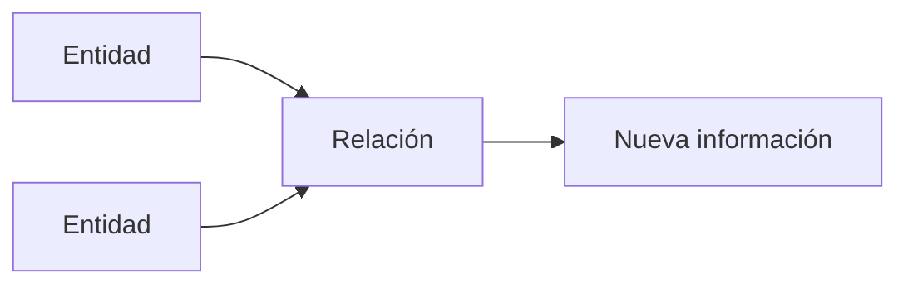

# Ejemplos de modelos relacionales

Después de estudiar los principios teóricos del Modelo Relacional es el momento de observar cómo se traducen en situaciones reales.

Uno de los errores más frecuentes entre los estudiantes consiste en pensar que una base de datos comienza escribiendo instrucciones SQL. En realidad, antes de escribir una sola línea de código debemos decidir qué información vamos a almacenar y cómo se relacionan los distintos elementos.

En este capítulo veremos varios ejemplos sencillos de modelos relacionales. No nos preocuparemos todavía por la sintaxis de MySQL; nuestro objetivo será comprender la estructura lógica de los datos.

### Ejemplo 1. Biblioteca

Imaginemos una pequeña biblioteca.

Necesitamos almacenar información sobre:

* Los libros.
* Los lectores.
* Los préstamos.

Podríamos comenzar identificando tres relaciones.

**Libros**

| IdLibro | Título    | Autor     |
| --------: | ------------ | ----------- |
|       1 | El Quijote | Cervantes |
|       2 | Fundación | Asimov    |

**Lectores**

| IdLector | Nombre |
| ---------: | -------- |
|        1 | Laura  |
|        2 | Sergio |

**Préstamos**

| IdPrestamo | IdLibro | IdLector | Fecha      |
| -----------: | --------: | ---------: | ------------ |
|        100 |       2 |        1 | 2026-09-12 |

Observemos que la tabla **Préstamos** conecta las otras dos mediante claves foráneas.

No almacena nuevamente el nombre del lector ni el título del libro.

Esto evita duplicar información.

### Ejemplo 2. Universidad

Una universidad necesita almacenar:

* Estudiantes.
* Asignaturas.
* Matrículas.

Las relaciones podrían ser:

```text
Estudiantes
------------
IdEstudiante
Nombre

Asignaturas
------------
IdAsignatura
Nombre

Matriculas
-----------
IdMatricula
IdEstudiante
IdAsignatura
Curso
```

Gracias a este diseño un estudiante puede matricularse en muchas asignaturas y una asignatura puede tener muchos estudiantes.

Más adelante veremos que este tipo de situación recibe el nombre de ​**relación muchos a muchos**​.

### Ejemplo 3. Hospital

Un hospital podría organizar su información mediante relaciones como:

```text
Pacientes

Médicos

Consultas

Especialidades

Recetas
```

Cada relación representa un conjunto homogéneo de información.

Las conexiones entre ellas permiten reconstruir toda la actividad del hospital.

### Un patrón común

Aunque pertenezcan a sectores completamente distintos, todos los ejemplos presentan la misma estructura.



Siempre aparecen tres ideas fundamentales:

* Entidades diferentes.
* Relaciones entre ellas.
* Identificadores únicos.

Este patrón se repetirá prácticamente en cualquier base de datos relacional.

### ¿Qué tienen en común?

Todos los ejemplos cumplen los principios estudiados hasta ahora.

* Cada relación representa un único tipo de información.
* Cada tupla describe un único elemento.
* Cada atributo tiene un significado concreto.
* Existen claves primarias.
* Las relaciones se establecen mediante claves foráneas.
* La información se almacena sin duplicaciones innecesarias.

Estos principios son independientes del tipo de aplicación.

### Caso práctico

Nuestra empresa comercial seguirá exactamente esta filosofía.

No construiremos una única tabla con toda la información.

En su lugar diseñaremos relaciones independientes para clientes, productos, empleados, proveedores, pedidos, líneas de pedido y facturas.

Posteriormente las conectaremos utilizando claves foráneas.

Este enfoque permitirá que la base de datos sea mucho más flexible, escalable y fácil de mantener.

### Ideas clave

* Todos los sistemas relacionales organizan la información mediante relaciones.
* Cada relación representa un único tipo de entidad.
* Las claves permiten conectar distintas relaciones.
* Evitar la duplicación de información simplifica el mantenimiento.
* El mismo modelo puede aplicarse a empresas, hospitales, universidades o cualquier otro sistema de información.

