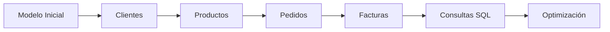

# Introducción al caso de estudio

A partir de esta clase comenzaremos a desarrollar un caso práctico que evolucionará durante todo el semestre.

En lugar de estudiar ejemplos aislados en cada tema, construiremos progresivamente una base de datos completa para una empresa comercial ficticia.

Este enfoque permitirá comprender cómo todas las piezas del Modelo Relacional encajan entre sí y cómo un diseño bien realizado facilita el desarrollo de aplicaciones reales.

### La empresa

Nuestra empresa se dedica a la venta de productos tecnológicos tanto en tiendas físicas como a través de Internet.

Su actividad diaria incluye:

* Registrar clientes.
* Gestionar empleados.
* Controlar el inventario.
* Comprar mercancía a proveedores.
* Recibir pedidos.
* Emitir facturas.
* Gestionar pagos.

Inicialmente la empresa es pequeña, pero esperamos que crezca durante los próximos años.

Por tanto, la base de datos deberá estar preparada para evolucionar sin necesidad de ser rediseñada continuamente.

### ¿Qué información almacenaremos?

En las próximas semanas identificaremos progresivamente las principales entidades del negocio.

Entre ellas:

```text
Clientes

Productos

Categorías

Proveedores

Empleados

Pedidos

Facturas

Pagos

Almacenes
```

Cada nueva clase incorporará nuevas relaciones al modelo.

Este crecimiento progresivo simulará el desarrollo real de un proyecto informático.

### ¿Qué aprenderemos con este caso?

El mismo caso práctico nos permitirá estudiar prácticamente todos los contenidos de la asignatura.

Por ejemplo:

* Diseño conceptual.
* Modelo Entidad-Relación.
* Transformación al Modelo Relacional.
* Creación de tablas.
* Claves primarias.
* Claves foráneas.
* Restricciones.
* Consultas SQL.
* Inserción y modificación de datos.
* Optimización básica.

En lugar de memorizar conceptos aislados, los veremos aparecer de forma natural durante el desarrollo del proyecto.

### Evolución del sistema

La base de datos no se construirá de una sola vez.

Cada bloque del curso añadirá nuevas funcionalidades.



Este crecimiento gradual reproduce el ciclo de vida habitual de muchos proyectos empresariales.

### Una metodología profesional

Durante el desarrollo del caso seguiremos el mismo orden que utilizaría un equipo profesional.

Primero analizaremos el problema.

Después diseñaremos el modelo.

Más adelante construiremos la base de datos.

Solo cuando la estructura sea correcta comenzaremos a escribir consultas SQL.

Este orden evitará muchos errores habituales en proyectos reales.

### Ideas clave

* Durante todo el semestre desarrollaremos un único caso práctico.
* La empresa comercial evolucionará progresivamente conforme avancemos en el curso.
* Cada nuevo tema ampliará el modelo anterior.
* El objetivo es aprender el proceso completo de diseño e implementación de una base de datos.
* Este enfoque permitirá comprender cómo se desarrolla un proyecto profesional desde sus primeras etapas.

