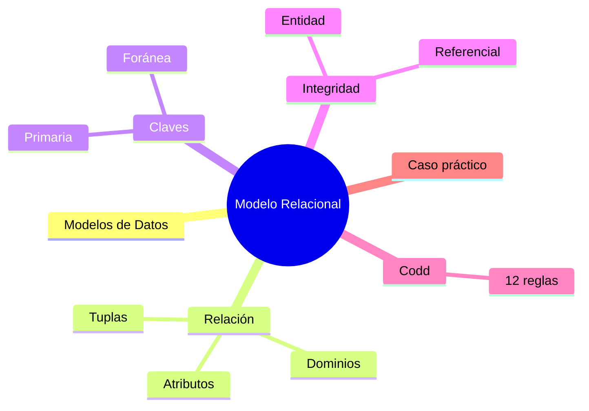

# Resumen

En esta tercera clase hemos estudiado uno de los pilares fundamentales de toda la asignatura: el ​**Modelo Relacional**​.

Comenzamos comprendiendo qué es un modelo de datos y por qué resulta imprescindible antes de construir cualquier base de datos. Vimos que un modelo no pretende copiar toda la realidad, sino representar únicamente la información necesaria para resolver un problema concreto.

A continuación analizamos la evolución histórica de los modelos de datos y descubrimos cómo la propuesta de Edgar F. Codd revolucionó el almacenamiento de información al introducir una organización basada en relaciones y en sólidos fundamentos matemáticos.

Posteriormente aprendimos la terminología propia del Modelo Relacional. Diferenciamos relaciones, tuplas y atributos, estudiamos el concepto de dominio y comprendimos la importancia de las distintas clases de claves para identificar registros y establecer conexiones entre tablas.

También analizamos las dos reglas fundamentales de integridad:

* ​**Integridad de entidad**​, que garantiza la identificación única de cada registro.
* ​**Integridad referencial**​, que asegura la coherencia de las relaciones entre distintas tablas.

Uno de los bloques más importantes de la clase estuvo dedicado a las ​**doce reglas de Codd**​, entendidas no como una lista para memorizar, sino como los principios que dieron forma a las bases de datos relacionales modernas.

Finalmente comprobamos que estos principios continúan presentes en gestores actuales como MySQL y aplicamos todos estos conceptos a distintos ejemplos antes de presentar el caso práctico que desarrollaremos durante el resto del semestre.

### Mapa conceptual

### ¿Qué hemos aprendido?

Al finalizar esta clase deberías ser capaz de:

* Explicar qué es un modelo de datos.
* Comprender las ventajas del Modelo Relacional.
* Diferenciar relaciones, tuplas y atributos.
* Definir correctamente un dominio.
* Identificar distintos tipos de claves.
* Explicar las reglas de integridad del Modelo Relacional.
* Comprender el propósito de las reglas de Codd.
* Analizar un modelo relacional sencillo.
* Identificar las entidades principales de una empresa comercial.

### Preparación para la siguiente clase

En la próxima sesión comenzaremos a estudiar el ​**Modelo Entidad-Relación (ER)**​.

Aprenderemos a identificar entidades, atributos y relaciones a partir de problemas del mundo real y utilizaremos diagramas para representar visualmente el diseño de una base de datos antes de transformarlo en un modelo relacional.

Esta será la primera etapa del proceso de diseño que utilizan los profesionales antes de implementar una base de datos en MySQL.

### Ideas clave

* El Modelo Relacional constituye la base de la mayoría de las bases de datos empresariales actuales.
* Un buen diseño comienza mucho antes de escribir instrucciones SQL.
* Las claves y las restricciones de integridad garantizan la calidad de los datos.
* Las reglas de Codd siguen siendo la referencia conceptual de los SGBD relacionales modernos.
* A partir de la próxima clase comenzaremos el diseño formal de nuestra propia base de datos.

