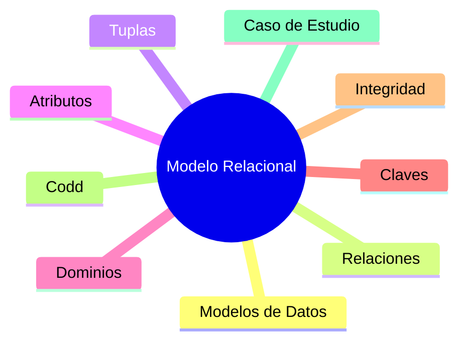

# Clase 3 — Introducción al Modelo Relacional

En las clases anteriores hemos conocido qué es una base de datos, qué problemas resuelve y cuáles serán las herramientas que utilizaremos durante el curso. También hemos preparado nuestro entorno de trabajo y comprendido cómo se comunican las aplicaciones con un servidor MySQL mediante una arquitectura Cliente-Servidor.

Ha llegado el momento de estudiar el verdadero protagonista de esta asignatura: ​**el Modelo Relacional**​.

Aunque hoy en día existen numerosos modelos de bases de datos, el modelo relacional continúa siendo el más utilizado en sistemas empresariales, aplicaciones financieras, comercio electrónico, administración pública y un gran número de aplicaciones críticas.

En esta clase descubriremos por qué fue necesario crear modelos de datos, cuáles son los conceptos fundamentales del Modelo Relacional propuesto por Edgar F. Codd y qué principios siguen utilizando los gestores de bases de datos modernos.

También comenzaremos a desarrollar el caso práctico que nos acompañará durante el resto del semestre: el diseño de la base de datos de una empresa comercial.

### Objetivos de aprendizaje

Al finalizar esta clase el estudiante será capaz de:

* Comprender qué es un modelo de datos.
* Explicar por qué existen distintos modelos de bases de datos.
* Identificar los elementos fundamentales del Modelo Relacional.
* Diferenciar relaciones, tuplas y atributos.
* Comprender el concepto de dominio.
* Explicar el papel de las claves.
* Entender las reglas de integridad del modelo relacional.
* Conocer las doce reglas propuestas por Edgar F. Codd.
* Relacionar dichas reglas con los SGBD actuales.
* Analizar un modelo relacional sencillo.
* Comprender el caso práctico que se desarrollará durante el curso.

### Contenido

1. [¿Qué es un modelo de datos?](01_que_es_un_modelo_de_datos.md)
2. [¿Por qué existen los modelos de datos?](02_por_que_existen_los_modelos_de_datos.md)
3. [El Modelo Relacional](03_modelo_relacional.md)
4. [Relaciones, tuplas y atributos](04_relaciones_tuplas_y_atributos.md)
5. [Dominios](05_dominios.md)
6. [Claves](06_claves.md)
7. [Integridad de entidad](07_integridad_de_entidad.md)
8. [Integridad referencial](08_integridad_referencial.md)
9. [Las doce reglas de Codd](09_las_12_reglas_de_codd.md)
10. [Codd en los SGBD modernos](10_codd_en_los_sgbd_modernos.md)
11. [Ejemplos de modelos relacionales](11_ejemplos_de_modelos_relacionales.md)
12. [Introducción al caso de estudio](12_introduccion_al_caso_de_estudio.md)
13. [Resumen](13_resumen.md)

### Mapa conceptual

### Relación con el resto del curso

Esta es probablemente la clase más importante de todo el bloque teórico inicial.

Los conceptos introducidos aquí aparecerán continuamente durante el resto del semestre. Antes de crear tablas, escribir consultas SQL o diseñar diagramas Entidad-Relación, es imprescindible comprender los principios sobre los que se construyen las bases de datos relacionales.

Al finalizar esta clase estaremos preparados para comenzar el diseño de bases de datos reales.

