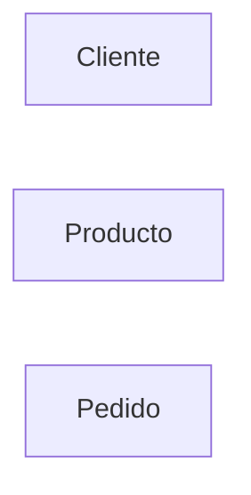

# Entidades

Una vez que comprendemos el problema que queremos resolver, el siguiente paso consiste en identificar ​**qué elementos del mundo real son importantes para nuestro sistema**​.

No toda la información que existe en una empresa debe almacenarse en una base de datos. Debemos seleccionar únicamente aquello que resulta relevante para el funcionamiento del negocio.

En el Modelo Entidad-Relación, estos elementos reciben el nombre de ​**entidades**​.

Las entidades constituyen los bloques fundamentales sobre los que construiremos toda la base de datos.

### ¿Qué es una entidad?

Una entidad es cualquier objeto, persona, lugar, concepto o acontecimiento sobre el que necesitamos almacenar información.

Una entidad debe tener identidad propia y poder distinguirse de las demás.

Por ejemplo, en una empresa comercial encontramos entidades como:

* Cliente
* Producto
* Empleado
* Proveedor
* Pedido
* Factura

Cada una representa un conjunto de objetos del mismo tipo.

### Entidad frente a instancia

Es importante distinguir entre la entidad y sus instancias.

La entidad representa una categoría general.

Una instancia representa un elemento concreto de esa categoría.

Por ejemplo:

| Entidad  | Instancia           |
| ---------- | --------------------- |
| Cliente  | Ana López          |
| Cliente  | Carlos Ruiz         |
| Producto | Monitor 27"         |
| Producto | Ratón inalámbrico |

Cuando dibujamos un diagrama ER representamos ​**entidades**​, no instancias individuales.

### ¿Cómo identificar entidades?

Una técnica muy utilizada durante el análisis consiste en leer la descripción del problema y buscar los ​**sustantivos**​.

Supongamos el siguiente texto:

> "Los clientes realizan pedidos que contienen productos suministrados por proveedores."

Los sustantivos principales son:

* Clientes
* Pedidos
* Productos
* Proveedores

Estos candidatos deberán analizarse para decidir si realmente serán entidades.

No todos los sustantivos terminan convirtiéndose en entidades, pero esta técnica constituye un excelente punto de partida.

### ¿Qué no suele ser una entidad?

No todo merece convertirse en una entidad independiente.

Por ejemplo, en una tienda:

* El nombre del cliente no es una entidad.
* El precio de un producto no es una entidad.
* La fecha de un pedido no es una entidad.

Estos elementos describen otras entidades y, por tanto, normalmente serán atributos.

### Representación gráfica

En el Modelo Entidad-Relación clásico, las entidades se representan mediante rectángulos.



Más adelante añadiremos atributos y relaciones a estos rectángulos.

### Caso práctico

Analizando nuestra empresa comercial podemos identificar inicialmente las siguientes entidades principales:

```text
Cliente

Producto

Empleado

Proveedor

Pedido

Factura

Categoría

Almacén
```

Durante las próximas clases este conjunto crecerá conforme aparezcan nuevas necesidades del negocio.

### Errores frecuentes

Los estudiantes suelen cometer algunos errores al identificar entidades.

Por ejemplo:

* Convertir cualquier sustantivo en una entidad.
* Crear entidades demasiado generales.
* Crear entidades duplicadas con nombres distintos.
* Confundir entidades con atributos.

Estos errores desaparecen con la práctica y con un buen conocimiento del negocio que se desea modelar.

### Ideas clave

* Una entidad representa un objeto sobre el que necesitamos almacenar información.
* Debe poseer identidad propia.
* Las entidades representan categorías, no objetos individuales.
* Los sustantivos del enunciado suelen ayudar a identificar entidades.
* Las entidades constituyen la base de cualquier diagrama ER.

