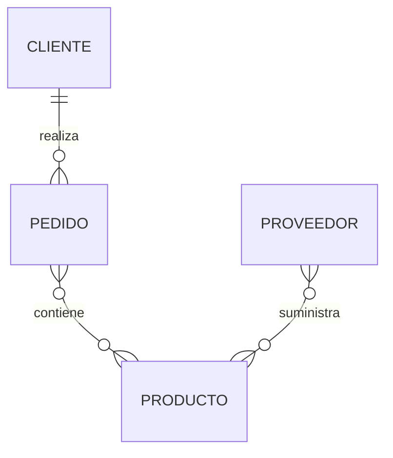

# Ejemplos paso a paso

Hasta este momento hemos estudiado los componentes del Modelo Entidad-Relación de forma individual. Sabemos qué son las entidades, los atributos, los identificadores y las relaciones.

Ahora ha llegado el momento de combinarlos para resolver un problema real.

En este capítulo construiremos un pequeño modelo conceptual paso a paso, siguiendo el mismo procedimiento que utilizaría un analista durante las primeras reuniones con un cliente.

El objetivo no es obtener un diagrama perfecto desde el primer intento, sino aprender el proceso de razonamiento que conduce a un buen diseño.

### Paso 1. Leer el problema

Todo proyecto comienza con una descripción del negocio.

Supongamos que nuestro cliente nos dice lo siguiente:

> "Nuestra empresa vende productos tecnológicos. Los clientes realizan pedidos. Cada pedido contiene uno o varios productos. Los productos son suministrados por proveedores."

Todavía no hablamos de tablas ni de SQL.

Simplemente estamos intentando comprender cómo funciona la empresa.

### Paso 2. Buscar las entidades

Una técnica muy útil consiste en localizar los principales sustantivos del texto.

En nuestro ejemplo aparecen:

* Clientes
* Productos
* Pedidos
* Proveedores

Estos serán nuestros primeros candidatos a entidades.

No significa que todos terminen formando parte del modelo definitivo, pero constituyen un excelente punto de partida.

### Paso 3. Buscar los atributos

A continuación preguntamos qué información necesita almacenar la empresa sobre cada entidad.

Por ejemplo:

**Cliente**

* IdCliente
* Nombre
* Apellidos
* Teléfono
* Correo electrónico

**Producto**

* IdProducto
* Nombre
* Precio
* Stock

**Proveedor**

* IdProveedor
* Nombre
* Teléfono

Observemos que todavía evitamos preocuparnos por los tipos de datos.

### Paso 4. Identificar las relaciones

Ahora buscamos los verbos que conectan las entidades.

En nuestro enunciado encontramos:

* El cliente **realiza** pedidos.
* El pedido **contiene** productos.
* El proveedor **suministra** productos.

Ya podemos comenzar a visualizar el modelo.

Este diagrama todavía es muy sencillo, pero ya representa correctamente las relaciones fundamentales del negocio.

### Paso 5. Revisar el modelo

Una vez construido el primer borrador debemos comprobar si responde correctamente a preguntas como:

* ¿Puede existir un cliente sin pedidos?
* ¿Puede un pedido contener varios productos?
* ¿Puede un producto tener varios proveedores?
* ¿Hemos olvidado alguna entidad importante?

Estas preguntas suelen descubrir errores o necesidades que no aparecían en la descripción inicial.

### El modelo nunca nace perfecto

Es importante comprender que un modelo conceptual es un documento vivo.

Durante las reuniones con el cliente aparecerán nuevos requisitos.

Por ejemplo:

* Los productos pertenecen a categorías.
* Existen almacenes.
* Algunos pedidos pueden cancelarse.
* Los empleados gestionan los pedidos.

Cada nuevo requisito hará evolucionar el diagrama.

Esto no significa que el diseño anterior fuera incorrecto.

Significa que ahora conocemos mejor el negocio.

### Caso práctico

A partir de este punto utilizaremos siempre el mismo modelo de empresa comercial.

Cada nueva clase añadirá nuevas entidades, atributos y relaciones, exactamente igual que sucede en un proyecto profesional.

Cuando terminemos el semestre, el estudiante habrá construido una base de datos completa partiendo únicamente de una descripción inicial del negocio.

### Ideas clave

* El modelado comienza analizando el problema, no escribiendo código.
* Las entidades suelen identificarse a partir de los sustantivos.
* Las relaciones suelen descubrirse analizando los verbos.
* El primer diagrama es un borrador que evolucionará con el proyecto.
* Un buen modelo conceptual mejora conforme aumenta el conocimiento del negocio.

