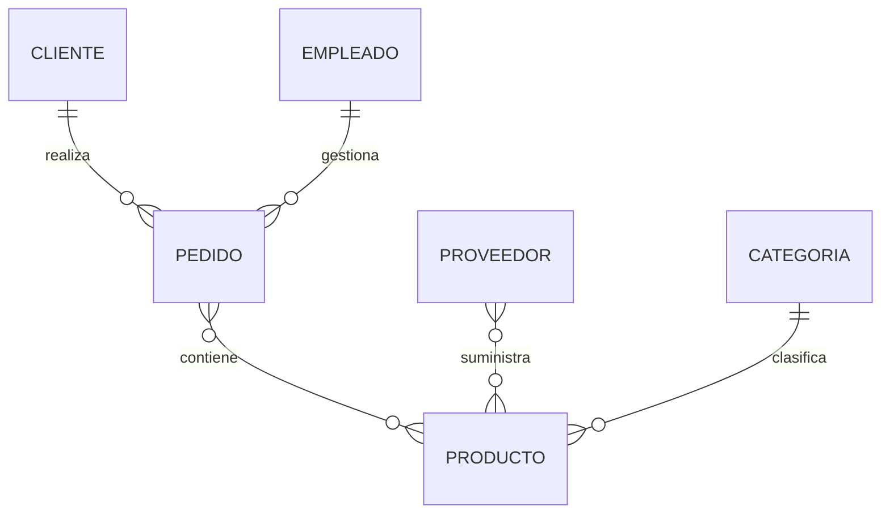

# Construcción del primer diagrama

En el capítulo anterior aprendimos a identificar los elementos principales de un problema.

Ahora construiremos nuestro **primer diagrama Entidad-Relación completo** para la empresa comercial que utilizaremos durante el resto del curso.

No será el modelo definitivo. Su objetivo consiste en representar únicamente la estructura principal del negocio sobre la que iremos trabajando en las próximas clases.

### Paso 1. Identificar las entidades principales

Después de varias reuniones con la empresa hemos decidido comenzar con las siguientes entidades:

* Cliente
* Pedido
* Producto
* Proveedor
* Categoría
* Empleado

Estas entidades representan el núcleo del negocio.

Más adelante añadiremos facturas, pagos, almacenes, inventario y otros elementos.

### Paso 2. Asignar atributos básicos

Cada entidad necesita un conjunto mínimo de atributos.

```text
Cliente
--------
IdCliente
Nombre
Apellidos
Email

Producto
---------
IdProducto
Nombre
Precio
Stock

Pedido
-------
IdPedido
Fecha
Estado

Proveedor
----------
IdProveedor
Nombre

Empleado
---------
IdEmpleado
Nombre

Categoría
----------
IdCategoria
Nombre
```

En este momento evitamos añadir demasiados atributos.

El objetivo es construir primero la estructura general.

### Paso 3. Definir las relaciones

Analizando el funcionamiento de la empresa obtenemos las siguientes relaciones:

* Un cliente realiza pedidos.
* Un empleado gestiona pedidos.
* Un pedido contiene productos.
* Un proveedor suministra productos.
* Un producto pertenece a una categoría.

Estas relaciones constituyen la columna vertebral del modelo.

### Primer diagrama ER



Aunque sencillo, este diagrama ya permite comprender gran parte del funcionamiento de la empresa.

### Analizando el modelo

A partir del diagrama podemos responder numerosas preguntas.

Por ejemplo:

* ¿Quién realizó un pedido?
* ¿Qué empleado lo gestionó?
* ¿Qué productos contiene?
* ¿Qué proveedor suministra cada producto?
* ¿A qué categoría pertenece un producto?

El diagrama no almacena datos.

Almacena ​**conocimiento sobre el negocio**​.

Esa es precisamente la función del modelo conceptual.

### Lo que todavía falta

Nuestro modelo inicial presenta algunas limitaciones.

Por ejemplo:

* No representa los atributos gráficamente.
* No diferencia todavía las entidades débiles.
* No aparecen las cardinalidades exactas de todas las relaciones.
* No refleja reglas más complejas del negocio.

Todo ello se incorporará progresivamente en las próximas clases.

Este crecimiento gradual es exactamente el que se sigue en proyectos reales.

### Del diagrama al modelo relacional

Una vez que el cliente apruebe el diagrama, podremos comenzar la siguiente fase.

Consistirá en transformar cada entidad en una relación del Modelo Relacional.

Posteriormente esas relaciones se convertirán en tablas de MySQL mediante instrucciones SQL.

Gracias a este proceso ordenado reduciremos considerablemente la probabilidad de cometer errores de diseño.

### Ideas clave

* Un diagrama ER representa la estructura lógica del negocio.
* El primer modelo debe ser sencillo y fácil de comprender.
* Es preferible comenzar con pocas entidades e ir ampliándolo progresivamente.
* El diagrama conceptual servirá como base para construir posteriormente el modelo relacional.
* A partir de este momento, todas las ampliaciones del caso de estudio partirán de este primer diagrama.

