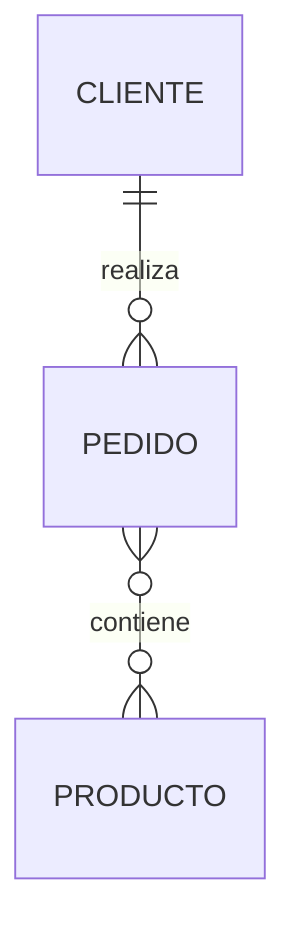

# Herramientas de modelado

Una vez que hemos aprendido a construir un diagrama Entidad-Relación surge una pregunta natural:

**¿Con qué herramientas se diseñan estos diagramas en un entorno profesional?**

En teoría, un diagrama ER puede dibujarse incluso con lápiz y papel. De hecho, durante las primeras reuniones con un cliente es habitual utilizar una pizarra o una hoja para representar rápidamente las ideas principales.

Sin embargo, cuando el proyecto crece, resulta imprescindible utilizar herramientas especializadas que permitan modificar el modelo fácilmente, documentarlo y compartirlo con el resto del equipo.

### ¿Qué debe ofrecer una buena herramienta?

No todas las aplicaciones de modelado tienen las mismas características.

Una herramienta profesional debería permitir:

* Dibujar diagramas de forma sencilla.
* Modificar el modelo rápidamente.
* Organizar proyectos grandes.
* Exportar diagramas a distintos formatos.
* Compartir el diseño con otros miembros del equipo.
* En algunos casos, generar automáticamente el modelo relacional.

No existe una herramienta perfecta para todos los proyectos.

La elección dependerá del tamaño del sistema, del presupuesto y del flujo de trabajo del equipo.

### Herramientas más utilizadas

A continuación se muestran algunas de las aplicaciones más conocidas.

| Herramienta            | Características principales                        |
| ------------------------ | ----------------------------------------------------- |
| MySQL Workbench        | Modelado e implementación de bases de datos MySQL. |
| draw.io (diagrams.net) | Diagramas generales y ER sencillos.                 |
| Visual Paradigm        | Modelado UML y bases de datos.                      |
| ERDPlus                | Herramienta educativa para diagramas ER.            |
| Lucidchart             | Diagramas colaborativos en línea.                  |

Cada una presenta ventajas e inconvenientes.

Durante este curso utilizaremos principalmente ​**MySQL Workbench**​, ya que además de diseñar diagramas permite generar posteriormente las tablas de la base de datos.

### MySQL Workbench

En la clase anterior instalamos MySQL Workbench como cliente gráfico para conectarnos al servidor.

Sin embargo, esta aplicación ofrece muchas más funcionalidades.

Entre ellas:

* Diseño de diagramas ER.
* Ingeniería directa (​*Forward Engineering*​), que genera automáticamente el código SQL a partir del modelo.
* Ingeniería inversa (​*Reverse Engineering*​), que crea un diagrama a partir de una base de datos existente.
* Documentación del esquema.

Esto la convierte en una herramienta muy adecuada para aprender el proceso completo de diseño e implementación.

### Diagramas como documentación

Un error frecuente consiste en pensar que el diagrama solo sirve durante el diseño inicial.

En realidad, los diagramas forman parte de la documentación técnica del proyecto.

Cuando un nuevo desarrollador se incorpora al equipo, el diagrama ER le permite comprender la estructura de la base de datos en pocos minutos.

Por ello, mantener el modelo actualizado es una buena práctica profesional.

### ¿Utilizaremos Mermaid?

Sí.

A lo largo del libro utilizaremos **Mermaid** para representar pequeños diagramas directamente en Markdown.

Por ejemplo:

Mermaid no sustituye a una herramienta profesional, pero resulta excelente para documentar proyectos en GitHub y explicar conceptos durante las clases.

### Caso práctico

Durante las próximas sesiones construiremos el modelo completo de la empresa comercial utilizando MySQL Workbench.

Además, todos los materiales del curso mostrarán versiones simplificadas de esos diagramas mediante Mermaid para facilitar su lectura desde GitHub.

### Ideas clave

* Existen numerosas herramientas para diseñar diagramas ER.
* MySQL Workbench será la principal herramienta práctica del curso.
* Los diagramas constituyen documentación técnica del proyecto.
* Mermaid es una excelente opción para documentar modelos en Markdown.
* Un buen diagrama debe ser fácil de leer y mantener.

