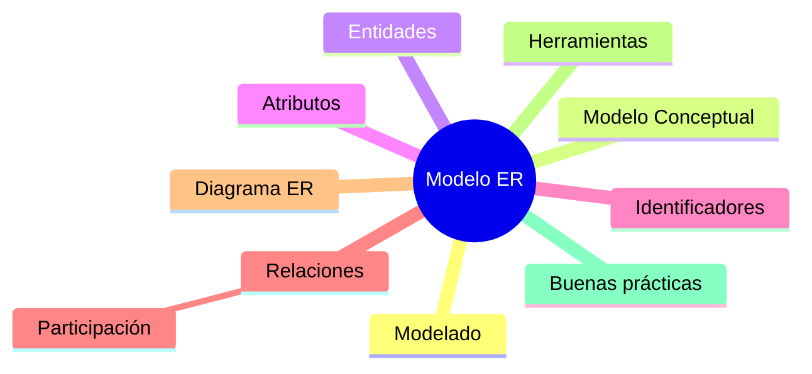

# Resumen

En esta clase hemos dado el primer paso hacia el diseño profesional de bases de datos.

Hasta ahora conocíamos el Modelo Relacional y sus fundamentos teóricos. A partir de esta sesión hemos aprendido cómo analizar un problema real antes de comenzar la implementación.

Comenzamos comprendiendo por qué el modelado es una fase imprescindible dentro del desarrollo de software y cómo un buen diseño reduce errores, costes de mantenimiento y futuras modificaciones.

Posteriormente estudiamos el ​**Modelo Entidad-Relación**​, el lenguaje conceptual más utilizado para representar la información de un negocio de forma independiente de cualquier tecnología concreta.

A continuación analizamos los elementos fundamentales del modelo:

* Entidades.
* Atributos.
* Identificadores.
* Entidades fuertes y débiles.
* Relaciones.
* Participación.

Después aplicamos todos estos conceptos al caso práctico de la empresa comercial, construyendo nuestro primer diagrama Entidad-Relación y comprendiendo cómo evolucionará durante el resto del semestre.

Finalmente conocimos las herramientas que utilizaremos para modelar bases de datos y revisamos un conjunto de buenas prácticas empleadas habitualmente en proyectos profesionales.

### Mapa conceptual

### ¿Qué hemos aprendido?

Al finalizar esta clase deberías ser capaz de:

* Explicar por qué una base de datos debe modelarse antes de implementarse.
* Identificar entidades y atributos en un problema real.
* Seleccionar identificadores adecuados.
* Diferenciar entidades fuertes y débiles.
* Descubrir relaciones entre entidades.
* Interpretar la participación de una entidad en una relación.
* Construir un diagrama ER sencillo.
* Utilizar herramientas básicas de modelado.
* Aplicar buenas prácticas durante el diseño conceptual.

### Preparación para la siguiente clase

En la próxima clase profundizaremos en los diagramas Entidad-Relación estudiando aspectos más avanzados, como las ​**cardinalidades**​, las ​**relaciones recursivas**​, las ​**relaciones ternarias**​, los **atributos multivalorados** y la transformación del modelo conceptual en un modelo relacional.

A partir de ese momento nuestro caso de estudio comenzará a parecerse cada vez más a una base de datos empresarial real.

### Ideas clave

* El Modelo Entidad-Relación constituye la herramienta estándar para el diseño conceptual de bases de datos.
* Un buen análisis del negocio facilita enormemente la implementación posterior.
* Las entidades y las relaciones describen la estructura del sistema antes de escribir código.
* Los diagramas ER sirven tanto para diseñar como para documentar una base de datos.
* El modelo conceptual será la base sobre la que construiremos el resto del curso.

