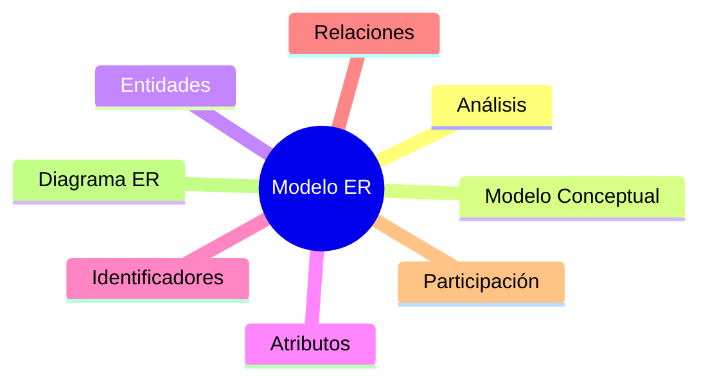

# README.md

# Clase 4 — Modelo Entidad-Relación (ER): del problema al diseño

Hasta ahora hemos estudiado el Modelo Relacional y comprendido cómo se organiza la información mediante relaciones, atributos y claves. Sin embargo, todavía no hemos respondido a una pregunta esencial:

**¿Cómo diseñamos una base de datos antes de crear las tablas?**

En el desarrollo profesional de software, las bases de datos no se construyen directamente escribiendo instrucciones SQL. Antes es necesario analizar el problema, identificar la información importante y representar ese conocimiento mediante un modelo conceptual.

El ​**Modelo Entidad-Relación (ER)**​, propuesto por Peter Chen en 1976, proporciona precisamente ese lenguaje de diseño.

Durante esta clase aprenderemos a identificar entidades, atributos, identificadores y relaciones, y construiremos el primer diagrama conceptual de la empresa comercial que nos acompañará durante todo el curso.

### Objetivos de aprendizaje

Al finalizar esta clase el estudiante será capaz de:

* Comprender la importancia del modelado previo al desarrollo.
* Explicar qué es un modelo conceptual.
* Identificar entidades dentro de un problema real.
* Diferenciar atributos e identificadores.
* Distinguir entidades fuertes y débiles.
* Representar relaciones entre entidades.
* Comprender la participación de las entidades en una relación.
* Construir diagramas Entidad-Relación sencillos.
* Utilizar herramientas de modelado.
* Aplicar buenas prácticas durante el diseño conceptual.

### Contenido

1. [¿Por qué modelar antes de programar?](01_por_que_modelar_antes_de_programar.md)
2. [¿Qué es un modelo conceptual?](02_que_es_un_modelo_conceptual.md)
3. [Entidades](03_entidades.md)
4. [Atributos](04_atributos.md)
5. [Identificadores](05_identificadores.md)
6. [Entidades fuertes y débiles](06_entidades_fuertes_y_debiles.md)
7. [Relaciones](07_relaciones.md)
8. [Participación](08_participacion.md)
9. [Ejemplos paso a paso](09_ejemplos_paso_a_paso.md)
10. [Construcción del primer diagrama](10_construccion_del_primer_diagrama.md)
11. [Herramientas de modelado](11_herramientas_de_modelado.md)
12. [Buenas prácticas](12_buenas_practicas.md)
13. [Resumen](13_resumen.md)

### Mapa conceptual

### Relación con el resto del curso

Esta clase constituye el puente entre el análisis de requisitos y la implementación de una base de datos.

En las siguientes sesiones aprenderemos a transformar los diagramas Entidad-Relación en modelos relacionales y, posteriormente, en tablas reales de MySQL utilizando SQL.

El diagrama construido en esta clase evolucionará durante todo el semestre conforme la empresa comercial incorpore nuevas necesidades.

