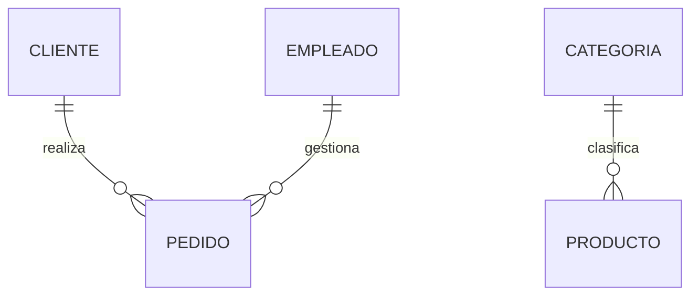

# Cardinalidad uno a muchos

Si tuviéramos que elegir una única cardinalidad como la más utilizada en bases de datos relacionales, probablemente sería la ​**relación uno a muchos (1:N)**​.

La inmensa mayoría de las aplicaciones empresariales están construidas alrededor de este tipo de relación.

Clientes y pedidos, departamentos y empleados, categorías y productos o profesores y asignaturas son solo algunos ejemplos.

Comprender correctamente esta cardinalidad resulta fundamental, ya que más adelante se transformará directamente en **claves foráneas** dentro del modelo relacional.

### ¿Qué significa uno a muchos?

Una relación uno a muchos indica que:

* Una instancia de la primera entidad puede relacionarse con muchas instancias de la segunda.
* Cada instancia de la segunda entidad solo puede relacionarse con una instancia de la primera.

La relación no es simétrica.

Cada lado desempeña un papel diferente.

### Ejemplo de la empresa comercial

Consideremos la relación entre clientes y pedidos.

Un cliente puede realizar numerosos pedidos a lo largo del tiempo.

Sin embargo, un pedido pertenece únicamente a un cliente.


Esta es una relación ​**1:N**​.

### Analizando el ejemplo

Imaginemos la siguiente situación.

| Cliente      | Pedidos       |
| -------------- | --------------- |
| Ana López   | 101, 105, 120 |
| Carlos Ruiz  | 106           |
| Laura Pérez | Ninguno       |

Observamos que:

* Un cliente puede no haber realizado todavía ningún pedido.
* Otro cliente puede haber realizado cientos de pedidos.
* Cada pedido pertenece exclusivamente a un cliente.

La relación sigue siendo uno a muchos.

### Otros ejemplos habituales

Este tipo de cardinalidad aparece constantemente en los sistemas de información.

| Entidad 1    | Entidad 2 |
| -------------- | ----------- |
| Categoría   | Productos |
| Departamento | Empleados |
| País        | Ciudades  |
| Editorial    | Libros    |
| Profesor     | Tutorías |

En todos estos casos existe una entidad "principal" que agrupa a muchas entidades "dependientes".

### ¿Cómo se implementará más adelante?

Aunque todavía no hemos llegado al Modelo Relacional, conviene adelantar una idea importante.

Una relación 1:N terminará convirtiéndose en una **clave foránea** situada en el lado "muchos".

Por ejemplo:

```text
CLIENTE

IdCliente
Nombre
...

PEDIDO

IdPedido
Fecha
IdCliente
```

El identificador del cliente aparecerá dentro del pedido.

Más adelante estudiaremos con detalle por qué ocurre esto.

### ¿Puede existir el lado "uno" sin el lado "muchos"?

Depende de las reglas del negocio.

Un cliente puede existir sin pedidos.

Una categoría puede existir antes de que tenga productos.

Un departamento puede crearse antes de contratar empleados.

Estas situaciones dependerán de la participación, concepto que ya estudiamos en la clase anterior.

### Caso práctico

Nuestro modelo inicial contiene varias relaciones uno a muchos.



Estas relaciones permanecerán prácticamente inalteradas durante todo el curso.

### Errores frecuentes

Uno de los errores más comunes consiste en invertir los lados de la relación.

Por ejemplo:

❌ Un pedido tiene muchos clientes.

✔ Un cliente tiene muchos pedidos.

Antes de establecer una cardinalidad conviene formular la relación en ambos sentidos.

Si una de las frases deja de tener sentido, probablemente hayamos invertido la relación.

### Ideas clave

* La relación uno a muchos es la más frecuente en bases de datos.
* Una entidad puede relacionarse con muchas instancias de otra.
* Cada instancia del lado "muchos" pertenece únicamente a una del lado "uno".
* En el modelo relacional dará lugar a una clave foránea.
* Analizar correctamente el negocio evita invertir la cardinalidad.

