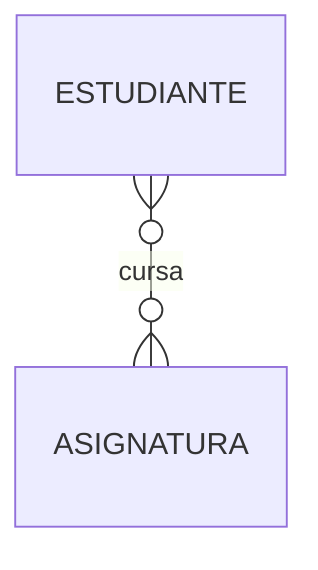
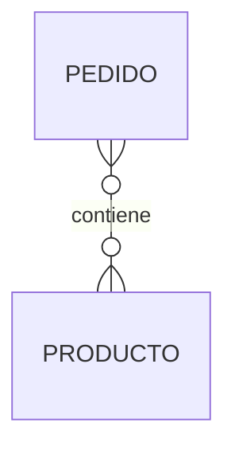
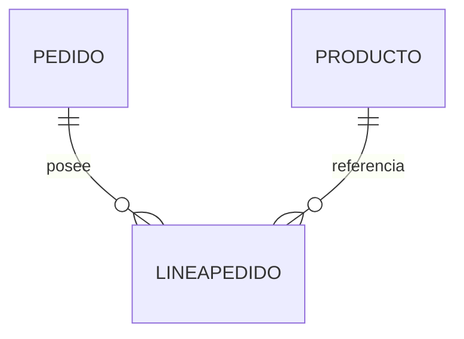

# Cardinalidad muchos a muchos

Después de estudiar las relaciones uno a uno y uno a muchos, llegamos a la tercera gran cardinalidad: ​**muchos a muchos (N:M)**​.

Este tipo de relación aparece cuando varias instancias de una entidad pueden relacionarse con varias instancias de otra.

Aunque conceptualmente resulta muy natural, veremos más adelante que las bases de datos relacionales no la implementan directamente.

### ¿Qué significa muchos a muchos?

Una relación muchos a muchos indica que:

* Una instancia de la primera entidad puede relacionarse con muchas instancias de la segunda.
* Una instancia de la segunda también puede relacionarse con muchas instancias de la primera.

Ambos lados presentan múltiples asociaciones.

### Ejemplo clásico

Pensemos en estudiantes y asignaturas.

Un estudiante cursa varias asignaturas.

Cada asignatura tiene muchos estudiantes.

Esta relación es claramente muchos a muchos.

### Caso de la empresa comercial

En nuestra empresa encontramos un ejemplo muy conocido.

Un pedido contiene varios productos.

Al mismo tiempo, un mismo producto puede aparecer en muchos pedidos distintos.

También se trata de una relación N:M.

### ¿Por qué supone un problema?

Imaginemos el siguiente caso.

Pedido 101

* Monitor
* Ratón
* Teclado

Pedido 102

* Ratón
* Webcam

¿Cómo almacenaríamos esta información?

Si añadimos muchos productos dentro del pedido, romperíamos la estructura del modelo relacional.

Si añadimos muchos pedidos dentro del producto, ocurriría exactamente lo mismo.

Necesitamos otra solución.

### La entidad asociativa

La respuesta consiste en crear una nueva entidad.

En lugar de conectar directamente pedidos y productos, introducimos una entidad llamada ​**LíneaPedido**​.

Ahora cada línea representa un único producto dentro de un pedido.

Además, podremos añadir nuevos atributos como:

* Cantidad.
* Precio de venta.
* Descuento.
* IVA aplicado.

Este diseño es mucho más flexible.

### Una idea importante

Siempre que encontremos una relación muchos a muchos debemos preguntarnos:

> ¿Existe realmente una entidad intermedia?

En la mayoría de aplicaciones reales la respuesta será sí.

La entidad intermedia suele representar un hecho del negocio y no una simple solución técnica.

### Caso práctico

Nuestro modelo conceptual evolucionará próximamente para incorporar la entidad ​**LíneaPedido**​, eliminando así la relación directa entre Pedido y Producto.

Esta será una de las primeras transformaciones importantes que realizaremos antes de implementar la base de datos.

### Errores frecuentes

Los estudiantes suelen intentar mantener relaciones N:M hasta la implementación en SQL.

Sin embargo, un modelo relacional no permite representar directamente este tipo de cardinalidad.

Siempre será necesario transformarla mediante una entidad intermedia.

### Ideas clave

* Una relación muchos a muchos conecta múltiples instancias en ambos sentidos.
* Es muy habitual en los modelos conceptuales.
* No puede implementarse directamente en una base de datos relacional.
* Normalmente se transforma en una entidad asociativa.
* La entidad intermedia suele almacenar información adicional sobre la relación.

