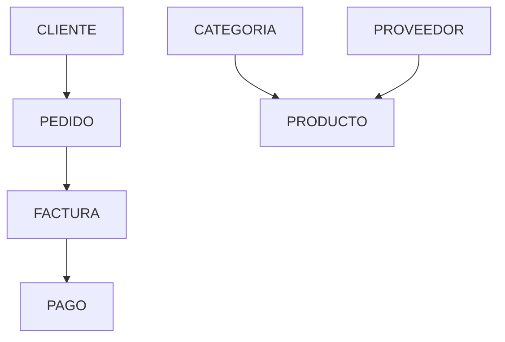

# Dependencias del negocio

Hasta ahora hemos aprendido a identificar entidades, atributos, relaciones y cardinalidades. Sin embargo, un modelo conceptual todavía puede ser incorrecto aunque todos esos elementos parezcan razonables.

¿Por qué?

Porque una base de datos no solo almacena información: también debe respetar las ​**dependencias del negocio**​.

Estas dependencias describen cómo unos datos condicionan la existencia o el comportamiento de otros.

Comprenderlas es una de las tareas más importantes durante el análisis de requisitos.

### ¿Qué es una dependencia del negocio?

Una dependencia del negocio expresa que un elemento del sistema necesita de otro para tener sentido o para cumplir una determinada regla.

Por ejemplo:

* Un pedido depende de un cliente.
* Una factura depende de un pedido.
* Una línea de pedido depende de un pedido.
* Un producto depende de una categoría.

Estas dependencias no son decisiones técnicas, sino consecuencias del funcionamiento de la empresa.

### Dependencias de existencia

Algunas entidades solo pueden existir si previamente existe otra.

Por ejemplo:

```text
Pedido
↓

Cliente
```

No podemos registrar un pedido si el cliente todavía no existe.

Lo mismo ocurre con una factura.

Antes debe existir el pedido que origina esa factura.

### Dependencias funcionales del negocio

Existen también dependencias relacionadas con la lógica de la empresa.

Por ejemplo:

* El precio de venta depende del producto vendido.
* El descuento depende de la promoción aplicada.
* El IVA depende del tipo de producto.

Estas reglas deberán respetarse posteriormente durante el desarrollo de la aplicación.

### Dependencias temporales

Algunas operaciones deben realizarse siguiendo un orden determinado.

Por ejemplo:

```text
Registrar cliente

↓

Crear pedido

↓

Emitir factura

↓

Registrar pago
```

Intentar invertir este orden produciría situaciones incoherentes.

No tendría sentido emitir una factura antes de que exista el pedido correspondiente.

### Caso práctico

En nuestra empresa comercial aparecen numerosas dependencias.



Este diagrama no representa cardinalidades.

Representa la dependencia lógica existente entre distintos procesos del negocio.

### ¿Por qué son importantes?

Las dependencias ayudan a responder preguntas como:

* ¿Qué ocurre si eliminamos un cliente?
* ¿Puede existir una factura sin pedido?
* ¿Qué información debe registrarse primero?
* ¿Qué datos dependen de otros?

Responder correctamente a estas preguntas evitará numerosos errores de diseño.

### Ideas clave

* Las dependencias describen cómo unos elementos del negocio condicionan a otros.
* Pueden ser de existencia, funcionales o temporales.
* Deben descubrirse durante el análisis del negocio.
* Un buen modelo conceptual refleja estas dependencias.
* Comprenderlas facilitará el diseño del modelo relacional.

