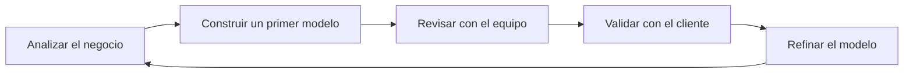

# Refinamiento del modelo

Pocas veces un modelo conceptual nace perfecto desde el primer intento.

En la práctica, el diseño de una base de datos es un proceso iterativo. Cada nueva reunión con el cliente, cada cambio en los requisitos y cada revisión del equipo aportan información adicional que obliga a mejorar el modelo.

Este proceso continuo recibe el nombre de ​**refinamiento del modelo**​.

Refinar no significa empezar de nuevo.

Significa mejorar progresivamente un diseño existente hasta que represente de forma precisa el funcionamiento del negocio.

### Un proceso iterativo

El refinamiento suele seguir un ciclo como el siguiente:

Cada iteración mejora la calidad del diseño y reduce la probabilidad de cometer errores durante la implementación.

### ¿Qué suele cambiar?

Durante el refinamiento pueden aparecer muchas modificaciones.

Por ejemplo:

* Incorporar nuevas entidades.
* Eliminar entidades innecesarias.
* Añadir atributos.
* Cambiar identificadores.
* Corregir cardinalidades.
* Descubrir nuevas reglas de negocio.
* Dividir una entidad demasiado grande en varias entidades más pequeñas.

Estos cambios son normales y no deben interpretarse como un fracaso del diseño inicial.

### Refinando nuestro caso de estudio

Recordemos el primer modelo de la empresa comercial.

Inicialmente estaba formado por:

* Cliente
* Producto
* Pedido
* Proveedor
* Categoría
* Empleado

Conforme hemos avanzado en el análisis ya hemos descubierto algunas mejoras:

* La relación entre **Pedido** y **Producto** deberá convertirse en una entidad asociativa (​**LíneaPedido**​).
* Será necesario incorporar una entidad ​**Factura**​.
* Más adelante aparecerán ​**Pagos**​, **Almacenes** e ​**Inventario**​.
* Algunas relaciones necesitarán nuevas restricciones de participación e integridad.

Nuestro modelo está evolucionando exactamente igual que lo haría en un proyecto real.

### ¿Cuándo termina el refinamiento?

Nunca existe un momento en el que un sistema deje completamente de evolucionar.

Incluso una vez que la aplicación está en producción pueden aparecer nuevas necesidades:

* Nuevos productos.
* Nuevas formas de pago.
* Nuevas normativas legales.
* Nuevos procesos de negocio.

Por ello, un buen diseño debe ser flexible y facilitar futuras ampliaciones.

### Preparación para la siguiente etapa

Después de varias iteraciones, llegará el momento de transformar el modelo conceptual en un ​**Modelo Relacional**​.

Cada entidad se convertirá en una relación (tabla), los identificadores pasarán a ser claves primarias y las relaciones se implementarán mediante claves foráneas.

Este será el siguiente gran paso del curso.

### Ideas clave

* El refinamiento consiste en mejorar progresivamente un modelo conceptual.
* Los cambios durante el análisis son normales y esperables.
* Un buen modelo evoluciona junto con el conocimiento del negocio.
* El objetivo es llegar a un diseño claro, consistente y preparado para crecer.
* El modelo refinado será la base para construir posteriormente la base de datos relacional.

