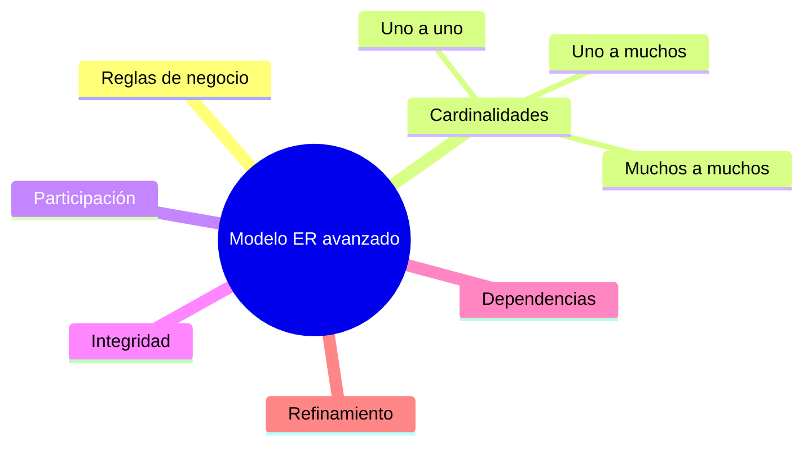

# Resumen

En esta clase hemos completado el estudio del Modelo Entidad-Relación incorporando uno de sus aspectos más importantes: las ​**reglas de negocio**​.

Hemos comprobado que un diagrama ER no es únicamente un conjunto de entidades y relaciones. Su verdadero objetivo consiste en representar el funcionamiento real de una organización, incluyendo las restricciones y normas que condicionan sus procesos.

Comenzamos definiendo qué es una regla de negocio y cómo se obtiene durante el análisis de requisitos. Posteriormente estudiamos las tres cardinalidades fundamentales:

* Uno a uno (1:1).
* Uno a muchos (1:N).
* Muchos a muchos (N:M).

También profundizamos en el concepto de participación y analizamos cómo las dependencias del negocio influyen en el diseño del modelo.

A continuación introdujimos las reglas básicas de integridad y vimos cómo ayudan a mantener la calidad y consistencia de los datos.

Finalmente revisamos ejemplos reales, aprendimos a detectar errores frecuentes y comprendimos que el diseño de una base de datos es un proceso iterativo en el que el modelo se refina progresivamente hasta representar fielmente el negocio.

### Mapa conceptual

### ¿Qué hemos aprendido?

Al finalizar esta clase deberías ser capaz de:

* Explicar qué es una regla de negocio.
* Diferenciar las cardinalidades 1:1, 1:N y N:M.
* Interpretar correctamente la participación de una entidad en una relación.
* Identificar dependencias entre procesos y entidades.
* Comprender las principales reglas de integridad.
* Detectar errores habituales en diagramas ER.
* Revisar y refinar un modelo conceptual antes de implementarlo.

### Preparación para la siguiente clase

En la próxima sesión comenzaremos la transformación del Modelo Entidad-Relación al ​**Modelo Relacional**​. Aprenderemos cómo convertir entidades en tablas, atributos en columnas, identificadores en claves primarias y relaciones en claves foráneas.

Ese será el paso que conectará definitivamente el análisis conceptual con la implementación en MySQL.

### Ideas clave

* Las reglas de negocio son el fundamento de un buen diseño de bases de datos.
* Las cardinalidades describen cómo se relacionan las entidades.
* La integridad garantiza que la información represente correctamente la realidad.
* Todo modelo debe revisarse y refinarse antes de implementarse.
* El modelo conceptual constituye la base sobre la que construiremos la base de datos relacional durante el resto del curso.

