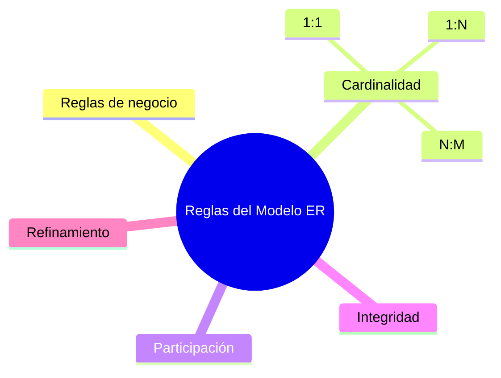

# README.md

# Clase 5 — Reglas de negocio, cardinalidades e integridad del Modelo Entidad-Relación

En la clase anterior aprendimos a construir un primer diagrama Entidad-Relación identificando entidades, atributos, identificadores y relaciones. Sin embargo, un diagrama formado únicamente por estos elementos todavía resulta insuficiente para describir con precisión el funcionamiento de una empresa.

Dos negocios pueden tener exactamente las mismas entidades y, aun así, funcionar de forma completamente distinta debido a sus **reglas de negocio**.

Por ejemplo, dos tiendas pueden gestionar clientes, productos y pedidos. Sin embargo, una puede permitir que un producto tenga varios proveedores mientras que otra solo admite uno. Una empresa puede exigir que todos los pedidos estén asociados a un cliente registrado, mientras que otra permite realizar compras como invitado.

Estas diferencias no son detalles de programación, sino reglas propias del negocio que deben quedar reflejadas en el modelo conceptual.

Durante esta clase aprenderemos a representar esas reglas mediante cardinalidades, participación y restricciones de integridad. También veremos cómo detectar errores habituales y cómo mejorar progresivamente un modelo hasta obtener un diseño sólido y coherente.

### Objetivos de aprendizaje

Al finalizar esta clase el estudiante será capaz de:

* Comprender qué es una regla de negocio.
* Interpretar correctamente las cardinalidades de una relación.
* Diferenciar relaciones uno a uno, uno a muchos y muchos a muchos.
* Comprender la diferencia entre cardinalidad y participación.
* Identificar dependencias propias del negocio.
* Aplicar reglas básicas de integridad durante el diseño conceptual.
* Detectar errores frecuentes en diagramas ER.
* Refinar un modelo conceptual antes de transformarlo al modelo relacional.

### Contenido

1. [¿Qué es una regla de negocio?](01_que_es_una_regla_de_negocio.md)
2. [Cardinalidad uno a uno](02_cardinalidad_uno_a_uno.md)
3. [Cardinalidad uno a muchos](03_cardinalidad_uno_a_muchos.md)
4. [Cardinalidad muchos a muchos](04_cardinalidad_muchos_a_muchos.md)
5. [Participación total y parcial](05_participacion_total_y_parcial.md)
6. [Dependencias del negocio](06_dependencias_del_negocio.md)
7. [Reglas de integridad](07_reglas_de_integridad.md)
8. [Casos reales](08_casos_reales.md)
9. [Errores frecuentes](09_errores_frecuentes.md)
10. [Cómo detectar errores](10_como_detectar_errores.md)
11. [Refinamiento del modelo](11_refinamiento_del_modelo.md)
12. [Resumen](12_resumen.md)

### Mapa conceptual

### Relación con el resto del curso

Esta clase completa el estudio del Modelo Entidad-Relación iniciado en la sesión anterior.

Una vez comprendidas las reglas del negocio y las cardinalidades, estaremos preparados para transformar nuestros diagramas conceptuales en modelos relacionales y, posteriormente, en tablas reales de MySQL.

El diagrama de la empresa comercial continuará evolucionando hasta convertirse en la base de datos completa del caso de estudio.
