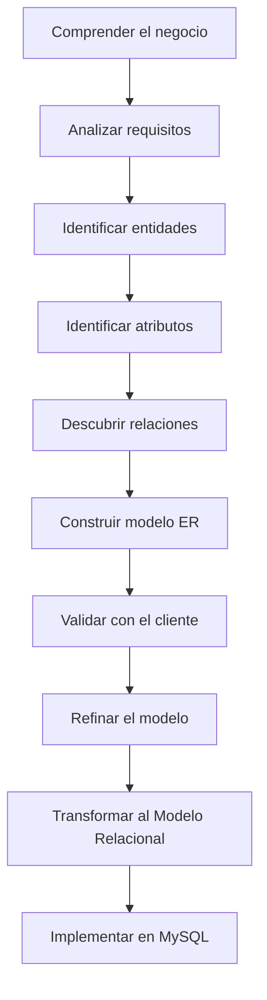

# Metodología de diseño

Cuando observamos una base de datos terminada es fácil pensar que el diseñador simplemente creó unas cuantas tablas y comenzó a almacenar información.

La realidad es muy distinta.

Las bases de datos profesionales son el resultado de un proceso de análisis y diseño cuidadosamente planificado. Saltarse alguno de sus pasos suele traducirse en errores difíciles de corregir más adelante.

Por este motivo, antes de aprender nuevas técnicas de modelado, es importante conocer la metodología que seguiremos durante todo el curso.

### ¿Qué es una metodología?

Una metodología es un conjunto organizado de pasos que permiten resolver un problema de forma sistemática.

No se trata de una receta rígida que deba seguirse siempre exactamente igual.

Cada proyecto es diferente.

Sin embargo, disponer de una metodología reduce enormemente la probabilidad de olvidar aspectos importantes del análisis.

### ¿Por qué no empezar directamente por SQL?

Es una tentación muy habitual.

Muchos estudiantes piensan que diseñar una base de datos consiste simplemente en escribir instrucciones como:

```sql
CREATE TABLE Cliente (...);

CREATE TABLE Producto (...);

CREATE TABLE Pedido (...);
```

El problema es que, si todavía no comprendemos el negocio, esas tablas probablemente serán incorrectas.

Una mala decisión tomada al principio puede obligar a reconstruir toda la base de datos meses después.

### Las fases del diseño

En este curso seguiremos siempre el mismo procedimiento.



Cada fase utiliza el resultado de la anterior.

Intentar alterar este orden suele producir modelos incompletos o inconsistentes.

### Un proceso iterativo

Aunque el diagrama anterior parece lineal, el diseño rara vez avanza únicamente hacia delante.

Es frecuente descubrir nueva información durante una reunión con el cliente y tener que regresar a fases anteriores.

Por ejemplo:

* aparece una nueva entidad;
* cambia una regla de negocio;
* una relación necesita otra cardinalidad;
* un atributo deja de ser necesario.

Lejos de ser un problema, estas iteraciones forman parte del trabajo habitual de un analista.

### El papel del cliente

Una metodología de diseño no consiste únicamente en dibujar diagramas.

También implica mantener una comunicación constante con quienes conocen el negocio.

Ellos son quienes pueden responder preguntas como:

* ¿Puede un cliente realizar varios pedidos?
* ¿Puede existir un pedido sin productos?
* ¿Quién autoriza una devolución?
* ¿Qué ocurre cuando un proveedor deja de trabajar con la empresa?

Cada respuesta mejora el modelo.

### Caso práctico

En nuestro proyecto de la empresa comercial aplicaremos esta metodología durante todo el semestre.

No añadiremos nuevas entidades porque sí.

Cada modificación deberá justificarse mediante una necesidad real del negocio.

De este modo, el modelo crecerá de forma ordenada y coherente, igual que ocurre en los proyectos profesionales.

### Ideas clave

* Diseñar una base de datos es un proceso, no una única tarea.
* La metodología reduce errores y mejora la calidad del modelo.
* Nunca debe comenzarse directamente por SQL.
* El análisis y la validación son tan importantes como la implementación.
* Un buen diseño evoluciona mediante sucesivas iteraciones.

