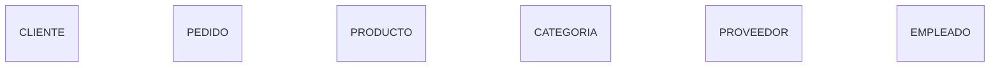

# Identificación de entidades

Una vez comprendido el problema del negocio, llega el momento de identificar los principales objetos sobre los que la organización necesita almacenar información.

Estos objetos se convertirán en las **entidades** de nuestro modelo conceptual.

Aunque el concepto de entidad ya fue estudiado en la clase anterior, ahora aprenderemos una metodología práctica para descubrirlas de forma sistemática durante el análisis de requisitos.

### ¿Dónde aparecen las entidades?

La mayoría de las entidades pueden localizarse analizando la documentación del negocio o las entrevistas realizadas con los usuarios.

Un método muy utilizado consiste en buscar los **sustantivos** del lenguaje natural.

Por ejemplo:

> "Los clientes realizan pedidos que contienen productos suministrados por proveedores."

Los sustantivos destacados son:

* Cliente
* Pedido
* Producto
* Proveedor

Todos ellos son candidatos naturales a convertirse en entidades.

No obstante, todavía debemos analizarlos antes de aceptarlos.

### No todos los sustantivos son entidades

Este método proporciona una primera aproximación, pero no todos los sustantivos representan objetos independientes.

Consideremos la siguiente frase:

> "Cada cliente tiene un nombre, un teléfono y una dirección."

Los sustantivos son:

* Cliente
* Nombre
* Teléfono
* Dirección

Solo **Cliente** representa una entidad.

Los demás describen características del cliente y, por tanto, serán atributos.

### Preguntas que ayudan a descubrir entidades

Cuando exista alguna duda, podemos formular preguntas sencillas.

* ¿El objeto existe por sí mismo?
* ¿La empresa necesita almacenar varios ejemplos de él?
* ¿Tiene identidad propia?
* ¿Puede describirse mediante atributos?
* ¿Se relaciona con otras entidades?

Si la mayoría de respuestas son afirmativas, probablemente estemos ante una entidad.

### Ejemplo práctico

Supongamos que analizamos la siguiente descripción:

> "La empresa vende productos organizados en categorías. Los clientes realizan pedidos que son preparados por empleados."

Podemos identificar las siguientes entidades:

| Posible entidad | ¿Debe ser entidad? | Motivo                          |
| ----------------- | --------------------- | --------------------------------- |
| Cliente         | Sí                 | Representa personas diferentes. |
| Producto        | Sí                 | Se gestionan individualmente.   |
| Pedido          | Sí                 | Es un documento del negocio.    |
| Categoría      | Sí                 | Agrupa productos.               |
| Empleado        | Sí                 | Gestiona pedidos.               |

Ya disponemos del núcleo principal del modelo.

### Evitar entidades redundantes

Un error habitual consiste en crear varias entidades para representar exactamente el mismo concepto.

Por ejemplo:

* Cliente
* ClienteVIP
* ClienteHabitual

En muchos casos estas diferencias pueden representarse mediante un atributo, por ejemplo:

```text
TipoCliente
```

Solo cuando cada categoría posea comportamiento propio tendrá sentido separarlas en entidades distintas.

### Entidades futuras

Durante el análisis inicial no es necesario descubrir absolutamente todas las entidades.

Es perfectamente normal que aparezcan nuevas necesidades conforme avance el proyecto.

Por ejemplo, en nuestra empresa comercial todavía no hemos incorporado:

* Facturas.
* Pagos.
* Almacenes.
* Transportistas.
* Devoluciones.

Estas entidades aparecerán cuando el negocio requiera modelarlas.

### Caso práctico

El modelo inicial de nuestra empresa quedará formado por las siguientes entidades.



En las próximas clases este conjunto irá creciendo poco a poco.

### Ideas clave

* Las entidades representan los principales objetos del negocio.
* Los sustantivos del lenguaje natural ayudan a descubrirlas.
* No todos los sustantivos son entidades; muchos serán atributos.
* Cada entidad debe representar un único concepto.
* Es preferible comenzar con pocas entidades e ir ampliando el modelo progresivamente.

