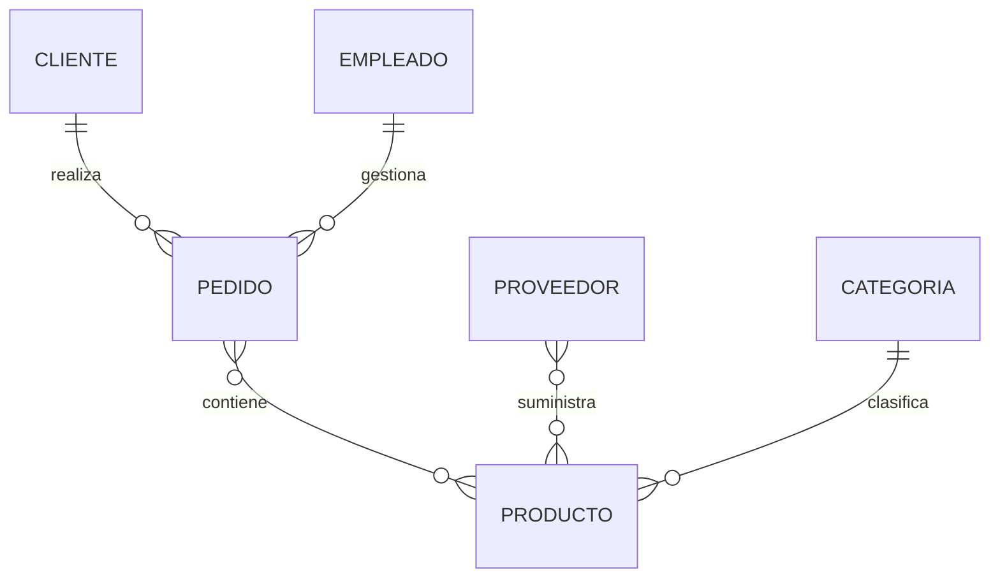

# Identificación de relaciones

Una vez identificadas las entidades, el siguiente paso consiste en descubrir cómo interactúan entre sí.

Estas interacciones reciben el nombre de ​**relaciones**​.

Sin relaciones tendríamos un conjunto de entidades aisladas incapaces de representar el funcionamiento real de una empresa.

Las relaciones son las que convierten un conjunto de objetos independientes en un verdadero modelo de datos.

### Buscar los verbos

Al igual que los sustantivos nos ayudaban a descubrir entidades, los verbos suelen indicar relaciones.

Por ejemplo:

> Los clientes **realizan** pedidos.

> Los pedidos **contienen** productos.

> Los proveedores **suministran** productos.

Cada verbo expresa una conexión entre dos entidades.

### Formular frases completas

Una técnica muy útil consiste en expresar las relaciones como oraciones sencillas.

Por ejemplo:

* Un cliente realiza pedidos.
* Un pedido contiene productos.
* Un empleado gestiona pedidos.
* Un proveedor suministra productos.

Si la frase resulta natural, probablemente la relación esté bien planteada.

### Determinar la cardinalidad

Después de descubrir la relación debemos responder otra pregunta.

¿Cuántas instancias pueden participar?

Por ejemplo:

* Un cliente puede realizar muchos pedidos.
* Un pedido pertenece a un único cliente.

La relación será:

Este razonamiento deberá repetirse para todas las relaciones del modelo.

### Evitar relaciones innecesarias

No todas las entidades deben relacionarse entre sí.

Por ejemplo, en nuestro modelo inicial no existe una relación directa entre **Proveedor** y ​**Cliente**​.

Aunque ambos participan en la actividad de la empresa, no interactúan directamente en los procesos que estamos modelando.

Añadir relaciones innecesarias complica el diagrama y dificulta su comprensión.

### Detectar relaciones ocultas

En ocasiones una relación no aparece explícitamente en la descripción inicial del negocio.

Por ejemplo:

> Un empleado registra un pedido.

Aunque esta frase no estuviera en los requisitos originales, podría descubrirse durante una entrevista con el cliente.

Por ello, el análisis debe mantenerse abierto a nueva información.

### Caso práctico

Nuestro modelo conceptual comienza a tomar forma.

En las siguientes clases este diagrama evolucionará hasta convertirse en la base de datos definitiva de la empresa.

### Ideas clave

* Las relaciones describen cómo interactúan las entidades.
* Los verbos del lenguaje natural ayudan a descubrirlas.
* Cada relación debe representar una necesidad real del negocio.
* Las cardinalidades completan la información de cada relación.
* Un buen modelo contiene únicamente las relaciones necesarias.
  

