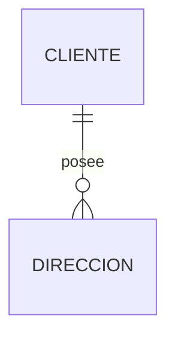
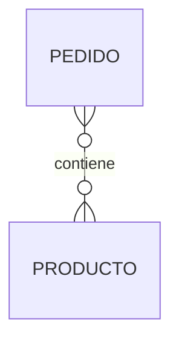
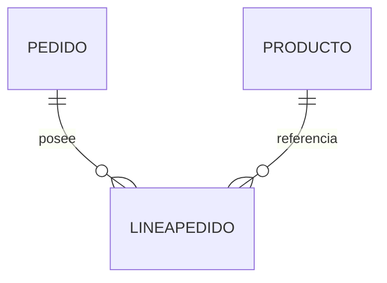

# Refactorización del diagrama

En programación existe un concepto muy conocido llamado ​**refactorización**​.

Consiste en mejorar el código sin modificar su comportamiento.

En el diseño de bases de datos ocurre algo muy parecido.

Podemos mejorar un diagrama Entidad-Relación sin cambiar las reglas del negocio que representa.

Este proceso recibe el nombre de ​**refactorización del modelo**​.

### ¿Por qué refactorizar?

Durante el análisis inicial solemos construir un modelo sencillo cuyo objetivo principal es comprender el problema.

Más adelante aparecen oportunidades de mejora.

Por ejemplo:

* Eliminar redundancias.
* Dividir entidades demasiado grandes.
* Simplificar relaciones.
* Mejorar la legibilidad.
* Preparar el modelo para futuras ampliaciones.

El comportamiento del sistema sigue siendo el mismo.

Lo que mejora es la calidad del diseño.

### Ejemplo

Supongamos que inicialmente diseñamos la siguiente entidad.

```text
Cliente

IdCliente
Nombre
Apellidos
Telefono
Correo
Calle
Numero
Ciudad
Provincia
CodigoPostal
Pais
```

Aunque el modelo funciona, resulta poco manejable.

Si la empresa desea almacenar varias direcciones por cliente, tendremos un problema.

Una posible refactorización consiste en crear una nueva entidad.



Ahora el modelo es mucho más flexible.

### Refactorizar relaciones

También pueden mejorarse las relaciones.

Recordemos la relación:



Sabemos que más adelante se convertirá en:



La información almacenada será la misma.

Sin embargo, el nuevo diseño resulta mucho más potente y permitirá incorporar atributos como:

* Cantidad.
* Precio de venta.
* Descuento.
* IVA.

### ¿Cuándo refactorizar?

Conviene plantearse una refactorización cuando:

* Una entidad acumula demasiados atributos.
* Existen relaciones difíciles de interpretar.
* Aparece información duplicada.
* El modelo resulta complicado de mantener.
* Surgen nuevos requisitos del negocio.

La refactorización no es un síntoma de fracaso.

Es una práctica habitual en proyectos profesionales.

### Caso práctico

Durante el resto del curso nuestro modelo sufrirá numerosas refactorizaciones.

Cada una tendrá un objetivo concreto:

* Mejorar la claridad.
* Eliminar redundancias.
* Facilitar la implementación.
* Preparar el modelo para nuevas funcionalidades.

Así trabajan realmente los equipos de desarrollo.

### Ideas clave

* Refactorizar significa mejorar el diseño sin alterar el funcionamiento del negocio.
* Las entidades y relaciones pueden reorganizarse para obtener un modelo más limpio.
* La refactorización facilita el mantenimiento y la evolución del sistema.
* Es una práctica habitual durante todo el ciclo de vida de una base de datos.
* Un modelo profesional evoluciona continuamente mediante pequeñas mejoras.

