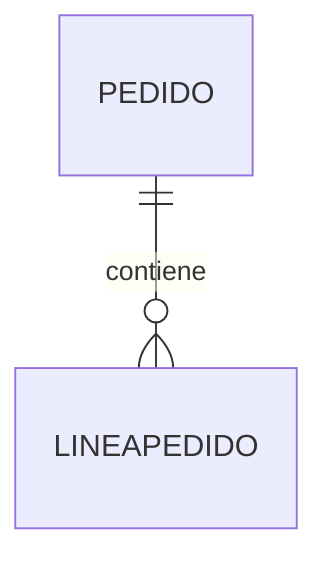
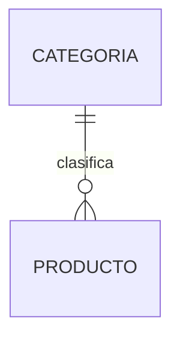

# Patrones de diseño frecuentes

Con la experiencia, los analistas descubren que muchos problemas de modelado se repiten una y otra vez.

Aunque cada empresa sea diferente, existen soluciones que aparecen con enorme frecuencia.

Estas soluciones reciben el nombre de ​**patrones de diseño**​.

Un patrón no es una regla obligatoria.

Es una solución que ha demostrado ser eficaz en numerosos proyectos similares.

Conocer estos patrones permite diseñar modelos de mayor calidad y detectar problemas con mayor rapidez.

### Patrón maestro-detalle

Es probablemente el patrón más utilizado en bases de datos empresariales.

Consiste en dividir una operación en dos entidades.

Una representa la información general.

La otra almacena los elementos individuales.

En nuestra empresa comercial aparece en los pedidos.

**Pedido** almacena la cabecera.

**LíneaPedido** almacena cada producto vendido.

Este patrón también aparece en:

* Factura → Líneas de factura.
* Compra → Líneas de compra.
* Albarán → Líneas de albarán.

### Patrón catálogo

Muchas aplicaciones necesitan gestionar listas relativamente estables.

Por ejemplo:

* Categorías.
* Provincias.
* Países.
* Métodos de pago.
* Estados de un pedido.

En lugar de repetir constantemente esos valores, se crea una entidad específica.

Este diseño evita duplicidades y facilita futuras modificaciones.

### Patrón persona-rol

En ocasiones una misma persona puede desempeñar varios papeles dentro del sistema.

Por ejemplo:

* Cliente.
* Proveedor.
* Empleado.

En sistemas complejos resulta habitual crear una entidad **Persona** y posteriormente especializarla mediante distintos roles.

Aunque nuestro caso de estudio todavía no necesita este patrón, es frecuente en aplicaciones de gran tamaño.

### Patrón histórico

Muchas empresas necesitan conservar información antigua.

Por ejemplo:

* Cambios de precio.
* Cambios de dirección.
* Historial laboral.
* Historial médico.

En lugar de sobrescribir los datos anteriores, se almacenan registros históricos.

Este patrón permite reconstruir el estado del sistema en cualquier momento del pasado.

### Caso práctico

Durante el desarrollo de nuestra empresa comercial utilizaremos varios de estos patrones.

Especialmente importantes serán:

* Maestro-detalle.
* Catálogo.
* Histórico.

Reconocerlos facilitará enormemente la comprensión del modelo.

### Ideas clave

* Los patrones de diseño son soluciones reutilizables a problemas habituales.
* No sustituyen al análisis del negocio.
* Ayudan a construir modelos más claros y mantenibles.
* Muchos sistemas empresariales utilizan los mismos patrones con pequeñas variaciones.
* Conocer estos patrones acelera el trabajo del analista.

