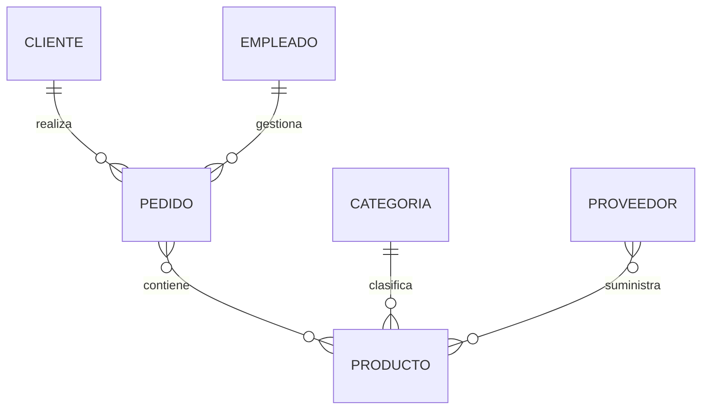

# Caso completo paso a paso

A lo largo de las clases anteriores hemos aprendido numerosas técnicas de modelado de forma independiente.

En este capítulo las utilizaremos conjuntamente para recorrer un proceso completo de análisis y diseño.

Nuestro objetivo será construir el primer modelo conceptual de la empresa comercial siguiendo exactamente la metodología aprendida en esta clase.

### Paso 1. Comprender el negocio

La empresa vende productos tecnológicos.

Los clientes realizan pedidos.

Los empleados preparan esos pedidos.

Los proveedores suministran los productos que posteriormente serán vendidos.

Esta descripción todavía no contiene ningún elemento técnico.

Solo describe el funcionamiento de la empresa.

### Paso 2. Identificar las entidades

A partir del análisis aparecen las siguientes entidades.

* Cliente.
* Pedido.
* Producto.
* Categoría.
* Proveedor.
* Empleado.

Estas entidades representan los principales objetos del negocio.

### Paso 3. Identificar atributos

Cada entidad necesita información propia.

Por ejemplo:

```text
Cliente

IdCliente
Nombre
Telefono
Correo

Producto

IdProducto
Nombre
Precio
Stock

Pedido

IdPedido
Fecha
Estado
```

Todavía es un modelo sencillo, pero suficiente para comenzar el diseño.

### Paso 4. Identificar relaciones

Ahora conectamos las entidades.



Ya disponemos de un primer diagrama funcional.

### Paso 5. Validar

Revisamos el modelo utilizando preguntas como:

* ¿Puede existir un pedido sin cliente?
* ¿Puede un producto pertenecer a varias categorías?
* ¿Puede un empleado gestionar muchos pedidos?

Las respuestas permiten corregir errores antes de continuar.

### Paso 6. Refinar

Durante la revisión descubrimos una mejora importante.

La relación muchos a muchos entre **Pedido** y **Producto** deberá transformarse posteriormente mediante una entidad ​**LíneaPedido**​.

También prevemos la incorporación futura de nuevas entidades como:

* Factura.
* Pago.
* Inventario.
* Almacén.

Nuestro modelo queda preparado para seguir creciendo.

### El resultado

Después de aplicar toda la metodología obtenemos un modelo mucho más sólido que si hubiéramos comenzado directamente escribiendo código SQL.

Además, todas las decisiones están justificadas mediante reglas del negocio, lo que facilitará enormemente las siguientes fases del curso.

### Ideas clave

* Un buen modelo surge de aplicar una metodología ordenada.
* Cada fase utiliza la información obtenida en la anterior.
* Validar y refinar son pasos imprescindibles.
* El primer modelo rara vez es el definitivo.
* La metodología aprendida podrá aplicarse a cualquier proyecto de bases de datos.

