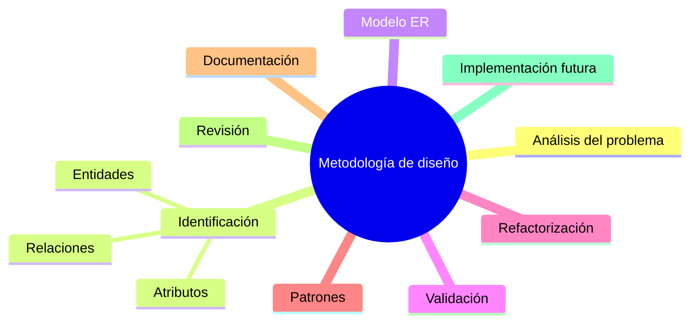

# Resumen

Con esta clase concluimos la fase de **análisis y diseño conceptual** del curso. A lo largo de las últimas sesiones hemos aprendido a comprender un problema, identificar los elementos fundamentales del negocio y representarlos mediante un modelo Entidad-Relación.

En esta ocasión hemos dado un paso más importante: hemos aprendido que diseñar una base de datos no consiste únicamente en dibujar entidades y relaciones, sino en seguir una **metodología de trabajo** que permita construir modelos correctos, comprensibles y fáciles de mantener.

Comenzamos estudiando la metodología general utilizada en proyectos profesionales, entendiendo que el diseño debe avanzar de forma ordenada desde el análisis del negocio hasta la implementación técnica.

Posteriormente vimos cómo analizar un problema antes de pensar en tablas o código SQL, aprendiendo a extraer información útil mediante entrevistas, documentación y observación de los procesos de la empresa.

Una vez comprendido el negocio, aprendimos a identificar correctamente las entidades, sus atributos y las relaciones que las conectan. También vimos que el primer modelo nunca debe considerarse definitivo y que resulta imprescindible validarlo junto con los expertos del negocio.

Después estudiamos la refactorización del modelo, entendiéndola como un proceso de mejora continua que aumenta la calidad del diseño sin modificar el comportamiento del sistema.

También conocimos algunos de los patrones de diseño más utilizados en bases de datos empresariales, como el patrón maestro-detalle, los catálogos y los historiales, comprobando que muchos problemas se resuelven mediante soluciones ya consolidadas en la industria.

Finalmente analizamos la importancia de documentar el modelo, revisar sistemáticamente todos sus elementos y preparar el diagrama para su transformación al Modelo Relacional.

Nuestro caso de estudio también ha evolucionado de forma significativa. Ya no se trata de un conjunto aislado de entidades, sino de un modelo coherente que representa el funcionamiento básico de una empresa comercial y que seguirá creciendo durante el resto del curso.

### Mapa conceptual

### Lo que deberías ser capaz de hacer

Al finalizar esta clase deberías poder:

* Explicar las fases del diseño de una base de datos profesional.
* Analizar un problema antes de comenzar el modelado.
* Identificar correctamente entidades, atributos y relaciones.
* Construir un primer diagrama Entidad-Relación coherente.
* Validar un modelo utilizando reglas del negocio.
* Detectar oportunidades de mejora mediante refactorización.
* Documentar adecuadamente un modelo conceptual.
* Revisar un diagrama antes de transformarlo al Modelo Relacional.

### Relación con las siguientes clases

Hasta este momento hemos trabajado exclusivamente en el ​**nivel conceptual**​, preocupándonos por representar correctamente la realidad del negocio.

A partir de la próxima clase comenzaremos una nueva etapa del curso: el ​**Modelo Relacional**​.

Aprenderemos cómo convertir cada uno de los elementos del diagrama Entidad-Relación en estructuras concretas de una base de datos:

* Las entidades se transformarán en tablas.
* Los atributos se convertirán en columnas.
* Los identificadores pasarán a ser claves primarias.
* Las relaciones se implementarán mediante claves foráneas.
* Las cardinalidades se traducirán en restricciones dentro del sistema gestor de bases de datos.

Este será el momento en el que el análisis conceptual comenzará a convertirse en una implementación real sobre MySQL.

### Ideas clave

* El diseño de bases de datos es un proceso metodológico, no una tarea improvisada.
* Comprender el negocio es más importante que escribir código SQL.
* El modelo conceptual debe validarse y refinarse antes de implementarse.
* La documentación es parte esencial del diseño profesional.
* Un buen modelo conceptual facilita enormemente la construcción del Modelo Relacional y reduce los errores durante el desarrollo de la base de datos.

### Cierre de la primera parte del curso

Con esta clase finaliza el bloque dedicado al ​**análisis conceptual**​. A partir de ahora abandonaremos progresivamente la perspectiva del analista para adoptar la del diseñador e implementador de bases de datos.

Durante las siguientes clases veremos cómo todo lo aprendido hasta aquí se materializa en tablas, claves, restricciones e instrucciones SQL, construyendo paso a paso una base de datos relacional completa para nuestra empresa comercial.

Este cambio marcará el inicio de la segunda gran etapa del curso: ​**el diseño lógico y la implementación de bases de datos relacionales**​.

