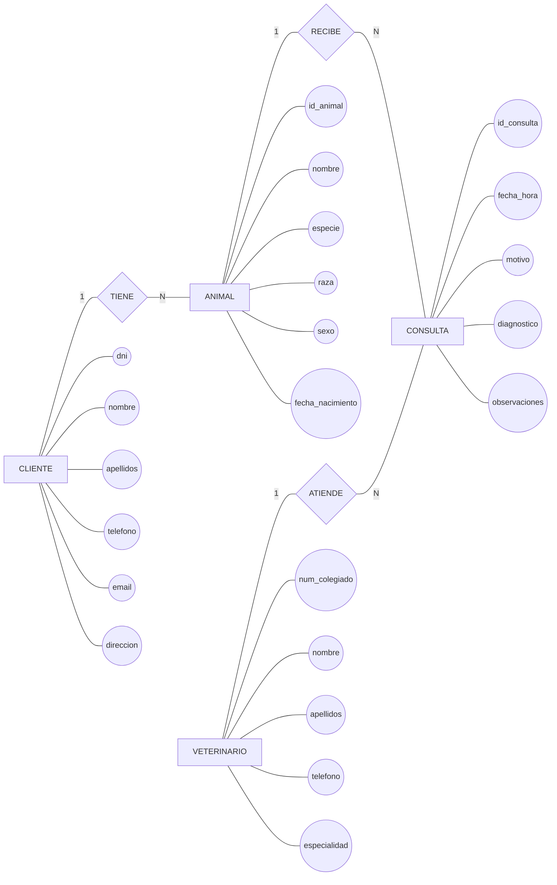

# Ejercicio 1 — Análisis de una clínica veterinaria

## 1. Requerimiento

Una clínica veterinaria necesita una base de datos para gestionar la información de sus clientes, los animales que atiende y las consultas realizadas.

De cada **cliente** se desea conocer su DNI, nombre, apellidos, teléfono, correo electrónico y dirección.

Cada cliente puede tener uno o varios ​**animales**​, y cada animal pertenece a un único cliente. De cada animal se desea almacenar un identificador, nombre, especie, raza, sexo y fecha de nacimiento.

La clínica dispone de varios ​**veterinarios**​. De cada veterinario se conoce su número de colegiado, nombre, apellidos, teléfono y especialidad.

Los animales acuden a la clínica para realizar ​**consultas veterinarias**​. Cada consulta corresponde a un único animal y es atendida por un único veterinario. Un animal puede tener muchas consultas a lo largo del tiempo y un veterinario puede atender muchas consultas.

De cada consulta se desea conocer la fecha y hora, el motivo de la consulta, el diagnóstico y las observaciones realizadas por el veterinario.

Un cliente debe tener al menos un animal registrado para poder formar parte de la base de datos de la clínica.

Un animal puede estar registrado aunque todavía no haya realizado ninguna consulta.

Todo veterinario registrado en la clínica debe haber atendido al menos una consulta.

---

# 2. Identificación de entidades

A partir del requerimiento podemos identificar inicialmente las siguientes entidades:

| Entidad               | Justificación                                               |
| ----------------------- | -------------------------------------------------------------- |
| **CLIENTE**     | Representa a las personas propietarias de los animales.      |
| **ANIMAL**      | Representa a los animales registrados en la clínica.        |
| **VETERINARIO** | Representa a los profesionales que atienden a los animales.  |
| **CONSULTA**    | Representa cada atención veterinaria realizada a un animal. |

## Entidades descartadas

No todo sustantivo mencionado en un requerimiento tiene que convertirse automáticamente en una entidad.

Por ejemplo:

* **Clínica** no se considera una entidad porque el requerimiento describe una única clínica y no se necesita gestionar información independiente sobre varias clínicas.
* **Especie** no se considera una entidad porque, en este escenario, se almacena como una característica del animal.
* **Especialidad** tampoco se considera una entidad porque se plantea como un atributo del veterinario.
* **Diagnóstico** no es una entidad independiente; forma parte de la información registrada en una consulta.

> **Criterio:** una entidad debe representar un objeto, concepto o hecho del negocio sobre el que necesitemos almacenar información propia.

---

# 3. Identificación de atributos

## Entidad CLIENTE

| Atributo        | Descripción                         | Clave |
| ----------------- | -------------------------------------- | ------- |
| `dni`       | Documento identificativo del cliente | PK    |
| `nombre`    | Nombre del cliente                   |       |
| `apellidos` | Apellidos del cliente                |       |
| `telefono`  | Teléfono de contacto                |       |
| `email`     | Correo electrónico                  |       |
| `direccion` | Dirección del cliente               |       |

**Clave primaria:**`dni`

---

## Entidad ANIMAL

| Atributo               | Descripción             | Clave |
| ------------------------ | -------------------------- | ------- |
| `id_animal`        | Identificador del animal | PK    |
| `nombre`           | Nombre del animal        |       |
| `especie`          | Especie del animal       |       |
| `raza`             | Raza del animal          |       |
| `sexo`             | Sexo del animal          |       |
| `fecha_nacimiento` | Fecha de nacimiento      |       |

**Clave primaria:**`id_animal`

---

## Entidad VETERINARIO

| Atributo            | Descripción              | Clave |
| --------------------- | --------------------------- | ------- |
| `num_colegiado` | Número de colegiado      | PK    |
| `nombre`        | Nombre del veterinario    |       |
| `apellidos`     | Apellidos del veterinario |       |
| `telefono`      | Teléfono de contacto     |       |
| `especialidad`  | Especialidad profesional  |       |

**Clave primaria:**`num_colegiado`

---

## Entidad CONSULTA

| Atributo            | Descripción                  | Clave |
| --------------------- | ------------------------------- | ------- |
| `id_consulta`   | Identificador de la consulta  | PK    |
| `fecha_hora`    | Fecha y hora de la consulta   |       |
| `motivo`        | Motivo de la consulta         |       |
| `diagnostico`   | Diagnóstico realizado        |       |
| `observaciones` | Observaciones del veterinario |       |

**Clave primaria:**`id_consulta`

---

# 4. Identificación de relaciones

A partir del requerimiento encontramos tres relaciones principales.

### CLIENTE — tiene — ANIMAL

El requerimiento indica:

> "Cada cliente puede tener uno o varios animales, y cada animal pertenece a un único cliente."

Por tanto:

* Un cliente tiene ​**uno o varios animales**​.
* Un animal pertenece a ​**un único cliente**​.

Relación:

**CLIENTE 1:N ANIMAL**

---

### ANIMAL — recibe — CONSULTA

El requerimiento indica:

> "Un animal puede tener muchas consultas a lo largo del tiempo."

Por tanto:

* Un animal puede tener ​**cero o muchas consultas**​.
* Una consulta corresponde a ​**un único animal**​.

Relación:

**ANIMAL 1:N CONSULTA**

---

### VETERINARIO — atiende — CONSULTA

El requerimiento indica:

> "Cada consulta [...] es atendida por un único veterinario."

Y:

> "Un veterinario puede atender muchas consultas."

Por tanto:

* Un veterinario debe atender ​**una o muchas consultas**​.
* Una consulta es atendida por ​**un único veterinario**​.

Relación:

**VETERINARIO 1:N CONSULTA**

---

# 5. Matriz de relaciones, cardinalidad y participación

Para evitar confundir **cardinalidad** con ​**participación**​, utilizaremos ambos conceptos por separado.

* **Cardinalidad:** indica cuántas ocurrencias de una entidad pueden asociarse con una ocurrencia de la otra.
* **Participación:** indica si la participación en la relación es **obligatoria** u ​**opcional**​.

| Entidad A   | Relación | Entidad B | Cardinalidad A → B | Participación A | Cardinalidad B → A | Participación B |
| ------------- | ----------- | ----------- | --------------------- | ------------------ | --------------------- | ------------------ |
| CLIENTE     | tiene     | ANIMAL    | 1:N                 | Total            | 1:1                 | Total            |
| ANIMAL      | recibe    | CONSULTA  | 1:N                 | Parcial          | 1:1                 | Total            |
| VETERINARIO | atiende   | CONSULTA  | 1:N                 | Total            | 1:1                 | Total            |

### Interpretación

**CLIENTE → ANIMAL**

Un cliente debe tener al menos un animal:

```text
CLIENTE 1 ─────── N ANIMAL
```

Participación:

```text
CLIENTE:   total
ANIMAL:    total
```

**ANIMAL → CONSULTA**

Un animal puede estar registrado sin haber acudido todavía a una consulta:

```text
ANIMAL 1 ─────── N CONSULTA
```

Por tanto:

```text
ANIMAL:    parcial
CONSULTA:  total
```

**VETERINARIO → CONSULTA**

Todo veterinario registrado debe haber atendido al menos una consulta:

```text
VETERINARIO 1 ─────── N CONSULTA
```

Por tanto:

```text
VETERINARIO: total
CONSULTA:    total
```

---

# 6. Resumen del modelo conceptual

El modelo conceptual obtenido es:

```text
CLIENTE
   │
   │ tiene
   │ 1:N
   ▼
ANIMAL
   │
   │ recibe
   │ 1:N
   ▼
CONSULTA
   ▲
   │ 1:N
   │ atiende
VETERINARIO
```

Las cuatro entidades identificadas son:

```text
CLIENTE
ANIMAL
VETERINARIO
CONSULTA
```

Y las tres relaciones son:

```text
CLIENTE ─── tiene ─── ANIMAL
ANIMAL ─── recibe ─── CONSULTA
VETERINARIO ─── atiende ─── CONSULTA
```

---

# 7. Diagrama ER

El siguiente diagrama representa las entidades, sus atributos y las relaciones identificadas.



---

# 8. Comprobación del modelo

Antes de considerar terminado el análisis, debemos comprobar que el modelo responde al requerimiento.

### ¿Puede un cliente tener varios animales?

Sí.

```text
CLIENTE 1 ─── N ANIMAL
```

### ¿Puede un animal pertenecer a varios clientes?

No.

Cada animal pertenece a un único cliente.

### ¿Puede un animal no haber tenido todavía consultas?

Sí.

```text
ANIMAL 1 ─── 0:N CONSULTA
```

### ¿Puede una consulta corresponder a varios animales?

No.

Cada consulta corresponde a un único animal.

### ¿Puede un veterinario atender muchas consultas?

Sí.

```text
VETERINARIO 1 ─── N CONSULTA
```

### ¿Puede existir una consulta sin veterinario?

No.

Cada consulta debe estar atendida por un veterinario.

### ¿Puede existir un veterinario sin haber atendido ninguna consulta?

No, según el requerimiento.

---

# 9. Resultado final

El modelo conceptual obtenido a partir del requerimiento contiene:

**4 entidades:**

```text
CLIENTE
ANIMAL
VETERINARIO
CONSULTA
```

**3 relaciones:**

```text
CLIENTE ─── tiene ─── ANIMAL
ANIMAL ─── recibe ─── CONSULTA
VETERINARIO ─── atiende ─── CONSULTA
```

**Cardinalidades:**

```text
CLIENTE      1:N ANIMAL
ANIMAL       1:N CONSULTA
VETERINARIO  1:N CONSULTA
```

El siguiente paso, una vez completado el modelo conceptual, sería transformar este modelo ER en un ​**modelo relacional**​, determinando tablas, claves primarias y claves foráneas.

