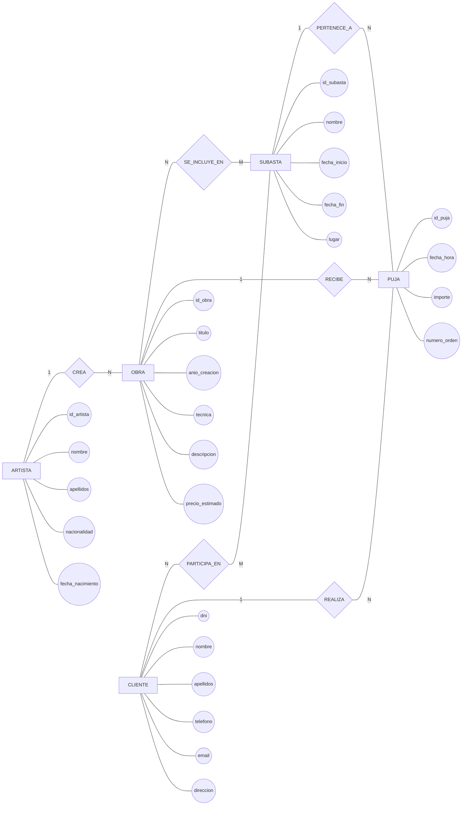

# Ejercicio 2 — Sistema de subastas de arte

## 1. Requerimiento

Una empresa especializada en subastas de arte quiere desarrollar una base de datos para gestionar las obras que pone a la venta, los artistas que las han creado, las subastas que organiza y las pujas realizadas por sus clientes.

De cada **artista** se desea almacenar un identificador, nombre, apellidos, nacionalidad y fecha de nacimiento.

Un artista puede haber creado varias ​**obras**​, pero cada obra ha sido creada por un único artista. De cada obra se desea conocer un identificador, título, año de creación, técnica utilizada, descripción y precio estimado.

La empresa organiza diferentes ​**subastas**​. De cada subasta se desea almacenar un identificador, nombre, fecha de inicio, fecha de finalización y lugar donde se celebra.

Una misma obra puede participar en diferentes subastas a lo largo del tiempo, y una subasta puede contener muchas obras. Sin embargo, una obra no puede participar dos veces en la misma subasta.

No todas las obras registradas tienen que haber participado todavía en una subasta.

Toda subasta debe contener al menos una obra.

Los **clientes** pueden participar en las subastas. De cada cliente se almacena su DNI, nombre, apellidos, teléfono, correo electrónico y dirección.

Un cliente puede participar en muchas subastas y una subasta puede tener muchos clientes participantes.

Para participar en una subasta, el cliente debe estar registrado previamente en la empresa.

Durante una subasta, los clientes realizan **pujas** por las obras.

Cada puja pertenece a un único cliente, corresponde a una única obra y se realiza dentro de una determinada subasta. De cada puja se desea almacenar un identificador, fecha y hora, importe ofrecido y número de orden de la puja dentro de la subasta.

Una obra puede recibir muchas pujas durante una subasta, mientras que un cliente puede realizar muchas pujas.

Una misma obra puede recibir pujas en diferentes subastas.

La empresa necesita conocer qué cliente realizó cada puja, sobre qué obra se realizó, en qué subasta tuvo lugar, el importe ofrecido y el momento en que se realizó.

---

# 2. Identificación de entidades

A partir del requerimiento podemos identificar las siguientes entidades:

| Entidad           | Justificación                                                                     |
| ------------------- | ------------------------------------------------------------------------------------ |
| **ARTISTA** | Representa a las personas que crean las obras.                                     |
| **OBRA**    | Representa cada obra de arte gestionada por la empresa.                            |
| **SUBASTA** | Representa cada evento de subasta organizado.                                      |
| **CLIENTE** | Representa a las personas que participan en las subastas.                          |
| **PUJA**    | Representa una oferta realizada por un cliente sobre una obra durante una subasta. |

En este caso ​**PUJA debe modelarse como entidad**​, porque tiene identidad propia y varios atributos que debemos almacenar.

---

# 3. Identificación de atributos

## ARTISTA

| Atributo               | Descripción              | Clave |
| ------------------------ | --------------------------- | ------- |
| `id_artista`       | Identificador del artista | PK    |
| `nombre`           | Nombre                    |       |
| `apellidos`        | Apellidos                 |       |
| `nacionalidad`     | Nacionalidad              |       |
| `fecha_nacimiento` | Fecha de nacimiento       |       |

**Clave primaria:**`id_artista`

---

## OBRA

| Atributo              | Descripción              | Clave |
| ----------------------- | --------------------------- | ------- |
| `id_obra`         | Identificador de la obra  | PK    |
| `titulo`          | Título de la obra        |       |
| `anio_creacion`   | Año de creación         |       |
| `tecnica`         | Técnica utilizada        |       |
| `descripcion`     | Descripción de la obra   |       |
| `precio_estimado` | Valor estimado de la obra |       |

**Clave primaria:**`id_obra`

---

## SUBASTA

| Atributo           | Descripción                  | Clave |
| -------------------- | ------------------------------- | ------- |
| `id_subasta`   | Identificador de la subasta   | PK    |
| `nombre`       | Nombre de la subasta          |       |
| `fecha_inicio` | Fecha y hora de inicio        |       |
| `fecha_fin`    | Fecha y hora de finalización |       |
| `lugar`        | Lugar donde se celebra        |       |

**Clave primaria:**`id_subasta`

---

## CLIENTE

| Atributo        | Descripción             | Clave |
| ----------------- | -------------------------- | ------- |
| `dni`       | Documento identificativo | PK    |
| `nombre`    | Nombre                   |       |
| `apellidos` | Apellidos                |       |
| `telefono`  | Teléfono                |       |
| `email`     | Correo electrónico      |       |
| `direccion` | Dirección               |       |

**Clave primaria:**`dni`

---

## PUJA

| Atributo           | Descripción                          | Clave |
| -------------------- | --------------------------------------- | ------- |
| `id_puja`      | Identificador de la puja              | PK    |
| `fecha_hora`   | Momento en que se realizó            |       |
| `importe`      | Importe ofrecido                      |       |
| `numero_orden` | Orden de la puja dentro de la subasta |       |

**Clave primaria:**`id_puja`

---

# 4. Identificación de relaciones

## ARTISTA — crea — OBRA

El requerimiento indica:

> Un artista puede haber creado varias obras, pero cada obra ha sido creada por un único artista.

Por tanto:

* Un artista puede crear ​**una o muchas obras**​.
* Una obra pertenece a ​**un único artista**​.

```text
ARTISTA 1:N OBRA
```

---

## OBRA — participa en — SUBASTA

El requerimiento indica:

> Una misma obra puede participar en diferentes subastas.

y:

> Una subasta puede contener muchas obras.

Por tanto tenemos una relación:

```text
OBRA N:M SUBASTA
```

Además:

* Una obra puede no haber participado todavía en ninguna subasta.
* Una subasta debe contener al menos una obra.

Esta relación es importante porque introduce por primera vez una ​**relación muchos a muchos**​.

---

## CLIENTE — participa en — SUBASTA

El requerimiento indica:

> Un cliente puede participar en muchas subastas y una subasta puede tener muchos clientes participantes.

Por tanto:

```text
CLIENTE N:M SUBASTA
```

Un cliente puede estar registrado sin haber participado todavía en ninguna subasta.

Una subasta puede tener muchos participantes.

---

## CLIENTE — realiza — PUJA

Cada puja pertenece a un único cliente.

Por tanto:

```text
CLIENTE 1:N PUJA
```

Un cliente puede realizar muchas pujas.

Cada puja pertenece obligatoriamente a un cliente.

---

## OBRA — recibe — PUJA

Cada puja corresponde a una única obra.

Por tanto:

```text
OBRA 1:N PUJA
```

Una obra puede recibir muchas pujas.

Una puja corresponde obligatoriamente a una obra.

---

## SUBASTA — contiene — PUJA

Cada puja se realiza dentro de una determinada subasta.

Por tanto:

```text
SUBASTA 1:N PUJA
```

Una subasta puede tener muchas pujas.

Una puja pertenece obligatoriamente a una subasta.

---

# 5. Matriz de relaciones, cardinalidad y participación

| Entidad A | Relación    | Entidad B | Cardinalidad A → B | Participación A | Cardinalidad B → A | Participación B |
| ----------- | -------------- | ----------- | --------------------- | ------------------ | --------------------- | ------------------ |
| ARTISTA   | crea         | OBRA      | 1:N                 | Total            | 1:1                 | Total            |
| OBRA      | participa en | SUBASTA   | N:M                 | Parcial          | N:M                 | Total            |
| CLIENTE   | participa en | SUBASTA   | N:M                 | Parcial          | N:M                 | Parcial          |
| CLIENTE   | realiza      | PUJA      | 1:N                 | Parcial          | 1:1                 | Total            |
| OBRA      | recibe       | PUJA      | 1:N                 | Parcial          | 1:1                 | Total            |
| SUBASTA   | contiene     | PUJA      | 1:N                 | Parcial          | 1:1                 | Total            |

### Interpretación de las participaciones

**ARTISTA — OBRA**

Todo artista registrado debe haber creado al menos una obra.

Toda obra debe tener un artista.

```text
ARTISTA: total
OBRA:    total
```

**OBRA — SUBASTA**

Una obra puede existir sin haber participado todavía en una subasta.

Una subasta debe contener al menos una obra.

```text
OBRA:    parcial
SUBASTA: total
```

**CLIENTE — SUBASTA**

Un cliente puede estar registrado sin participar todavía en una subasta.

Una subasta puede, según el modelo planteado, estar creada antes de que se registre ningún participante.

```text
CLIENTE: parcial
SUBASTA: parcial
```

**CLIENTE — PUJA**

Un cliente puede estar registrado y no realizar ninguna puja.

Toda puja debe pertenecer a un cliente.

```text
CLIENTE: parcial
PUJA:    total
```

**OBRA — PUJA**

Una obra puede no recibir ninguna puja.

Toda puja debe realizarse sobre una obra.

```text
OBRA: parcial
PUJA: total
```

**SUBASTA — PUJA**

Una subasta puede existir sin pujas, por ejemplo antes de comenzar.

Toda puja debe pertenecer a una subasta.

```text
SUBASTA: parcial
PUJA:    total
```

---

# 6. Observación importante sobre PUJA

En este ejercicio ​**PUJA no debe tratarse simplemente como una relación entre CLIENTE, OBRA y SUBASTA**​.

La puja tiene información propia:

* fecha y hora;
* importe;
* número de orden;
* identificador.

Por ello, conceptualmente la estamos tratando como una entidad.

Además, una puja necesita estar relacionada simultáneamente con:

```text
CLIENTE
OBRA
SUBASTA
```

Esto hace que el ejercicio sea más complejo que el anterior.

---

# 7. Comprobaciones del modelo

### ¿Puede un artista tener varias obras?

Sí.

```text
ARTISTA 1 ─── N OBRA
```

### ¿Puede una obra pertenecer a varios artistas?

No.

Cada obra tiene un único artista.

### ¿Puede una obra participar en varias subastas?

Sí.

```text
OBRA N ─── M SUBASTA
```

### ¿Puede una obra no haber participado todavía en ninguna subasta?

Sí.

### ¿Puede una subasta contener varias obras?

Sí.

### ¿Puede un cliente participar en varias subastas?

Sí.

```text
CLIENTE N ─── M SUBASTA
```

### ¿Puede un cliente realizar muchas pujas?

Sí.

### ¿Puede una puja pertenecer a varios clientes?

No.

Cada puja pertenece a un único cliente.

### ¿Puede una obra recibir muchas pujas?

Sí.

### ¿Puede una puja realizarse sobre varias obras?

No.

Cada puja corresponde a una única obra.

### ¿Puede una puja existir fuera de una subasta?

No.

Cada puja pertenece a una única subasta.

---

# 8. Diagrama conceptual simplificado

El modelo obtenido puede resumirse de la siguiente forma:



---

# 9. Resultado final

**5 entidades:**

```text
ARTISTA
OBRA
SUBASTA
CLIENTE
PUJA
```

**6 relaciones:**

```text
ARTISTA ─── crea ─── OBRA
OBRA ─── participa en ─── SUBASTA
CLIENTE ─── participa en ─── SUBASTA
CLIENTE ─── realiza ─── PUJA
OBRA ─── recibe ─── PUJA
SUBASTA ─── contiene ─── PUJA
```

**Cardinalidades principales:**

```text
ARTISTA      1:N OBRA
OBRA         N:M SUBASTA
CLIENTE      N:M SUBASTA
CLIENTE      1:N PUJA
OBRA         1:N PUJA
SUBASTA      1:N PUJA
```

