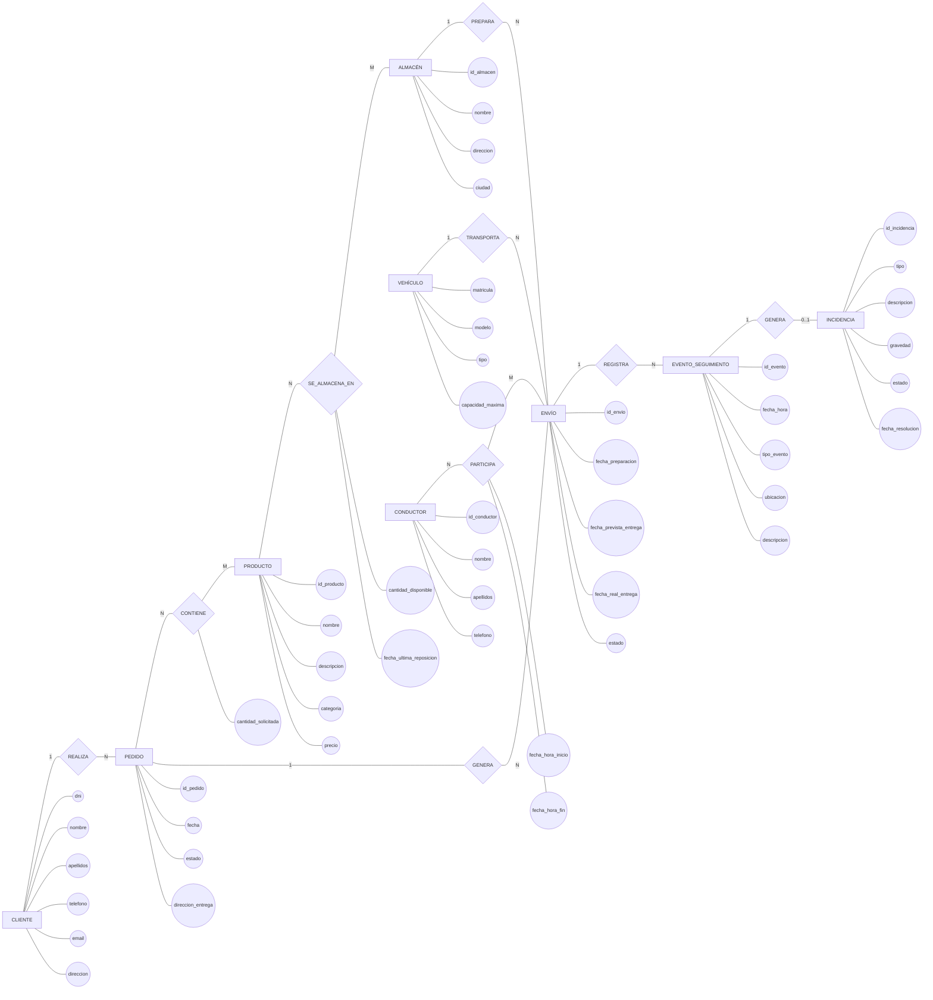

# Ejercicio 3. Gestión logística y distribución

## Enunciado

Una empresa de logística y distribución necesita diseñar una base de datos para gestionar sus operaciones de almacenamiento, preparación y transporte de mercancías.

La empresa trabaja con diferentes ​**clientes**​, que realizan pedidos de productos. De cada cliente se desea almacenar su DNI, nombre, apellidos, teléfono, correo electrónico y dirección.

Cada cliente puede realizar varios pedidos a lo largo del tiempo, aunque cada pedido pertenece exclusivamente a un cliente. De cada pedido se desea conocer su identificador, fecha de realización, estado y dirección de entrega.

Los pedidos están formados por diferentes ​**productos**​. Un mismo producto puede aparecer en numerosos pedidos y un pedido puede contener numerosos productos. Para cada producto incluido en un pedido debe registrarse la cantidad solicitada.

La empresa dispone de diferentes ​**almacenes**​, situados en distintas ciudades. De cada almacén se conoce su identificador, nombre, dirección y ciudad.

Los productos se encuentran almacenados en estos almacenes. Un mismo producto puede estar disponible en varios almacenes y un almacén puede contener numerosos productos. Para cada producto almacenado en un almacén se desea conocer la cantidad disponible y la fecha de la última reposición.

Cuando un pedido debe ser enviado, la empresa genera uno o varios ​**envíos**​. Un pedido puede dividirse en varios envíos cuando sus productos se encuentran en diferentes almacenes. Cada envío pertenece exclusivamente a un pedido.

Cada envío se prepara en un único almacén, aunque un almacén puede preparar numerosos envíos. De cada envío se desea conocer su identificador, fecha de preparación, fecha prevista de entrega, fecha real de entrega y estado.

Para transportar los envíos, la empresa dispone de diferentes ​**vehículos**​. Cada vehículo está identificado por su matrícula y tiene información sobre su modelo, tipo y capacidad máxima de carga.

Un vehículo puede transportar numerosos envíos a lo largo del tiempo, aunque cada envío utiliza un único vehículo.

Los vehículos son conducidos por diferentes ​**conductores**​. Un conductor puede participar en numerosos envíos y un mismo envío puede requerir la participación de varios conductores. Esto puede ocurrir cuando un envío necesita diferentes conductores durante un trayecto largo.

Para cada participación de un conductor en un envío se desea registrar la fecha y hora en la que comenzó su participación y la fecha y hora en la que terminó.

Durante el transporte se realiza un seguimiento de cada envío mediante diferentes ​**eventos de seguimiento**​. Cada evento representa una situación concreta, como la salida del almacén, la llegada a un centro logístico, una incidencia durante el transporte, la salida para reparto o la entrega al cliente.

Cada evento de seguimiento pertenece a un único envío y un envío puede tener numerosos eventos. De cada evento se desea conocer su identificador, fecha y hora, tipo de evento, ubicación y descripción.

Cuando se produce una ​**incidencia**​, se registra información adicional sobre ella. Una incidencia está asociada al evento de seguimiento en el que fue detectada. De cada incidencia se desea conocer su identificador, tipo, descripción, gravedad, estado y fecha de resolución.

El sistema debe permitir conocer, entre otras cuestiones:

* Qué pedidos ha realizado cada cliente.
* Qué productos contiene cada pedido.
* Qué cantidad de cada producto se ha solicitado.
* En qué almacenes está disponible cada producto.
* Qué cantidad de un producto existe en cada almacén.
* Cuándo se realizó la última reposición de un producto en un almacén.
* Qué envíos se han generado a partir de un pedido.
* Desde qué almacén se ha preparado cada envío.
* Qué vehículo ha transportado cada envío.
* Qué conductores han participado en un envío.
* Cuándo comenzó y terminó la participación de cada conductor.
* Qué eventos de seguimiento ha tenido un envío.
* Dónde se encontraba un envío durante su transporte.
* Qué incidencias se produjeron durante un envío.

## 1. Analizar el requisito

Analiza el funcionamiento de la empresa e identifica los principales conceptos que deben representarse en la base de datos.

Determina:

* Qué elementos necesitan una identidad propia.
* Qué información debe almacenarse sobre cada elemento.
* Qué relaciones existen entre los elementos.
* Qué relaciones pueden ser de tipo N:M.
* Qué relaciones tienen información propia.
* Qué conceptos dependen de otros conceptos.
* Qué participaciones son obligatorias y cuáles son opcionales.

Presta especial atención a los productos almacenados en diferentes almacenes, ya que la relación entre PRODUCTO y ALMACÉN necesita almacenar información propia.

También debes analizar la participación de los conductores en los envíos, ya que una misma relación puede tener varios conductores y debe conservar información sobre el período de participación de cada uno.

## 2. Identificar entidades

Identifica las entidades necesarias para representar el sistema.

Como mínimo, analiza las siguientes entidades:

* CLIENTE
* PEDIDO
* PRODUCTO
* ALMACÉN
* ENVÍO
* VEHÍCULO
* CONDUCTOR
* EVENTO\_SEGUIMIENTO
* INCIDENCIA

Determina si todos estos conceptos deben convertirse en entidades independientes y justifica su existencia dentro del modelo conceptual.

## 3. Identificar atributos

Para cada entidad, identifica sus atributos y determina cuál será su atributo identificador.

Como punto de partida:

### CLIENTE

* dni
* nombre
* apellidos
* telefono
* email
* direccion

### PEDIDO

* id\_pedido
* fecha
* estado
* direccion\_entrega

### PRODUCTO

* id\_producto
* nombre
* descripcion
* categoria
* precio

### ALMACÉN

* id\_almacen
* nombre
* direccion
* ciudad

### ENVÍO

* id\_envio
* fecha\_preparacion
* fecha\_prevista\_entrega
* fecha\_real\_entrega
* estado

### VEHÍCULO

* matricula
* modelo
* tipo
* capacidad\_maxima

### CONDUCTOR

* id\_conductor
* nombre
* apellidos
* telefono

### EVENTO\_SEGUIMIENTO

* id\_evento
* fecha\_hora
* tipo\_evento
* ubicacion
* descripcion

### INCIDENCIA

* id\_incidencia
* tipo
* descripcion
* gravedad
* estado
* fecha\_resolucion

Determina si es necesario modificar, eliminar o añadir algún atributo a partir del análisis del requisito.

## 4. Identificar relaciones

Identifica las relaciones existentes entre las entidades.

### CLIENTE — PEDIDO

Un cliente puede realizar varios pedidos.

Cada pedido pertenece a un único cliente.

Relación:

**CLIENTE — REALIZA — PEDIDO**

### PEDIDO — PRODUCTO

Un pedido contiene uno o varios productos.

Un producto puede aparecer en numerosos pedidos.

Para cada combinación de pedido y producto debe conocerse la cantidad solicitada.

Relación:

**PEDIDO — CONTIENE — PRODUCTO**

### PRODUCTO — ALMACÉN

Un producto puede encontrarse en varios almacenes.

Un almacén puede contener numerosos productos.

Para cada combinación de producto y almacén debe conocerse la cantidad disponible y la fecha de la última reposición.

Relación:

**PRODUCTO — SE\_ALMACENA\_EN — ALMACÉN**

### PEDIDO — ENVÍO

Un pedido puede generar uno o varios envíos.

Cada envío pertenece a un único pedido.

Relación:

**PEDIDO — GENERA — ENVÍO**

### ALMACÉN — ENVÍO

Un almacén puede preparar numerosos envíos.

Cada envío se prepara en un único almacén.

Relación:

**ALMACÉN — PREPARA — ENVÍO**

### VEHÍCULO — ENVÍO

Un vehículo puede transportar numerosos envíos a lo largo del tiempo.

Cada envío utiliza un único vehículo.

Relación:

**VEHÍCULO — TRANSPORTA — ENVÍO**

### CONDUCTOR — ENVÍO

Un conductor puede participar en numerosos envíos.

Un envío puede requerir varios conductores.

La participación de un conductor en un envío tiene como atributos la fecha y hora de inicio y la fecha y hora de finalización.

Relación:

**CONDUCTOR — PARTICIPA — ENVÍO**

### ENVÍO — EVENTO\_SEGUIMIENTO

Un envío puede tener numerosos eventos de seguimiento.

Cada evento de seguimiento pertenece a un único envío.

Relación:

**ENVÍO — REGISTRA — EVENTO\_SEGUIMIENTO**

### EVENTO\_SEGUIMIENTO — INCIDENCIA

Un evento de seguimiento puede tener asociada una incidencia.

Cada incidencia pertenece al evento en el que fue detectada.

Relación:

**EVENTO\_SEGUIMIENTO — GENERA — INCIDENCIA**

## 5. Matriz de cardinalidad y participación

| Relación        | Entidad A           | Cardinalidad A | Participación A | Entidad B           | Cardinalidad B | Participación B |
| ------------------ | --------------------- | ---------------: | ------------------ | --------------------- | ---------------: | ------------------ |
| REALIZA          | CLIENTE             |            1:N | Parcial          | PEDIDO              |            N:1 | Total            |
| CONTIENE         | PEDIDO              |            N:M | Total            | PRODUCTO            |            N:M | Parcial          |
| SE\_ALMACENA\_EN | PRODUCTO            |            N:M | Parcial          | ALMACÉN            |            N:M | Parcial          |
| GENERA           | PEDIDO              |            1:N | Parcial          | ENVÍO              |            N:1 | Total            |
| PREPARA          | ALMACÉN            |            1:N | Parcial          | ENVÍO              |            N:1 | Total            |
| TRANSPORTA       | VEHÍCULO           |            1:N | Parcial          | ENVÍO              |            N:1 | Total            |
| PARTICIPA        | CONDUCTOR           |            N:M | Parcial          | ENVÍO              |            N:M | Total            |
| REGISTRA         | ENVÍO              |            1:N | Parcial          | EVENTO\_SEGUIMIENTO |            N:1 | Total            |
| GENERA           | EVENTO\_SEGUIMIENTO |         1:0..1 | Parcial          | INCIDENCIA          |            1:1 | Total            |

## 6. Atributos de las relaciones

Las siguientes relaciones tienen información propia:

### CONTIENE

La relación entre PEDIDO y PRODUCTO debe almacenar:

* cantidad\_solicitada

Este atributo pertenece a la relación porque la cantidad depende simultáneamente del pedido y del producto.

### SE\_ALMACENA\_EN

La relación entre PRODUCTO y ALMACÉN debe almacenar:

* cantidad\_disponible
* fecha\_ultima\_reposicion

Estos atributos pertenecen a la relación porque describen la situación concreta de un producto dentro de un almacén determinado.

### PARTICIPA

La relación entre CONDUCTOR y ENVÍO debe almacenar:

* fecha\_hora\_inicio
* fecha\_hora\_fin

Estos atributos pertenecen a la relación porque describen la participación concreta de un conductor en un envío determinado.

## 7. Diagrama Entidad-Relación

Representa el sistema mediante un diagrama Entidad-Relación utilizando la ​**notación Chen**​.

El diagrama debe representar:

* Las entidades mediante rectángulos.
* Las relaciones mediante rombos.
* Los atributos mediante elipses.
* Los identificadores de las entidades.
* Las cardinalidades.
* Las relaciones N:M.
* Los atributos propios de las relaciones.
* Las relaciones entre los envíos, sus conductores y sus eventos de seguimiento.
* Las incidencias asociadas a los eventos de seguimiento.

