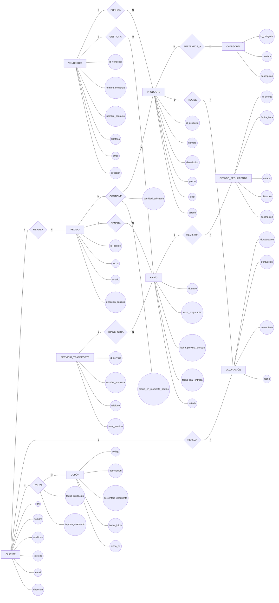

# Ejercicio 4. Plataforma de comercio electrónico y distribución

## Enunciado

Una empresa quiere desarrollar una plataforma de comercio electrónico en la que diferentes **vendedores** puedan publicar sus productos y recibir pedidos de ​**clientes**​.

La plataforma gestiona la información de los vendedores. De cada vendedor se desea conocer su identificador, nombre comercial, nombre de contacto, teléfono, correo electrónico y dirección.

Cada vendedor puede publicar numerosos ​**productos**​, aunque cada producto pertenece exclusivamente a un vendedor. De cada producto se desea conocer su identificador, nombre, descripción, precio, stock disponible y estado.

Los productos pueden clasificarse dentro de diferentes ​**categorías**​. Una categoría puede contener numerosos productos y un producto puede pertenecer a varias categorías. Por ejemplo, un producto podría pertenecer simultáneamente a las categorías "Electrónica" y "Accesorios".

Los **clientes** pueden consultar los productos disponibles y realizar diferentes ​**pedidos**​. De cada cliente se desea almacenar su DNI, nombre, apellidos, teléfono, correo electrónico y dirección.

Cada pedido pertenece a un único cliente. Un cliente puede realizar numerosos pedidos a lo largo del tiempo. De cada pedido se desea conocer su identificador, fecha, estado y dirección de entrega.

Un pedido puede contener uno o varios productos. Un mismo producto puede aparecer en numerosos pedidos diferentes. Para cada producto incluido en un pedido se debe registrar la cantidad solicitada y el precio que tenía el producto en el momento de realizar el pedido, ya que el precio actual puede cambiar posteriormente.

Un mismo pedido puede contener productos de diferentes vendedores. Por este motivo, la plataforma divide el pedido en diferentes ​**envíos**​, de forma que cada envío agrupa los productos correspondientes a un vendedor concreto.

Cada envío pertenece a un único pedido y corresponde a un único vendedor. Un pedido puede generar varios envíos y un vendedor puede gestionar numerosos envíos.

Cada envío puede utilizar uno de los diferentes **servicios de transporte** disponibles en la plataforma. De cada servicio de transporte se conoce su identificador, nombre de la empresa, teléfono de contacto y nivel de servicio.

Un servicio de transporte puede encargarse de numerosos envíos, aunque cada envío utiliza un único servicio de transporte.

La plataforma registra además diferentes **eventos de seguimiento** para cada envío. Cada evento representa una situación concreta del envío, como "preparado", "recogido", "en tránsito", "en reparto" o "entregado".

Un envío puede tener numerosos eventos de seguimiento y cada evento pertenece a un único envío. De cada evento se registra su identificador, fecha y hora, estado, ubicación y descripción.

Los clientes también pueden realizar **valoraciones** de los productos que han comprado. Una valoración pertenece a un único cliente y a un único producto. Un cliente puede valorar diferentes productos y un producto puede recibir valoraciones de numerosos clientes.

Cada valoración contiene una puntuación de 1 a 5, un comentario y la fecha en que fue realizada.

La plataforma también dispone de ​**cupones de descuento**​. Un cupón puede ser utilizado por diferentes clientes, y un cliente puede utilizar diferentes cupones. Para cada utilización de un cupón se desea registrar la fecha de utilización y el importe del descuento aplicado.

Un cupón tiene un código identificador, una descripción, un porcentaje de descuento, una fecha de inicio y una fecha de finalización.

El sistema debe permitir conocer, entre otras cuestiones:

* Qué productos vende cada vendedor.
* En qué categorías está clasificado cada producto.
* Qué productos ha comprado un cliente.
* Qué productos contiene cada pedido.
* Qué cantidad de cada producto se solicitó.
* Qué precio tenía un producto cuando se realizó un pedido.
* Qué vendedores participan en un pedido.
* Qué envíos se han generado para un pedido.
* Qué vendedor gestiona cada envío.
* Qué servicio de transporte utiliza cada envío.
* Qué eventos de seguimiento ha tenido un envío.
* Qué valoraciones ha realizado un cliente.
* Qué valoración media ha recibido un producto.
* Qué cupones ha utilizado un cliente.
* Cuándo utilizó un cliente un determinado cupón.
* Qué descuento se aplicó en cada utilización.

## 1. Analizar el requisito

Analiza el funcionamiento de la plataforma descrita en el enunciado.

Identifica:

* Los principales conceptos sobre los que es necesario almacenar información.
* Qué conceptos tienen identidad propia.
* Qué información caracteriza a cada concepto.
* Qué relaciones existen entre los diferentes conceptos.
* Qué relaciones pueden ser de tipo N:M.
* Qué relaciones necesitan almacenar información propia.
* Qué conceptos pueden aparecer varias veces relacionados con un mismo elemento.
* Qué información depende simultáneamente de dos o más conceptos.

Presta especial atención a:

* La relación entre PRODUCTO y CATEGORÍA.
* La relación entre PEDIDO y PRODUCTO.
* La división de un PEDIDO en varios ENVÍOS.
* La relación entre CLIENTE y PRODUCTO mediante las VALORACIONES.
* La relación entre CLIENTE y CUPÓN mediante la utilización del cupón.

## 2. Identificar entidades

Identifica las entidades necesarias para representar el sistema.

Como mínimo, analiza las siguientes entidades:

* VENDEDOR
* PRODUCTO
* CATEGORÍA
* CLIENTE
* PEDIDO
* ENVÍO
* SERVICIO\_TRANSPORTE
* EVENTO\_SEGUIMIENTO
* VALORACIÓN
* CUPÓN

Determina si todos estos conceptos deben convertirse en entidades independientes y justifica su existencia dentro del modelo conceptual.

## 3. Identificar atributos

Para cada entidad, identifica sus atributos y determina cuál será su atributo identificador.

Como punto de partida:

### VENDEDOR

* id\_vendedor
* nombre\_comercial
* nombre\_contacto
* telefono
* email
* direccion

### PRODUCTO

* id\_producto
* nombre
* descripcion
* precio
* stock
* estado

### CATEGORÍA

* id\_categoria
* nombre
* descripcion

### CLIENTE

* dni
* nombre
* apellidos
* telefono
* email
* direccion

### PEDIDO

* id\_pedido
* fecha
* estado
* direccion\_entrega

### ENVÍO

* id\_envio
* fecha\_preparacion
* fecha\_prevista\_entrega
* fecha\_real\_entrega
* estado

### SERVICIO\_TRANSPORTE

* id\_servicio
* nombre\_empresa
* telefono
* nivel\_servicio

### EVENTO\_SEGUIMIENTO

* id\_evento
* fecha\_hora
* estado
* ubicacion
* descripcion

### VALORACIÓN

* id\_valoracion
* puntuacion
* comentario
* fecha

### CUPÓN

* codigo
* descripcion
* porcentaje\_descuento
* fecha\_inicio
* fecha\_fin

Determina si es necesario modificar, eliminar o añadir algún atributo a partir del análisis del requisito.

## 4. Identificar relaciones

Identifica las relaciones existentes entre las entidades.

### VENDEDOR — PRODUCTO

Un vendedor puede publicar numerosos productos.

Cada producto pertenece exclusivamente a un vendedor.

Relación:

**VENDEDOR — PUBLICA — PRODUCTO**

### PRODUCTO — CATEGORÍA

Un producto puede pertenecer a varias categorías.

Una categoría puede contener numerosos productos.

Relación:

**PRODUCTO — PERTENECE\_A — CATEGORÍA**

### CLIENTE — PEDIDO

Un cliente puede realizar numerosos pedidos.

Cada pedido pertenece a un único cliente.

Relación:

**CLIENTE — REALIZA — PEDIDO**

### PEDIDO — PRODUCTO

Un pedido puede contener numerosos productos.

Un producto puede aparecer en numerosos pedidos.

Para cada combinación de pedido y producto debe conocerse la cantidad solicitada y el precio del producto en el momento de realizar el pedido.

Relación:

**PEDIDO — CONTIENE — PRODUCTO**

### PEDIDO — ENVÍO

Un pedido puede generar uno o varios envíos.

Cada envío pertenece a un único pedido.

Relación:

**PEDIDO — GENERA — ENVÍO**

### VENDEDOR — ENVÍO

Un vendedor puede gestionar numerosos envíos.

Cada envío corresponde a un único vendedor.

Relación:

**VENDEDOR — GESTIONA — ENVÍO**

### SERVICIO\_TRANSPORTE — ENVÍO

Un servicio de transporte puede encargarse de numerosos envíos.

Cada envío utiliza un único servicio de transporte.

Relación:

**SERVICIO\_TRANSPORTE — TRANSPORTA — ENVÍO**

### ENVÍO — EVENTO\_SEGUIMIENTO

Un envío puede tener numerosos eventos de seguimiento.

Cada evento de seguimiento pertenece a un único envío.

Relación:

**ENVÍO — REGISTRA — EVENTO\_SEGUIMIENTO**

### CLIENTE — VALORACIÓN — PRODUCTO

Un cliente puede realizar numerosas valoraciones.

Cada valoración pertenece a un único cliente y a un único producto.

Un producto puede recibir numerosas valoraciones.

Relaciones:

**CLIENTE — REALIZA — VALORACIÓN**

**PRODUCTO — RECIBE — VALORACIÓN**

La VALORACIÓN se representa como entidad porque posee atributos propios.

### CLIENTE — CUPÓN

Un cliente puede utilizar diferentes cupones.

Un cupón puede ser utilizado por diferentes clientes.

Para cada utilización debe registrarse la fecha y el importe del descuento aplicado.

Relación:

**CLIENTE — UTILIZA — CUPÓN**

## 5. Matriz de cardinalidad y participación

| Relación    | Entidad A            | Cardinalidad A | Participación A | Entidad B           | Cardinalidad B | Participación B |
| -------------- | ---------------------- | ---------------: | ------------------ | --------------------- | ---------------: | ------------------ |
| PUBLICA      | VENDEDOR             |            1:N | Parcial          | PRODUCTO            |            N:1 | Total            |
| PERTENECE\_A | PRODUCTO             |            N:M | Total            | CATEGORÍA          |            N:M | Parcial          |
| REALIZA      | CLIENTE              |            1:N | Parcial          | PEDIDO              |            N:1 | Total            |
| CONTIENE     | PEDIDO               |            N:M | Total            | PRODUCTO            |            N:M | Parcial          |
| GENERA       | PEDIDO               |            1:N | Parcial          | ENVÍO              |            N:1 | Total            |
| GESTIONA     | VENDEDOR             |            1:N | Parcial          | ENVÍO              |            N:1 | Total            |
| TRANSPORTA   | SERVICIO\_TRANSPORTE |            1:N | Parcial          | ENVÍO              |            N:1 | Total            |
| REGISTRA     | ENVÍO               |            1:N | Parcial          | EVENTO\_SEGUIMIENTO |            N:1 | Total            |
| REALIZA      | CLIENTE              |            1:N | Parcial          | VALORACIÓN         |            N:1 | Total            |
| RECIBE       | PRODUCTO             |            1:N | Parcial          | VALORACIÓN         |            N:1 | Total            |
| UTILIZA      | CLIENTE              |            N:M | Parcial          | CUPÓN              |            N:M | Parcial          |

## 6. Atributos de las relaciones

Las siguientes relaciones tienen información propia:

### CONTIENE

La relación entre PEDIDO y PRODUCTO debe almacenar:

* cantidad\_solicitada
* precio\_en\_momento\_pedido

Estos atributos pertenecen a la relación porque dependen de la combinación concreta entre un pedido y un producto.

El precio actual del PRODUCTO puede cambiar posteriormente, pero el pedido debe conservar el precio que tenía el producto cuando fue adquirido.

### UTILIZA

La relación entre CLIENTE y CUPÓN debe almacenar:

* fecha\_utilizacion
* importe\_descuento

Estos atributos describen una utilización concreta de un cupón por parte de un cliente.

Un mismo cliente puede utilizar diferentes cupones y un mismo cupón puede ser utilizado por diferentes clientes.

## 7. Diagrama Entidad-Relación

Representa el sistema mediante un diagrama Entidad-Relación utilizando la ​**notación Chen**​.

El diagrama debe representar:

* Todas las entidades.
* Todos los atributos.
* Los atributos identificadores.
* Todas las relaciones.
* Las cardinalidades.
* Las relaciones N:M.
* Los atributos propios de las relaciones.
* La relación entre pedidos y productos.
* La división de pedidos en envíos.
* La relación entre vendedores y envíos.
* El seguimiento de los envíos.
* Las valoraciones realizadas por los clientes.
* La utilización de cupones por parte de los clientes.

