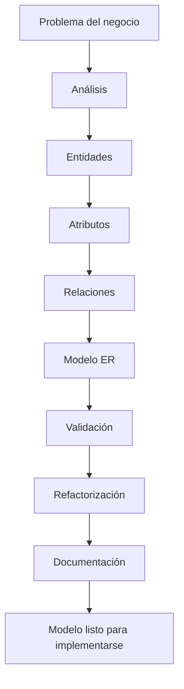

# Clase 6 — Metodología de diseño de Bases de Datos

Hasta este momento hemos aprendido los fundamentos del Modelo Relacional y del Modelo Entidad-Relación. Ya sabemos identificar entidades, atributos, relaciones, cardinalidades y reglas de negocio. También hemos construido nuestros primeros diagramas conceptuales.

Sin embargo, todavía queda una pregunta fundamental:

> **¿Cuál es el orden correcto para diseñar una base de datos?**

Muchos principiantes comienzan creando tablas inmediatamente después de escuchar una idea general del proyecto. Otros empiezan escribiendo código SQL sin haber analizado el problema. Aunque ambos enfoques pueden funcionar en proyectos muy pequeños, suelen provocar numerosos errores cuando el sistema crece.

Los profesionales siguen una metodología de diseño que permite avanzar de forma ordenada desde la comprensión del negocio hasta la implementación final de la base de datos.

En esta clase aprenderemos ese proceso completo. Veremos cómo analizar un problema, descubrir sus entidades y relaciones, validar el modelo con el cliente, refinar el diagrama y documentar el resultado para que pueda ser entendido y mantenido por todo el equipo de desarrollo.

Durante toda la sesión seguiremos ampliando el caso de estudio de la empresa comercial que nos acompaña desde las primeras clases. El objetivo será construir un procedimiento de trabajo que utilizaremos repetidamente durante el resto del curso.

### Objetivos de aprendizaje

Al finalizar esta clase el estudiante será capaz de:

* Comprender las fases del diseño profesional de una base de datos.
* Analizar un problema antes de comenzar el modelado.
* Identificar correctamente entidades, atributos y relaciones.
* Validar un modelo conceptual con criterios objetivos.
* Refinar un diagrama ER mediante sucesivas iteraciones.
* Reconocer patrones habituales de diseño.
* Documentar correctamente un modelo de datos.
* Revisar un diseño antes de transformarlo al Modelo Relacional.

### Contenido

1. [Metodología de diseño](01_metodologia_de_diseno.md)
2. [Análisis del problema](02_analisis_del_problema.md)
3. [Identificación de entidades](03_identificacion_de_entidades.md)
4. [Identificación de atributos](04_identificacion_de_atributos.md)
5. [Identificación de relaciones](05_identificacion_de_relaciones.md)
6. [Validación del modelo](06_validacion_del_modelo.md)
7. [Refactorización del diagrama](07_refactorizacion_del_diagrama.md)
8. [Patrones de diseño frecuentes](08_patrones_de_diseno_frecuentes.md)
9. [Documentación del modelo](09_documentacion_del_modelo.md)
10. [Caso completo paso a paso](10_caso_completo_paso_a_paso.md)
11. [Revisión del modelo](11_revision_del_modelo.md)
12. [Resumen](12_resumen.md)

### Mapa conceptual

### Relación con el resto del curso

Esta clase cierra definitivamente la fase de análisis conceptual. A partir de la siguiente comenzaremos a transformar nuestros diagramas Entidad-Relación en un Modelo Relacional y, posteriormente, en tablas reales implementadas mediante SQL sobre MySQL.

La metodología aprendida aquí servirá para cualquier proyecto de bases de datos, independientemente del lenguaje de programación, el SGBD o el tamaño del sistema.

