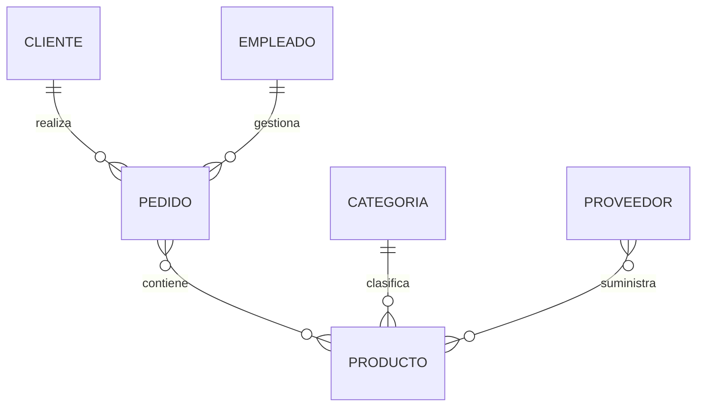

# Recordatorio del Modelo ER

Antes de comenzar la transformación conviene recordar los principales elementos que forman un diagrama Entidad-Relación.

Aunque ya los hemos estudiado con detalle en las clases anteriores, repasarlos facilitará enormemente la comprensión de las reglas que aprenderemos a continuación.

### Los componentes del modelo

Todo modelo ER está formado por un pequeño conjunto de elementos fundamentales.

| Elemento       | Función                                             |
| ---------------- | ------------------------------------------------------ |
| Entidad        | Representa un objeto del negocio.                    |
| Atributo       | Describe una característica de una entidad.         |
| Identificador  | Distingue de forma única cada instancia.            |
| Relación      | Conecta dos o más entidades.                        |
| Cardinalidad   | Indica cuántas instancias pueden relacionarse.      |
| Participación | Determina si la relación es obligatoria u opcional. |

Estos elementos serán los protagonistas de la transformación.

### Nuestro modelo actual

Al finalizar la clase anterior, el modelo conceptual de la empresa comercial tenía un aspecto similar al siguiente.



Todavía no existen tablas.

Solo estamos representando la realidad del negocio.

### Lo que ocurrirá ahora

En las próximas secciones iremos sustituyendo cada elemento del diagrama por su equivalente relacional.

Por ejemplo:

```text
Entidad
↓

Tabla
```

Más adelante veremos también que una relación 1:N no se transforma igual que una relación N:M.

Cada caso posee sus propias reglas.

### Una transformación sistemática

Es importante comprender que esta conversión no depende del gusto del diseñador.

Existen reglas ampliamente aceptadas que prácticamente todos los sistemas relacionales siguen desde hace décadas.

Esto significa que dos diseñadores diferentes deberían obtener modelos muy parecidos a partir del mismo diagrama ER.

### El objetivo

Al finalizar esta clase nuestro diagrama conceptual habrá desaparecido por completo.

En su lugar tendremos un conjunto de tablas relacionadas mediante claves primarias y claves foráneas, exactamente igual que las que posteriormente construiremos en MySQL.

### Ideas clave

* El Modelo ER utiliza entidades, atributos y relaciones.
* El Modelo Relacional utiliza tablas, columnas y claves.
* La transformación sigue reglas bien definidas.
* El significado del negocio debe mantenerse intacto.
* Todo el trabajo realizado hasta ahora servirá como base para la implementación física de la base de datos.

