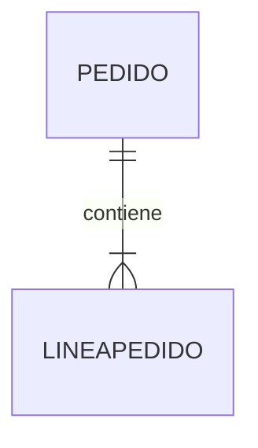

# Entidades débiles a tablas

Las entidades fuertes se transforman directamente en tablas.

¿Ocurre lo mismo con las entidades débiles?

La respuesta es sí, aunque con una diferencia muy importante.

Las entidades débiles necesitan utilizar parte de la identidad de otra entidad para poder identificarse correctamente.

Por ello, durante la transformación, su tabla dependerá también de otra tabla.

### Recordando las entidades débiles

Una entidad débil no posee un identificador completamente independiente.

Necesita apoyarse en otra entidad.

Un ejemplo clásico es ​**LíneaPedido**​.

Una línea de pedido no existe sin el pedido al que pertenece.

Además, el número de línea suele comenzar desde uno dentro de cada pedido.

### Modelo conceptual



Observamos que LíneaPedido depende completamente de Pedido.

### Transformación

La entidad débil también se convierte en una tabla.

```text
PEDIDO
-------------------------
IdPedido
Fecha
Estado

LINEAPEDIDO
-------------------------
IdPedido
NumeroLinea
Cantidad
PrecioVenta
```

Sin embargo, aparece una diferencia importante.

La tabla **LINEAPEDIDO** incorpora el identificador del pedido.

Este identificador formará parte de su propia clave primaria.

### Clave primaria compuesta

En muchos casos una entidad débil utiliza una clave compuesta.

Por ejemplo:

```text
(IdPedido, NumeroLinea)
```

Esta combinación garantiza que dos líneas del mismo pedido nunca tengan el mismo número.

Sin embargo:

```text
Pedido 15
Línea 1
```

y

```text
Pedido 16
Línea 1
```

son perfectamente válidos.

### ¿Siempre ocurre así?

No necesariamente.

Algunas empresas prefieren utilizar un identificador artificial.

Por ejemplo:

```text
IdLineaPedido
```

y mantener **IdPedido** únicamente como clave foránea.

Ambos diseños son correctos.

La elección dependerá de los requisitos del proyecto.

Durante el curso estudiaremos ambas alternativas.

### Caso práctico

Nuestra empresa comercial utilizará inicialmente una clave compuesta para LíneaPedido porque refleja muy bien la dependencia existente respecto al pedido.

Más adelante veremos cómo MySQL permite implementar cualquiera de las dos soluciones.

### Ideas clave

* Las entidades débiles también se transforman en tablas.
* Su identificación depende de otra entidad.
* Es frecuente utilizar claves primarias compuestas.
* La entidad propietaria aporta parte de la identificación.
* La transformación mantiene la dependencia existente en el modelo conceptual.

