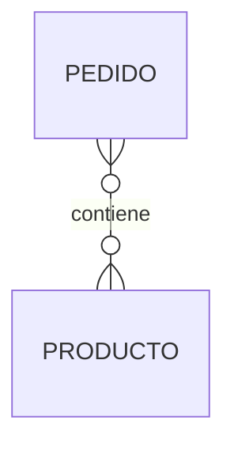
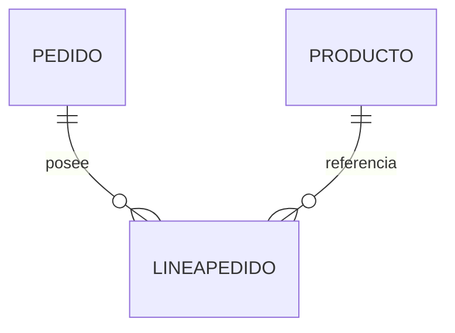
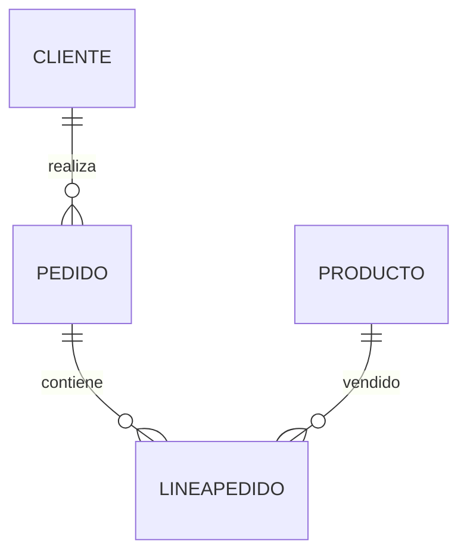

# Relaciones N a M

Las relaciones **muchos a muchos (N:M)** representan una de las situaciones más habituales en el mundo real. Sin embargo, también son las que requieren una transformación más importante al pasar al Modelo Relacional.

La razón es sencilla:

> **Las bases de datos relacionales no pueden representar directamente una relación muchos a muchos.**

Será necesario introducir una nueva tabla que actúe como intermediaria.

### Recordando la relación

Consideremos el siguiente fragmento del Modelo ER.



Su significado es claro.

* Un pedido puede contener muchos productos.
* Un producto puede aparecer en muchos pedidos.

La relación es perfectamente válida desde el punto de vista conceptual.

### ¿Por qué no puede implementarse directamente?

Supongamos que intentamos guardar los productos dentro de la tabla PEDIDO.

```text
PEDIDO

IdPedido
Fecha
Producto1
Producto2
Producto3
Producto4
...
```

Surgen inmediatamente varios problemas.

* No sabemos cuántos productos tendrá cada pedido.
* Aparecen muchas columnas vacías.
* El número máximo de productos queda limitado.
* Resulta imposible realizar consultas eficientes.

Probemos la alternativa.

```text
PRODUCTO

IdProducto
Nombre
Pedido1
Pedido2
Pedido3
...
```

Los mismos problemas vuelven a aparecer.

Necesitamos otra solución.

### La tabla intermedia

La solución consiste en crear una nueva tabla.



La relación muchos a muchos desaparece.

Ahora tenemos dos relaciones uno a muchos.

### La nueva tabla

```text
LINEAPEDIDO

--------------------------
IdPedido
IdProducto
Cantidad
PrecioVenta
Descuento
```

Esta tabla recibe distintos nombres según la organización.

Algunos ejemplos son:

* LíneaPedido
* DetallePedido
* PedidoProducto
* ItemPedido

Lo importante no es el nombre.

Lo importante es que representa ​**cada aparición concreta de un producto dentro de un pedido**​.

### Una ventaja adicional

La nueva tabla permite almacenar información que antes no tenía lugar.

Por ejemplo:

* Cantidad comprada.
* Precio aplicado.
* Descuento.
* IVA.
* Observaciones.

Estos datos pertenecen a la relación entre pedido y producto, no al pedido ni al producto individualmente.

Por eso la tabla intermedia resulta tan útil.

### Caso práctico

Nuestra empresa comercial utilizará exactamente este diseño.



Este será uno de los elementos más importantes de toda la base de datos.

### Ideas clave

* Las relaciones N:M no pueden implementarse directamente.
* Siempre se transforman en una tabla intermedia.
* La tabla intermedia convierte una relación N:M en dos relaciones 1:N.
* Además permite almacenar información propia de la relación.
* Es uno de los patrones más utilizados en aplicaciones empresariales.

