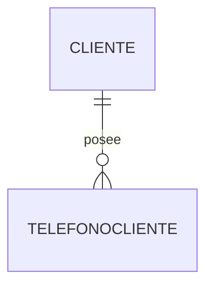

# Atributos multivaluados

Hasta ahora todos los atributos estudiados tenían un único valor para cada entidad.

Por ejemplo, un producto posee un único precio y un pedido tiene una única fecha.

Sin embargo, existen situaciones en las que un atributo puede almacenar ​**varios valores**​.

Estos reciben el nombre de ​**atributos multivaluados**​.

### Un ejemplo sencillo

Supongamos que un cliente puede registrar varios números de teléfono.

En el Modelo ER podríamos representarlo como un atributo multivaluado.

```text
CLIENTE

IdCliente

Nombre

{Telefono}
```

Las llaves indican que pueden existir varios teléfonos.

### Una mala solución

Un error frecuente consiste en crear varias columnas.

```text
CLIENTE

Telefono1

Telefono2

Telefono3

Telefono4
```

Este diseño presenta numerosos inconvenientes.

* Limita el número máximo de teléfonos.
* Muchas columnas permanecerán vacías.
* Resulta difícil ampliar el sistema.

No es un diseño relacional correcto.

### La solución adecuada

La estrategia consiste en crear una nueva tabla.



Posteriormente:

```text
CLIENTE

IdCliente
Nombre

TELEFONOCLIENTE

IdTelefono
Numero
IdCliente
```

Cada teléfono ocupa una fila distinta.

Ahora un cliente puede tener uno, dos o cien teléfonos sin modificar la estructura de la base de datos.

### Otros ejemplos

Este patrón aparece constantemente.

* Correos electrónicos.
* Direcciones.
* Fotografías.
* Redes sociales.
* Documentos adjuntos.
* Idiomas que habla una persona.

Siempre que un atributo pueda repetirse un número indeterminado de veces, conviene plantearse si realmente debería convertirse en una nueva entidad.

### Caso práctico

En nuestro modelo inicial almacenaremos un único teléfono y un único correo electrónico por cliente.

Más adelante ampliaremos el sistema para permitir múltiples direcciones y varios métodos de contacto, aplicando exactamente esta técnica.

### Ideas clave

* Un atributo multivaluado admite varios valores.
* No debe representarse mediante múltiples columnas similares.
* Lo habitual es crear una nueva tabla relacionada mediante una clave foránea.
* Esta solución mantiene la flexibilidad del modelo.
* Es un ejemplo de normalización temprana.

