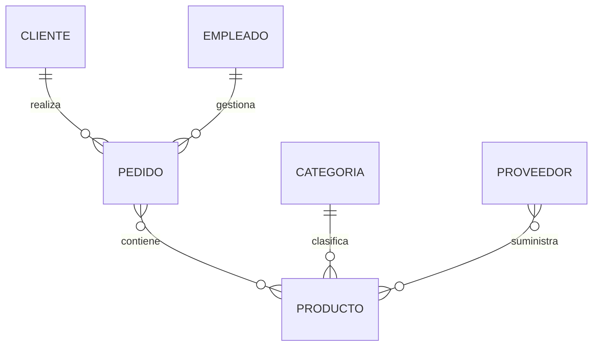

# Caso práctico completo

A lo largo de esta clase hemos aprendido las reglas fundamentales para transformar un Modelo Entidad-Relación en un Modelo Relacional.

Para concluir, aplicaremos todas ellas a nuestro caso de estudio de la empresa comercial.

### Paso 1. Modelo conceptual

Partimos del siguiente diagrama.



Este modelo describe correctamente el negocio, pero todavía no puede implementarse en MySQL.

### Paso 2. Transformar entidades

Cada entidad fuerte se convierte en una tabla.

```text
CLIENTE
PRODUCTO
PEDIDO
EMPLEADO
PROVEEDOR
CATEGORIA
```

### Paso 3. Transformar atributos

Cada atributo pasa a convertirse en una columna.

Por ejemplo:

```text
CLIENTE

-------------------------
IdCliente
Nombre
Telefono
Correo

PRODUCTO

-------------------------
IdProducto
Nombre
Precio
Stock
```

### Paso 4. Definir claves primarias

Cada tabla recibe una clave primaria.

```text
CLIENTE
PK IdCliente

PRODUCTO
PK IdProducto

PEDIDO
PK IdPedido
```

### Paso 5. Transformar relaciones

Las relaciones uno a muchos incorporan claves foráneas.

```text
PEDIDO

-------------------------
IdPedido
Fecha
Estado

FK IdCliente

FK IdEmpleado
```

La relación muchos a muchos entre PEDIDO y PRODUCTO se transforma mediante una nueva tabla.

```text
LINEAPEDIDO

-------------------------
PK IdPedido
PK IdProducto

Cantidad
PrecioVenta
Descuento
```

### Resultado final

El primer Modelo Relacional de nuestra empresa queda formado por las siguientes tablas.

```text
CLIENTE

PRODUCTO

PEDIDO

LINEAPEDIDO

CATEGORIA

PROVEEDOR

EMPLEADO
```

Este modelo será el punto de partida para las próximas clases, donde aprenderemos a implementarlo mediante SQL utilizando instrucciones `CREATE TABLE`, claves primarias, claves foráneas y restricciones de integridad.

### Ideas clave

* La transformación sigue un conjunto de reglas bien definidas.
* Cada elemento del Modelo ER tiene un equivalente en el Modelo Relacional.
* El resultado es un conjunto de tablas relacionadas mediante claves.
* Este modelo ya está preparado para implementarse en MySQL.
* A partir de ahora comenzaremos a trabajar directamente con SQL.

