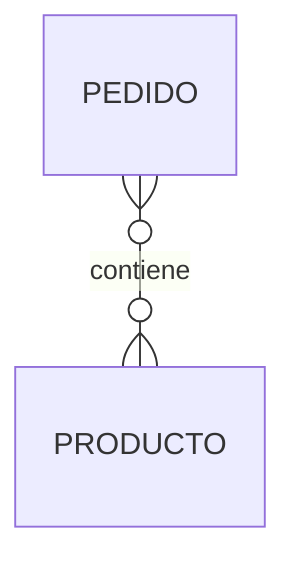

# Errores frecuentes

Transformar un Modelo Entidad-Relación en un Modelo Relacional parece, a primera vista, un proceso mecánico. Sin embargo, en la práctica es una de las fases donde más errores cometen los estudiantes que se inician en el diseño de bases de datos.

La mayoría de estos errores no producen fallos inmediatos. La base de datos puede incluso llegar a funcionar correctamente durante un tiempo. El problema aparece cuando el sistema crece, aumenta el volumen de información o se incorporan nuevas funcionalidades.

Por ello, aprender a reconocer estos errores desde el principio evitará muchos problemas en el futuro.

### Error 1. Olvidar una clave primaria

Toda tabla debe poseer una clave primaria.

Sin ella no es posible identificar unívocamente cada registro.

Por ejemplo:

```text
CLIENTE

Nombre
Telefono
Correo
```

¿Cómo distinguiríamos dos clientes llamados "Juan García"?

La solución consiste en incorporar un identificador.

```text
CLIENTE

IdCliente
Nombre
Telefono
Correo
```

### Error 2. No transformar una relación N:M

Uno de los errores más habituales consiste en intentar representar directamente una relación muchos a muchos.

Por ejemplo:



Muchos estudiantes intentan copiar esta relación directamente a la base de datos.

Esto no es posible.

Siempre será necesario crear una tabla intermedia.

```text
LINEAPEDIDO

IdPedido
IdProducto
Cantidad
PrecioVenta
```

### Error 3. Duplicar información

Otro error frecuente consiste en repetir datos en varias tablas.

Por ejemplo:

```text
PEDIDO

IdPedido
Fecha
NombreCliente
TelefonoCliente
CorreoCliente
```

Si el cliente cambia de teléfono habría que modificar todos sus pedidos.

La solución correcta consiste en almacenar únicamente la clave foránea.

```text
PEDIDO

IdPedido
Fecha
IdCliente
```

Los datos del cliente permanecerán en la tabla CLIENTE.

### Error 4. Elegir una mala clave primaria

La clave primaria debe ser estable.

Por ejemplo, utilizar el correo electrónico como identificador puede parecer buena idea.

Sin embargo, los usuarios cambian de correo con relativa frecuencia.

Esto obligaría a modificar todas las referencias existentes.

Por ese motivo suelen utilizarse identificadores artificiales.

### Error 5. Utilizar atributos multivaluados como columnas

Diseños como este:

```text
Telefono1
Telefono2
Telefono3
Telefono4
```

no son escalables.

La solución consiste en crear una tabla independiente.

```text
TELEFONOCLIENTE

IdTelefono
Numero
IdCliente
```

### Error 6. Crear demasiadas tablas

El extremo contrario también es peligroso.

Algunos diseñadores convierten cualquier pequeño atributo en una nueva entidad.

Por ejemplo:

```text
Nombre

↓

TABLA NOMBRE
```

Esto complica innecesariamente el modelo.

Solo deben convertirse en tablas aquellos elementos que realmente representen entidades o relaciones propias.

### Error 7. No validar el modelo

Un modelo aparentemente correcto puede contener errores importantes.

Antes de implementarlo conviene revisar siempre:

* tablas;
* claves primarias;
* claves foráneas;
* cardinalidades;
* reglas del negocio.

La validación suele ahorrar muchas horas de trabajo posterior.

### Cómo evitar estos errores

Una buena práctica consiste en seguir siempre la misma secuencia.

1. Identificar entidades.
2. Transformarlas en tablas.
3. Transformar atributos.
4. Definir claves primarias.
5. Transformar relaciones.
6. Validar el resultado.

Trabajar de forma ordenada reduce enormemente la probabilidad de cometer errores.

### Ideas clave

* La mayoría de errores aparecen durante la transformación del modelo.
* Las relaciones N:M siempre requieren una tabla intermedia.
* Toda tabla necesita una clave primaria.
* Debe evitarse la duplicación de información.
* La validación final es tan importante como la propia transformación.

